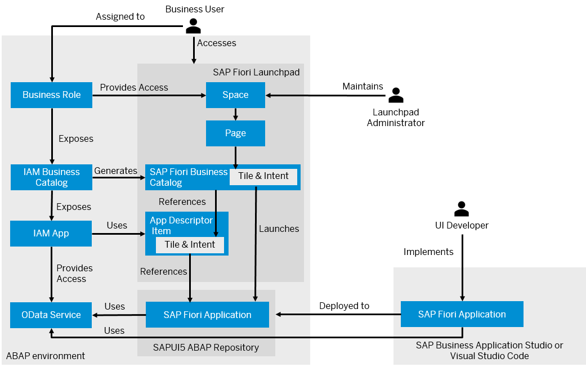
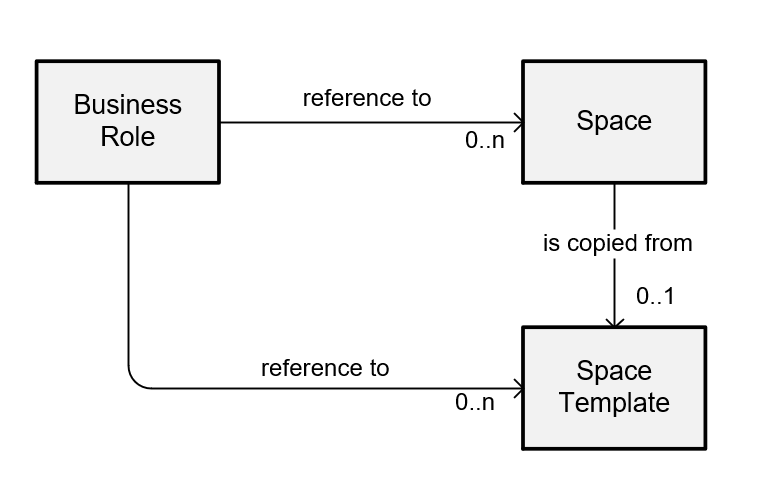

<!-- loio1d9deef79d7d4936850b2d6343206ec8 -->

# SAP Fiori Applications in the ABAP Environment

When you plan to create an SAP Fiori application in the ABAP environment and want to provide this application to business users, you may want to get a better understanding of the required steps before getting started with the UI development.

<a name="loio1d9deef79d7d4936850b2d6343206ec8__section_o4c_g1n_ktb"/>

## Implementing and Deploying the UI

To generate an SAP Fiori application for an OData service, you can use the Fiori Tools application generator in SAP Business Application Studio or Visual Studio Code. When generating the application, you can browse the available OData services for UI development. As part of the application implementation, you can define the tile of the application, and run the application in preview mode. The tile information is stored in the `manifest.json` file of the application.

To deploy the SAP Fiori application, you have to create a deployment configuration and provide the target package and transport request. When deploying the application to the After you have deployed the SAP Fiori application, you need to create an IAM app and assign the automatically created SAP Fiori launchpad app descriptor item to the IAM app. Furthermore, you need to create an IAM business catalog and assign the IAM app to the business catalog. SAPUI5 ABAP repository in the ABAP environment, the following objects are automatically created:

-   A business server page \(BSP\) application, which stores the code of the SAP Fiori application
-   An SAP Fiori launchpad app descriptor item, which contains the tile and cross navigation inbound/intent navigation for the SAP Fiori launchpad integration
-   A folder in the MIME repository, which stores all MIME objects, such as graphics, icons, of the app
-   A node in the Internet Communication Framework \(ICF\), which enables clients \(browser\) to access the code stored in the BSP application

The SAP Fiori launchpad app descriptor item is created from the `manifest.json` file of the SAPUI5After you have deployed the SAP Fiori application, you need to create an IAM app and app, where you also have configured the tile and navigation parameters are configured. The app descriptor item is created upon deployment if you have defined the intent navigation in the `manifest.json` file. If you change the ID of the intent, existing references from the SAP Fiori launchpad to the tile break.

You can find the BSP application and the SAP Fiori launchpad app descriptor item stored as objects in your deployment package in ABAP Development Tools for Eclipse. The folder in the MIME repository and the node in the ICF are not available in ABAP Development Tools but are listed in the transport request. Alternatively, you can use CDS view `I_CustABAPObjDirectoryEntry`.

The SAP Fiori UI is deployed in ABAP language version `ABAP for Cloud Development`, which restricts access to data sources: Data sources must be released for system-internal use in cloud development or must be in the same software component.

> ### Restriction:  
> Only OData services from your custom service binding are supported.
> 
> API services on [SAP API Business Hub](http://api.sap.com) are not supported. They are released for external consumption only.

To discover the available OData services or run the application in preview mode, business catalog `SAP_CORE_BC_EXT_TST` has to be assigned to you. To deploy the application, business catalog `SAP_A4C_BC_DEV_UID_PC` needs to be assigned to you. Both business catalogs are contained in business role template `SAP_BR_DEVELOPER`.

<a name="loio1d9deef79d7d4936850b2d6343206ec8__section_izl_sfn_ktb"/>

## Enabling Access to Business Users

When you publish the IAM business catalog, a corresponding SAP Fiori business catalog is generated by the system. The IAM business catalog enables access to the SAP Fiori application.

Additionally, you can create a space template and a page template referring to the SAP Fiori launchpad app descriptor item and maintain a business role template to have a streamlined process for an administrator of setting up Business Roles by providing predefined roles with predefined layouts. This saves time and effort for an administrator but still allows for a more tailored user experience.

While the IAM business catalog defines the access to the apps, the space and page template determine which apps are visible for the users on the Fiori Launchpad. The business role template combines the IAM business catalogs and pace templates that are typically needed for such a role.

### Scoping

Fiori space and page templates are not visible in the development system by default and therefore cannot be used. To use them in the development system, you need to programmatically scope them. See [Scoping Space and Page Templates](scoping-space-and-page-templates-74d5b1a.md) for more details about scoping. In non-development systems the space and page templates are scoped automatically during import into the system.

After the page and space template are scoped, they are visible as predefined spaces and pages in the [Manage Launchpad Spaces](https://help.sap.com/docs/btp/user-interface-configurations/manage-launchpad-spaces?version=Cloud) and [Manage Launchpad Pages](https://help.sap.com/docs/btp/user-interface-configurations/manage-launchpad-pages?version=Cloud) apps.

### Preview

As a developer you can launch the preview of the page template in the Manage Launchpad Pages app from the ADT \(ABAP Development Tools for Eclipse\) editor. To preview the created page template, you need authorization for the [Manage Launchpad Pages](https://help.sap.com/docs/btp/user-interface-configurations/manage-launchpad-pages?version=Cloud) app.

### 

> ### Restriction:  
> Creation of Space Templates and Page Templates
> 
> Space templates can’t be merged with other space templates directly. To merge a space template with another space template, one of the templates must be copied to create a space first.
> 
> When you want to merge one or more customer-created spaces with a predefined space \(e.g. delivered by SAP\) or a template, open the general details for the customer-created space, then enter the space ID of the predefined space or template in the field Merge ID. The same is true for the merging of page templates.

<a name="loio1d9deef79d7d4936850b2d6343206ec8__section_nkd_gfd_bbc"/>

## Translation

*Maintain Translations*

When it comes to managing translation, there are basically two areas: Texts from the ABAP development objects and texts from the SAP Fiori application, e.g., texts for the IAM app or IAM business catalog. Texts from the SAP Fiori application are usually defined in i18n \(internationalization\) property files, e.g. the texts for the tile used in the *manifest.json*.

To handle texts from the ABAP development objects, you use the[Maintain Translations App](https://help.sap.com/docs/btp/sap-business-technology-platform/maintain-translations?version=Cloud). This application provides a user-friendly interface for managing translations within the ABAP environment. It allows you to easily maintain and update translations used in ABAP development objects.

For non-ABAP based texts, such as those found in the SAP Fiori application, a different approach is needed. In this case, you need to follow the Fiori translation process. Please refer to [Translate Texts in SAP Fiori](https://help.sap.com/docs/SAP_FIORI_OVERVIEW/a1482918da994432859015bf1a083d9b/1a165cd7eb15425ab2a62b86625c3ef2.html) for more details.

<a name="loio1d9deef79d7d4936850b2d6343206ec8__section_qn2_2gd_bbc"/>

## Providing Access to Business Users

You as an administrator create a [business role](https://help.sap.com/docs/btp/sap-business-technology-platform/maintain-business-roles-new-preview?version=Cloud), so that the application appears in the SAP Fiori Launchpad for [business users](https://help.sap.com/docs/btp/sap-business-technology-platform/maintain-business-users?version=Cloud) that are assigned to the business role. Using role templates as well as predefined space and page templates simplifies the process for an administrator of setting up business roles.

To make an SAP Fiori application accessible on the SAP Fiori launchpad home page of business users, you must perform the following steps:

-   Create a business role and assign at least one [business catalog](https://help.sap.com/docs/btp/sap-business-technology-platform/iam-business-catalogs?version=Cloud) to the role. The business role controls the access to your applications. The business catalog contains the actual authorizations that allow users to access apps.

-   You can either assign a predefined space \(space template\) to the [business role](https://help.sap.com/docs/btp/sap-business-technology-platform/maintain-business-roles-new-preview?version=Cloud), copy an existing one, or create a new launchpad space and page and then add apps to the page. The space and page control the layout of the Fiori launchpad. More information and tips on creating and handling spaces and pages can be found in [Best Practices for Managing Spaces and Pages](https://help.sap.com/docs/btp/user-interface-configurations/best-practices-for-managing-spaces-and-pages?version=Cloud).

    

    -   The space and page need to be recorded on a customizing request. See [Export Customizing Transports](https://help.sap.com/docs/btp/sap-business-technology-platform/export-customizing-transports?version=Cloud)for more details on how to use it.

-   You can also create a business role from a business role template and adapt the business role to your needs.

-   If you are using a group-based layout in the SAP Fiori launchpad, you must enable SAP Fiori launchpad spaces in the Manage Launchpad Settings app.

    -   Enable spaces in the [Manage Launchpad Settings app](https://help.sap.com/docs/btp/user-interface-configurations/manage-launchpad-settings?version=Cloud).

        > ### Note:  
        > This is a one-time effort.

Business users that are assigned to the [business role](https://help.sap.com/docs/sap-btp-abap-environment/abap-environment/business-role-templates?q=Role%20Templates&version=Cloud) can now access the app.

**Related Information**  

[Develop an SAP Fiori Application UI and Deploy it to ABAP Using SAP Business Application Studio](develop-an-sap-fiori-application-ui-and-deploy-it-to-abap-using-sap-business-application-eaaeba4.md "Get an overview about how to create and deploy an SAP Fiori application to ABAP using SAP Business Application Studio.")

