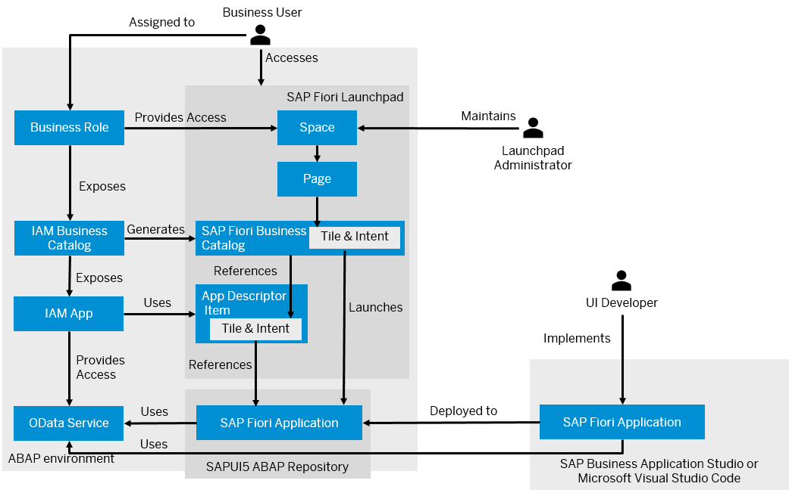

<!-- loio1d9deef79d7d4936850b2d6343206ec8 -->

# SAP Fiori Applications in the ABAP Environment

When you plan to create an SAP Fiori application in the ABAP environment and want to provide this application to business users, you may want to get a better understanding of the required steps before getting started with the UI development.

<a name="loio1d9deef79d7d4936850b2d6343206ec8__section_o4c_g1n_ktb"/>

## Implementing and Deploying the UI

To generate an SAP Fiori application for an OData service, you can use the Fiori Tools application generator in SAP Business Application Studio or Visual Studio Code. When generating the application, you can browse the available OData services for UI development. As part of the application implementation, you can define the tile of the application, and run the application in preview mode. The tile information is stored in the `manifest.json` file of the application.

To deploy the SAP Fiori application, you have to create a deployment configuration and provide the target package and transport request. When deploying the application to the SAPUI5 ABAP repository in the ABAP environment, the following objects are automatically created:

-   A business server page \(BSP\) application, which stores the code of the SAP Fiori application
-   An SAP Fiori launchpad app descriptor item, which contains the tile and cross navigation inbound/intent navigation for the SAP Fiori launchpad integration
-   A folder in the MIME repository, which stores all MIME objects, such as graphics, icons, of the app
-   A node in the Internet Communication Framework \(ICF\), which enables clients \(browser\) to access the code stored in the BSP application

The SAP Fiori launchpad app descriptor item is created from the `manifest.json` file of the SAPUI5 app, where you also have configured the tile and navigation parameters are configured. The app descriptor item is created upon deployment if you have defined the intent navigation in the `manifest.json` file. Note that only one intent navigation consisting of a semantic object and action is supported. If you change the ID of the intent, existing references from the SAP Fiori launchpad to the tile break.

You can find the BSP application and the SAP Fiori launchpad app descriptor item stored as objects in your deployment package in ABAP Development Tools for Eclipse. The folder in the MIME repository and the node in the ICF are not available in ABAP Development Tools but are listed in the transport request. Alternatively, you can use CDS view `I_CustABAPObjDirectoryEntry`.

The SAP Fiori UI is deployed in ABAP language version `ABAP for Cloud Development`, which restricts access to data sources: Data sources must be released for system-internal use in cloud development or must be in the same software component.

To discover the available OData services or run the application in preview mode, business catalog `SAP_CORE_BC_EXT_TST` has to be assigned to you. To deploy the application, business catalog `SAP_A4C_BC_DEV_UID_PC` needs to be assigned to you. Both business catalogs are contained in business role template `SAP_BR_DEVELOPER`.

<a name="loio1d9deef79d7d4936850b2d6343206ec8__section_izl_sfn_ktb"/>

## Providing Access to Business Users

After you have deployed the SAP Fiori application, you have to create an IAM app, IAM business catalog, and business role to make your application consumable for business users. This also requires adding the business service for which you’ve created your UI to the IAM app and assigning the automatically created SAP Fiori launchpad app descriptor item to the IAM app. When you publish the IAM app and IAM business catalog, a corresponding SAP Fiori business catalog is generated by the system. Business users that are assigned to the business role and catalog can now access the app. See [Providing Access to the SAP Fiori Application](https://help.sap.com/docs/BTP/65de2977205c403bbc107264b8eccf4b/b569abb158934306a65f3eb38f86ffba.html).

> ### Note:  
> The SAP Fiori app is not yet available on the home page, which means that business users can only access it by using the [app finder](https://help.sap.com/docs/BTP/fd8f9fda63fa4c7a92bb1d4b4ac5582c/48a5dbb0308b47d8969485845d5966ae.html?version=Cloud).

<a name="loio1d9deef79d7d4936850b2d6343206ec8__section_krv_33n_ktb"/>

## Integrating the SAP Fiori App into SAP Fiori launchpad

To make an SAP Fiori application accessible on the SAP Fiori launchpad home page of business users, you have to log on to the system as an administrator and perform the following steps:

-   Enable spaces.

    > ### Note:  
    > This is a one-time effort.

-   Create a launchpad space and page, and add the app. See [Adding Apps to a Page](https://help.sap.com/docs/BTP/fd8f9fda63fa4c7a92bb1d4b4ac5582c/57cbbebee44e4f019e807c208ec6ea2e.html?version=Cloud).

    > ### Note:  
    > The space and page need to be recorded on a customizing request.

-   Assign the launchpad space to the business role you have created earlier. For users that are assigned to the business role and catalog, the space, page, and tile are displayed on the home page so that they can launch the application.

> ### Restriction:  
> You can't assign the tile to a group in SAP Fiori launchpad.

**Related Information**  

[Develop an SAP Fiori Application UI and Deploy it to ABAP Using SAP Business Application Studio](develop-an-sap-fiori-application-ui-and-deploy-it-to-abap-using-sap-business-application-eaaeba4.md "Get an overview on how to create and deploy an SAP Fiori application to ABAP using SAP Business Application Studio.")

