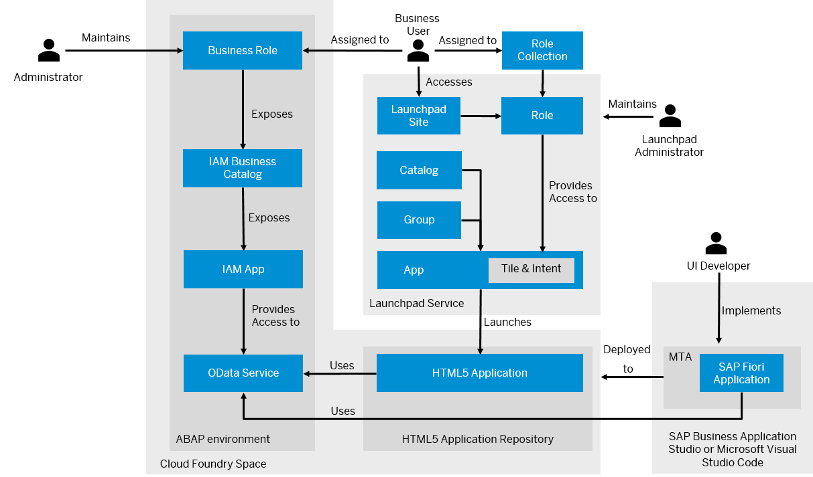

<!-- loioc954634cd3a94f83a3aab9593b9a0bbe -->

# SAP Fiori Applications in the Cloud Foundry Environment

When you plan to create an SAP Fiori application that you have deployed to the SAP BTP, Cloud Foundry environment and want to provide this application to business users, you may want to get a better understanding of the required steps before getting started with the UI development.

> ### Recommendation:  
> We recommend using the same UI5 version that is being used by the ABAP environment system.
> 
> To check the UI5 version in the SAP Fiori launchpad of your ABAP environment system, use command ***Alt+Ctrl+Shift+P*** or navigate to the user actions menu and select *About*. See [User Actions Menu](https://help.sap.com/docs/btp/sap-fiori-launchpad-for-sap-btp-abap-environment/user-actions-menu?version=Cloud).

<a name="loioc954634cd3a94f83a3aab9593b9a0bbe__section_oph_cgp_ktb"/>

## Implementing and Deploying the UI

To develop an SAP Fiori application, you can create a multitarget application using the Fiori Tools application router generator, where we recommended using the SAP-managed approuter. See [Application Router](https://help.sap.com/docs/BTP/65de2977205c403bbc107264b8eccf4b/01c5f9ba7d6847aaaf069d153b981b51.html) and [Developing HTML5 Applications and Extensions](https://help.sap.com/docs/Portal_Service/ad4b9f0b14b0458cad9bd27bf435637d/c1b9d6facfc942e3bca664ae06387e9b.html).

Afterwards, you can start creating your SAP Fiori application using the Fiori Tools application generator and add it to the multitarget application \(MTA\). When generating the application, you can browse the available OData services for UI development. The application generation process also includes adding information for the SAP Fiori app tile in the SAP Fiori launchpad, such as a title, action, and semantic object. This information has to be defined in the project attributes of your MTA by adding an FLP configuration. Your configuration is then stored in the `manifest.json` file. Note that only one intent navigation consisting of a semantic object and action is supported. If you change the ID of the intent, existing references from the SAP Fiori launchpad to the tile break.

You can integrate the OData service of your ABAP environment into the application by specifying a corresponding route in the `xs-app.json` file. The routing can be done either by providing a destination that points to the ABAP environment instance or by specifying the service endpoint of the ABAP environment and binding the service instance. See [Configure Destinations](https://help.sap.com/docs/Portal_Service/ad4b9f0b14b0458cad9bd27bf435637d/fab4035652cb4fc48503c65dc841d335.html) and [Binding Service Instances to Applications](https://help.sap.com/docs/BTP/65de2977205c403bbc107264b8eccf4b/e98280a71f17413088f8a10838a1e4cc.html). The Fiori application generator adds a route to the `xs-app.json` file using the destination that you specify in the generator.

> ### Note:  
> If you have used the Fiori Tools application generator to create your app, you have selected a destination that points to your development subaccount. Make sure that the destination in your target subaccount has the same name as the one maintained in the `xs-app.json` file.

The next step is to build the MTA project. This generates an `*.mtar` file and `mta_archives` folder.

Before deploying your UI, you should preview your application. To preview your application or discover available OData services, business catalog `SAP_CORE_BC_EXT_TST` has to be assigned to your user, which allows you to preview your application and . See [Business Catalogs for Development Tasks](../50-administration-and-ops/business-catalogs-for-development-tasks-a9f4278.md).

The final step is to create a deployment configuration and deploy the MTA to your SAP BTP, Cloud Foundry environment space, which requires the [space developer role](https://help.sap.com/docs/BTP/65de2977205c403bbc107264b8eccf4b/967fc4e2b1314cf7afc7d7043b53e566.html?version=Cloud). By doing so, the SAP Fiori application that you have added to the MTA gets deployed to the HTML5 application repository.

<a name="loioc954634cd3a94f83a3aab9593b9a0bbe__section_qp1_vlw_ktb"/>

## Providing Access to Business Users

After you have deployed the SAP Fiori application, you have to create an IAM app to make your application consumable for business users. This requires assigning the business service to the IAM app. Additionally, you have to use SAP Build Work Zone, standard edition and log on as an administrator to create a role. A corresponding role collection is automatically created in the SAP BTP cockpit. This allows you to assign business users to the role collection in the SAP BTP cockpit. Being assigned to the role collection, business users can access the launchpad site and the app.

<a name="loioc954634cd3a94f83a3aab9593b9a0bbe__section_jrx_r2d_ltb"/>

## Integrating the SAP Fiori App into SAP Fiori launchpad

To make an SAP Fiori application accessible on the SAP Fiori launchpad home page of business users, you have to assign your app to a group and catalog. See [Assign Apps to a Group and to a Catalog](https://help.sap.com/docs/Launchpad_Service/8c8e1958338140699bd4811b37b82ece/6f60d52c7ebc4b698817d6dd45cb5899.html). Afterwards, you need to add content to the HTML5 apps content provider in SAP Build Work Zone, standard edition. The HTML5 apps provider reflects all the HTML5 apps that are deployed to the HTML5 app repository that is assigned to the subaccount. See [HTML5 Apps Content Provider](https://help.sap.com/docs/Launchpad_Service/8c8e1958338140699bd4811b37b82ece/ad2103e2fde342878bcf41a8ae8a0bd8.html) and [Integrate Apps and Shell Plugins](https://help.sap.com/docs/Launchpad_Service/8c8e1958338140699bd4811b37b82ece/60a0b39b56924da9b96b3a83ec9f0942.html).

**Related Information**  

[Develop an SAP Fiori Application and Deploy it to Cloud Foundry Using SAP Business Application Studio](develop-an-sap-fiori-application-and-deploy-it-to-cloud-foundry-using-sap-business-applic-2498cbf.md "Get an overview about how to create and deploy an SAP Fiori application to Cloud Foundry using SAP Business Application Studio.")

[Develop an SAP Fiori Application and Deploy it to Cloud Foundry Using Visual Studio Code](develop-an-sap-fiori-application-and-deploy-it-to-cloud-foundry-using-visual-studio-code-a064640.md "Get an overview about how to create and deploy an SAP Fiori application to Cloud Foundry using Visual Studio Code (VS Code).")

