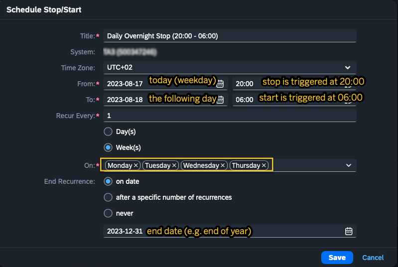
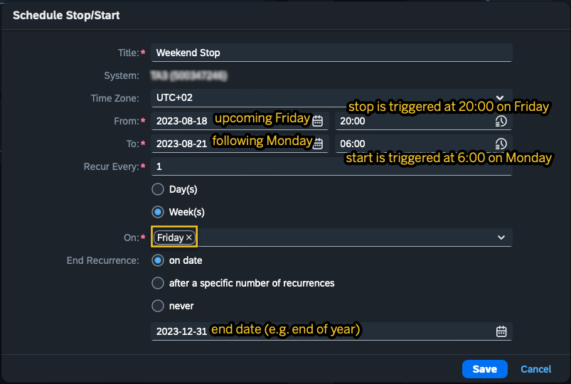
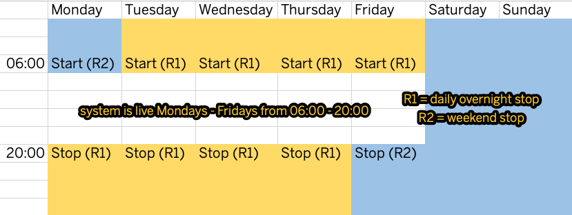
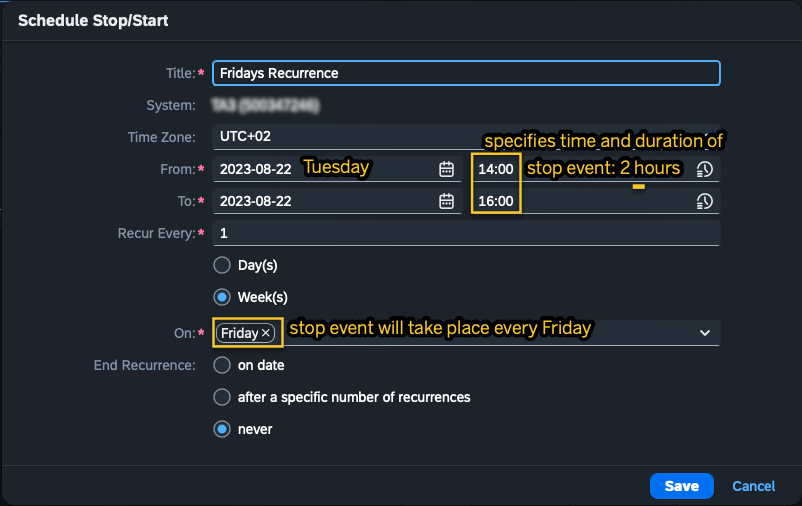

<!-- loio04053ddc096f4becb1be45355da2f70f -->

# Schedule a \(Recurring\) Stop/Start

You want put a system into hibernation at a specific time, choosing at what time it will be stopped, and when it will be started again. This planned hibernation can be scheduled to happen once, or it can be set up to recur regularly, e.g. on a daily or weekly basis. Here’s how to schedule a planned or recurring stop \(= recurrence\).

> ### Note:  
> Note that it is not possible to schedule recurrences for free-tier systems.

1.  Log into the *Landscape Portal*.
2.  In the *Systems* section, click on the*Manage System Hibernation* tile to open the app.
3.  On the left side, under *Systems*, you can see a list of all your systems, as well as their current status \(*Live* or *Stopped*\). *Live* systems are currently active, *Stopped* systems are in hibernation. Select one or more systems for which you want to schedule a planned stop, then click*Schedule Stop/Start* at the top.
4.  Fill in the information in the pop-up window, then click *Save*.
5.  Your scheduled stop will be added under *Scheduled Stops/Starts*. Click the arrow on the left to expand the panel and view more information on it.
6.  \(Optional\) You can delete a planned stop by clicking the respective icon to the right of it. This can be done as soon as the planned stop is active \(a few minutes after its creation\).

<a name="loio04053ddc096f4becb1be45355da2f70f__section_pf4_l3g_myb"/>

## Example 1

Let’s say you want a system to only be live from 6:00 to 20:00 on Mondays through Fridays. It should be stopped outside of working hours as well as on the weekends.

Here’s how you can set up this scenario in the app:

Create two recurrences. Recurrence 1 stops the system on weekdays over night \(from 20:00 to 6:00\). Recurrence 2 stops the system on the weekends \(from Friday night 20:00 until Monday morning 06:00\).

*Settings for Reccurence 1*:

Starting today, the system will stop over night from Mondays to Fridays until the end of the year. Now let’s set the recurrence for the weekend stops.

*Settings for Reccurence 2*:

With this recurrence, the system will stop every Friday night until Monday morning.

The two recurrences \(R1: daily overnight stop in purple; R2: weekend stop in green\) will make sure your system is only live from Mondays through Fridays from 06:00 to 20:00.

> ### Note:  
> Note that the end time you select \(06:00 in our example\) specifies when the system \(re\)start will be triggered. It might take a few minutes for the system to be available again.

<a name="loio04053ddc096f4becb1be45355da2f70f__section_yly_4tl_4yb"/>

## Example 2

Keep in mind that the date you specify in the *From* field is the start date of your scheduled recurrence but not necessarily the start of your stop event: If you schedule a stop/start that recurs on a weekly basis, the day of the week you specify in the *On* field determines the start date of your system stop.

Let's look at an example.

If you enter the following settings, the system stop will not be triggered on August 22nd \(a Tuesday\) , but on the first Friday after this date \(August 25th\) and every following Friday. The stop will be triggered on Fridays at 14:00 and the start will be triggered two hours later, at 16:00.

