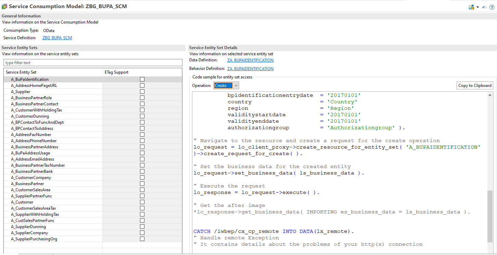

<!-- loioed5d88ea66ce439398c37fe3dfc2cfd5 -->

# Service Consumption Model

You want to consume an OData request remotely/asynchronously using the Client Proxy. As preparation, you need to create a Service Consumption Model for the OData Service you want to consume.

<a name="loioed5d88ea66ce439398c37fe3dfc2cfd5__section_yxd_y1d_vtb"/>

## Overview

For an introduction about the Client Proxy, please refer to the corresponding chapter.

<a name="loioed5d88ea66ce439398c37fe3dfc2cfd5__section_e4n_1bd_vtb"/>

## How-To \(Creating a Service Consumption Model\)

### Overview

Similar to an OData request that needs an underlying OData model, a \(remote\) Client Proxy request needs a corresponding Service Consumption Model.

The advantages of using a Service Consumption Model \(instead of manually creating a corresponding model\) are:

-   Simple creation via XML- or EDMX-file uploading; no need for manual model definition

-   Code generator created code snippets as blueprint on how to write Client Proxy related coding:

### Example

You want to create a Service Consumption Model for remote consumption of your OData service. You already have the metadata of the corresponding OData service you want to consume stored as XML or EDMX file. Below you find a step-by-step description on how to define your Service Consumption Model.

### Step-by-step

Please see [Generating Proxies for Remote OData Service](https://help.sap.com/viewer/25cf71e63940453397a32dc2b7676947/2111.500/en-US/aa3a88a28694471d8c90623dc32ceabe.html) for a step-by-step description on how to create your Service Consumption Model.

<a name="loioed5d88ea66ce439398c37fe3dfc2cfd5__section_jkb_wkd_vtb"/>

## Constraints

-   Not all features available for an OData service models are supported for Service Consumption Models, i.e. a Service Consumption Model might not be creatable for your underlying OData service. This is the case if your Service Model contains e.g. Complex Collections, Actions or Functions.

