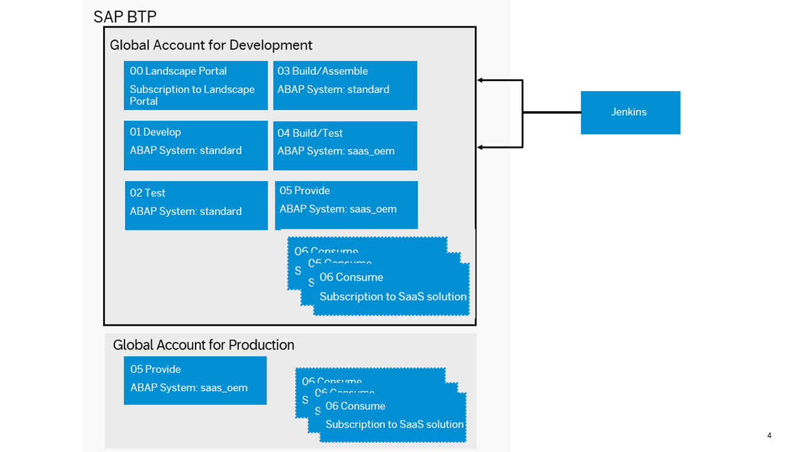

<!-- loio9f2150f2b15e414aacd46c1723ce48fb -->

# Set Up a Global Account for Development

As a SaaS solution operator, you have to configure the global account for development \(used for development, testing, and demo purposes\).

> ### Recommendation:  
> We recommend the following subaccount structure:
> 
> -   In the *00 Landscape Portal* subaccount, your subscription to the Landscape Portal is created. If required, the CI/CD service should also be subscribed in this subaccount. No Cloud Foundry environment is required.
> 
> -   In the *01 Develop* subaccount, add-on development is performed in a permanent development system. See [Development in the ABAP Environment](development-in-the-abap-environment-31367ef.md).
> -   In the *02 Test* subaccount, the developed software components are tested after a successful import into a permanent test system.
> -   In the *03 Build/Assemble* subaccount, the add-on package assembly is performed in a transient assembly system that is created and deleted automatically by the build pipeline.
> -   In the *04 Build/Test* subaccount, the add-on product is installed and tested again.
> -   In the *05 Provide* subaccount, the add-on product is provided as a SaaS solution for testing purposes in the development phase.

> ### Note:  
> You can use a booster \(see [Booster for Landscape Portal](booster-for-landscape-portal-8d34e0f.md)\) to automatically perform the setup of subaccounts 00 Landscape Portal, 03 Build/Assemble and 04 Build/Test. This includes the assignment of entitlements, creation of subscriptions and trust setup as described below.

> ### Note:  
> If you use gCTS instead of add-ons for delivering software components to production systems, the setup and usage of the following subaccounts is redundant:
> 
> -   *03 Build/Assemble* \(used for the add-on assembly\)
> -   *04 Build/Test* \(used for add-on installation test\)
> 
> Additionally, considering the availability of software components only in the same global accounts, you have to create the production systems as well as development and test systems in the same global account \(only one global account is used\).
> 
> In the provider subaccount, the entitlement for an ABAP instance of service plan type `abap/standard` instead of `abap/saas_oem` needs to be available.
> 
> See [Delivery via Add-On or gCTS](delivery-via-add-on-or-gcts-438d7eb.md).

You should configure a Cloud Foundry space in each subaccount. Dividing the development, testing, and assembling activities into different subaccounts allows for maximum flexibility. For instance, you may want to use different identity providers or consume different connectivity services during testing and development.

The ABAP systems that you use for development, testing, and add-on assembly are of type `abap/standard` and made available via entitlements. ABAP systems for add-on installation are of type `abap/saas_oem`. These service entitlements must be assigned by an administrator to different subaccounts, according to the following structure:

<table>
<tr>
<th valign="top">

Global Account

</th>
<th valign="top">

Subaccount

</th>
<th valign="top">

Space

</th>
<th valign="top">

Services

</th>
</tr>
<tr>
<td valign="top" rowspan="5">

Global Account for Development

</td>
<td valign="top">

01 Develop

</td>
<td valign="top">

Develop

</td>
<td valign="top">

1x abap/standard

abap/hana\_compute\_unit \(standard: 2\)

abap/abap\_compute\_unit \(standard: 1\)

</td>
</tr>
<tr>
<td valign="top">

02 Test

</td>
<td valign="top">

Test

</td>
<td valign="top">

1x abap/standard

abap/hana\_compute\_unit \(standard: 2\)

abap/abap\_compute\_unit \(standard: 1\)

</td>
</tr>
<tr>
<td valign="top">

03 Build/Assemble

</td>
<td valign="top">

Build/Assemble

</td>
<td valign="top">

1x abap/standard

abap/hana\_compute\_unit \(standard: 2\)

abap/abap\_compute\_unit \(standard: 1\)

</td>
</tr>
<tr>
<td valign="top">

04 Build/Test

</td>
<td valign="top">

Build/Test

</td>
<td valign="top">

1x abap/saas\_oem

abap/hana\_compute\_unit \(standard: 2\)

abap/abap\_compute\_unit \(standard: 1\)

</td>
</tr>
<tr>
<td valign="top">

05 Provide

</td>
<td valign="top">

Provide

</td>
<td valign="top">

1x abap/saas\_oem

abap/hana\_compute\_unit \(standard: 2\)

abap/abap\_compute\_unit \(standard: 1\)

Application Runtime

abap-solution

saas-registry

xsuaa

</td>
</tr>
</table>

Additionally, the following entitlements for SaaS application subscriptions are required:

-   SAP Business Application Studio for UI development. See [SAP Business Application Studio](sap-business-application-studio-c736960.md).
-   Web access for ABAP for access to systems during development phase. See [Subscribing to the Web Access for ABAP](../20-getting-started/subscribing-to-the-web-access-for-abap-98928b0.md).
-   Landscape Portal to manage systems and tenants in the provider subaccount. See [Landscape Portal](https://help.sap.com/docs/help/d91c4152c3d74c12bc9bd4ed92681902/6aa0a773510e4c82b167fcca4c755327.html).

If you want to integrate an existing corporate identity provider in the subaccounts of the global account for development for authentication/authorization, see [Trust and Federation with Identity Providers](../50-administration-and-ops/trust-and-federation-with-identity-providers-cb1bc8f.md). To restrict access based on certain criteria such as the IP address, you need to use the [SAP Cloud Identity Services - Identity Authentication](https://help.sap.com/viewer/6d6d63354d1242d185ab4830fc04feb1/Cloud/en-US/d17a116432d24470930ebea41977a888.html).

> ### Tip:  
> For in-depth information about the system landscape/account model, check out [System Landscape/Account Model](system-landscape-account-model-4ca7563.md).

