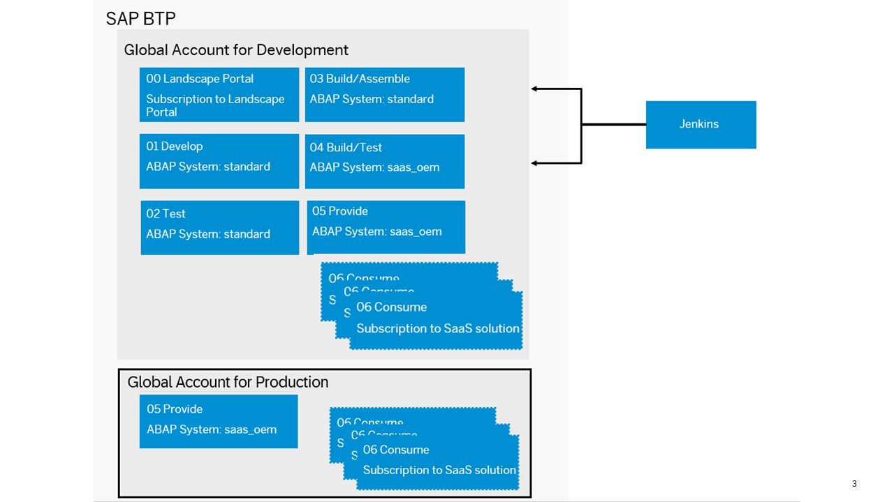

<!-- loio2e7b4b631e814de1b8fe3959af4105bc -->

# Set Up a Global Account for Production

As a SaaS solution operator, you have to configure the global account for production.

> ### Recommendation:  
> We recommend the following subaccount structure:
> 
> In the *00 Landscape Portal* subaccount, your subscription to the Landscape Portal is created. If required, the CI/CD service should also be subscribed in this subaccount. No Cloud Foundry environment is required.
> 
> In the *05 Provide* subaccount, the add-on product is provided as a SaaS solution for production purposes in the production phase. The solution is consumed by your customers from consumer subaccounts.

In the provider context, the `ABAP environment (saas_oem)` service plan is used.

> ### Note:  
> In the provider subaccount, the entitlement for an ABAP instance of service plan type `abap/standard` needs to be available.
> 
> Additionally, considering the availability of software components only in the same global accounts, you have to create the production systems as well as development and test systems in the same global account.
> 
> See [Delivery via Add-On or gCTS](delivery-via-add-on-or-gcts-438d7eb.md).

These provider ABAP instances allow flexible sizing, multitenancy, and the possibility to install an add-on product during provisioning.

For the provisioning of these ABAP systems of service plan `saas_oem`, another set of services comes into play: With the ABAP Solution Provider and the saas-registry service, you can provide your add-ons as SaaS solution offerings. See [ABAP Solution Service](abap-solution-service-1697387.md).

Note that these service entitlements must be assigned to different subaccounts, according to the following structure:

<table>
<tr>
<th valign="top">

Global Account

</th>
<th valign="top">

Subaccount

</th>
<th valign="top">

Space

</th>
<th valign="top">

Services

</th>
</tr>
<tr>
<td valign="top">

Global Account for Production

</td>
<td valign="top">

05 Provide

</td>
<td valign="top">

Provide

</td>
<td valign="top">

abap/saas\_oem

abap/hana\_compute\_unit \(standard: 4\)

abap/abap\_compute\_unit \(standard: 1\)

Application Runtime

abap-solution

saas-registry

xsuaa

</td>
</tr>
</table>

Additionally, the following entitlements for SaaS application subscriptions are required:

-   Web access for ABAP for access to systems during the development phase. See [Subscribing to the Web Access for ABAP](https://help.sap.com/docs/BTP/65de2977205c403bbc107264b8eccf4b/98928b0941294c74b946cdcefca9b047.html?version=Cloud).
-   Landscape Portal to manage systems and tenants in the provider subaccount. See [Landscape Portal](https://help.sap.com/docs/help/d91c4152c3d74c12bc9bd4ed92681902/6aa0a773510e4c82b167fcca4c755327.html).

If you want to integrate an existing corporate identity provider in the subaccounts of the global account for production for authentication/authorization, see [Trust and Federation with Identity Providers](../50-administration-and-ops/trust-and-federation-with-identity-providers-cb1bc8f.md). To restrict access based on certain criteria such as the IP address, you need to use the [SAP Cloud Identity Services - Identity Authentication](https://help.sap.com/viewer/6d6d63354d1242d185ab4830fc04feb1/Cloud/en-US/d17a116432d24470930ebea41977a888.html).

> ### Tip:  
> For in-depth information about the system landscape/account model, check out [System Landscape/Account Model](system-landscape-account-model-4ca7563.md).

