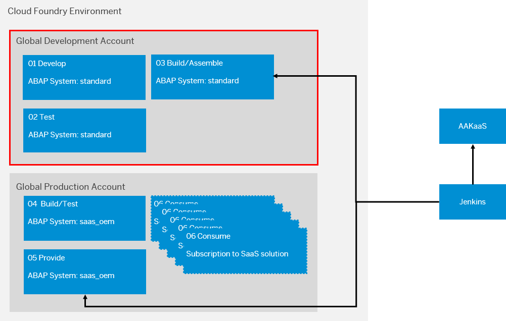

<!-- loio44035458f01e4142a18d44f9c0301e62 -->

# Set Up Maintenance System Landscape

Bug fixes aren’t implemented as part of the development code line, but in a separate correction code line. In this manner, corrections can be delivered to consumers even while regular development is ongoing.

We recommend setting up a maintenance system landscape that runs in parallel to the development system landscape. This maintenance landscape consists of:

-   A correction system COR where corrections are developed. This system is provisioned in subaccount *01 Develop* in the development space. Set parameter `is_development_allowed = true`.

-   A quality assurance system QAS for testing the corrections. This system is provisioned in subaccount *02 Test* in the test space. Set parameter `is_development_allowed = false`.

The required entitlements and system-related details are listed in the table below:

<table>
<tr>
<th valign="top">

Global Account

</th>
<th valign="top">

Subaccount

</th>
<th valign="top">

Space

</th>
<th valign="top">

Entitlements

</th>
<th valign="top">

ABAP System

</th>
</tr>
<tr>
<td valign="top" rowspan="2">

Global Account for Development

</td>
<td valign="top">

01 Develop

</td>
<td valign="top">

Develop

</td>
<td valign="top">

1x abap/standard

abap/hana\_compute\_unit \(standard: 2\)

abap/abap\_compute\_unit \(standard: 1\)

</td>
<td valign="top">

COR

</td>
</tr>
<tr>
<td valign="top">

02 Test

</td>
<td valign="top">

Test

</td>
<td valign="top">

1x abap/standard

abap/hana\_compute\_unit \(standard: 2\)

abap/abap\_compute\_unit \(standard: 1\)

</td>
<td valign="top">

QAS

</td>
</tr>
</table>

The Manage System Hibernation app in the Landscape Portal allows you to shut down the maintenance systems when no corrections are being developed, significantly reducing the costs incurred. See [Manage System Hibernation](https://help.sap.com/docs/btp/sap-business-technology-platform/manage-system-hibernation?version=Cloud). For more information on working with two codelines, see [Use Case 2: One Development and Correction Codeline in a 5-System Landscape](https://help.sap.com/docs/btp/sap-business-technology-platform/use-case-2-one-development-and-correction-codeline-in-5-system-landscape?version=Cloud).

It is not strictly necessary to set up a separate maintenance system landscape. You can also implement corrections in the existing development and test systems to further reduce costs. In this case, ongoing development must be stopped while the release branch is checked out and worked on. See [Use Case 1: One Codeline in a 3-System Landscape](https://help.sap.com/docs/btp/sap-business-technology-platform/use-case-1-one-codeline-in-3-system-landscape?version=Cloud).

