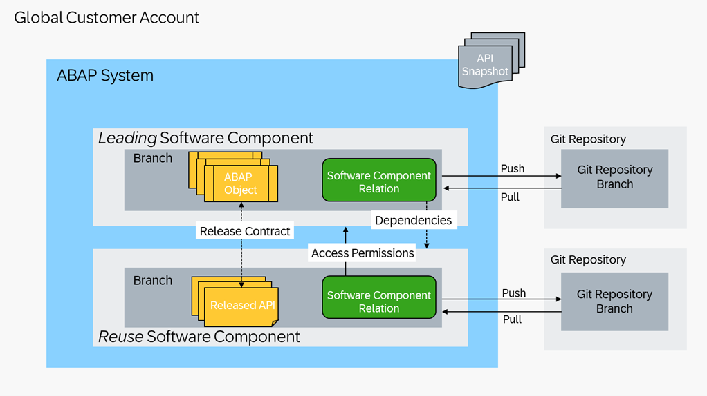

<!-- loio0e25ec4e3f644ac283e7268b71c55d6c -->

# Software Component Dependencies

The leading software component is the one that is dependent on objects in the reuse software component. To make sure that the software components are imported in the correct order, the reuse software component should be the first, whereas a leading software component would be the last in order.

Software component relations are one option to grant access permissions and to define dependencies for a whole software component.

<a name="loio0e25ec4e3f644ac283e7268b71c55d6c__section_hr4_1yy_w2c"/>

## Released APIs and Snapshots

Development objects come with an API state that can be set for a certain release contract. A released API will remain stable, with different consistency and stability criteria depending on the release contract. You will get a warning in ABAP development tools for Eclipse whenever an attempt is made to change an already released API.

Additionally, for some release contracts \(e.g. C1\) a visibility is defined which corresponds to a use in developer extensibility in an ABAP language version like ABAP for Cloud Development. For more information, see [Released APIs](https://help.sap.com/docs/abap-cloud/abap-development-tools-user-guide/released-apis).

In contrast to software component relations, release contracts are mostly used to guarantee the stability and consistency of an API. See [Providing Released APIs](https://help.sap.com/docs/abap-cloud/abap-development-tools-user-guide/providing-released-apis).

To detect and prevent incompatible changes in released APIs, corresponding API facades need to be extracted in a generated API snapshot. Refer to [Checking the Compatibility of released APIs](https://help.sap.com/docs/abap-cloud/abap-development-tools-user-guide/checking-compatibility-of-released-apis).

The ATC check `API_COMPATIBILITY` compares the current state of released APIs against this snapshot to find compatibility issues. An SAP default API snapshot will be created automatically whenever an API is released, but compatibility checks should be done against a check-relevant snapshot of the previous deliverable state of a software component. For the initial release of a software component no previous state exists, and therefore comparison against a snapshot is not possible.

This means that API snapshots should be used as “image” of a finalized delivery: Instead of frequently regenerating already existing snapshots, generate a snapshot once at the end of a release cycle and try to keep existing released APIs stable across the whole release cycle. The assumption here is that the APIs already released in a software component usually do not change over the course of a release. You may use the Notes feature of the Manage API Snapshots app to document any changes to the snapshots. For more information, see [Manage API Snapshots](https://help.sap.com/docs/btp/sap-business-technology-platform/manage-api-snapshots?version=Cloud).

> ### Note:  
> Usually, positive incompatible change findings should be removed. Use ATC exemptions to mitigate false-positive `API_COMPATIBILITY` check findings. In case you cannot identify an actual incompatible change in the corresponding development object, please contact the SAP support.
> 
> You may also create ATC exemptions to temporarily mitigate findings if they cannot be resolved in time for an urgent correction. Make sure to remove exemptions after finding a resolution. See [Working with ATC Exemptions](https://help.sap.com/docs/abap-cloud/abap-development-tools-user-guide/working-with-atc-exemptions). Although technically possible, regenerating or deleting API Snapshots should not be used as a mitigation for ATC findings. Instead, create an ATC exemption in this case.

The additional visibility in other software components that comes with certain release contracts is not targeted to a specific software component but rather bound to a certain ABAP language version.

> ### Note:  
> Do not create release contracts if you cannot guarantee the stability of the released APIs. For such cases you can use software component relations to access custom development objects across Cloud software components. For more information, see [Software Component Relations](https://help.sap.com/docs/abap-cloud/abap-development-tools-user-guide/software-component-relations). If on the other hand you release APIs in your software components, make sure to create API snapshots accordingly in your test and development systems.

<a name="loio0e25ec4e3f644ac283e7268b71c55d6c__section_uv4_pyy_w2c"/>

## Software Component Relations

With Software Component Relations you can define access permissions and specify the software components which are permitted to use content of a reuse software component. At the same time dependencies can be defined to specify whose content is used by a software component.

In contrast to using release contracts for cloud development, software component relations permit usage of APIs included in a software component from within a specific other component. No stability or consistency commitment is defined for the included APIs since only the software component relation with its access permissions is included in API snapshots. The API facades themselves are not included. Both the defined access permissions and dependencies target specific software components.

Undeclared dependencies can be detected using the `SCR_CONSISTENCY ATC` check and the incompatible removal of access permissions using `API_COMPATIBILITY`. For more information, see [Software Component Relations](https://help.sap.com/docs/abap-cloud/abap-development-tools-user-guide/software-component-relations) .

> ### Note:  
> If your solution consists of \(multiple\) leading and reuse software components, we strongly recommend to explicitly declare these dependencies. The leading software component is the one that does not have parent components, as opposed to a reuse software component, which has other software components depending on it.
> 
> When the software components are delivered as part of an add-on product, declaring software component dependencies is mandatory. The `SCR_CONSISTENCY` check is used implicitly during the [abapEnvironmentAssemblePackages](https://www.project-piper.io/steps/abapEnvironmentAssemblePackages/) step in the [Build](https://www.project-piper.io/pipelines/abapEnvironment/stages/build/) stage of the ABAP environment pipeline.

Software component relations can be created in cases where all software components are originating from the same development system. Additionally, access permissions can be granted to software components with a namespace that is registered as producer namespace in the development system. In case of other distributed development scenarios, you can use release contracts instead of access permissions.

