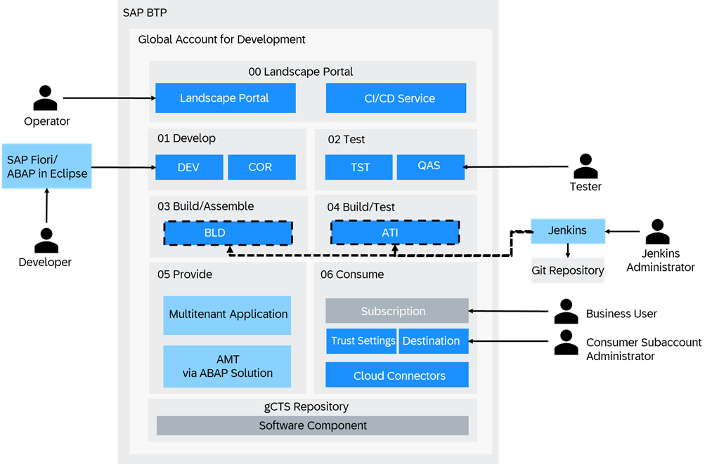
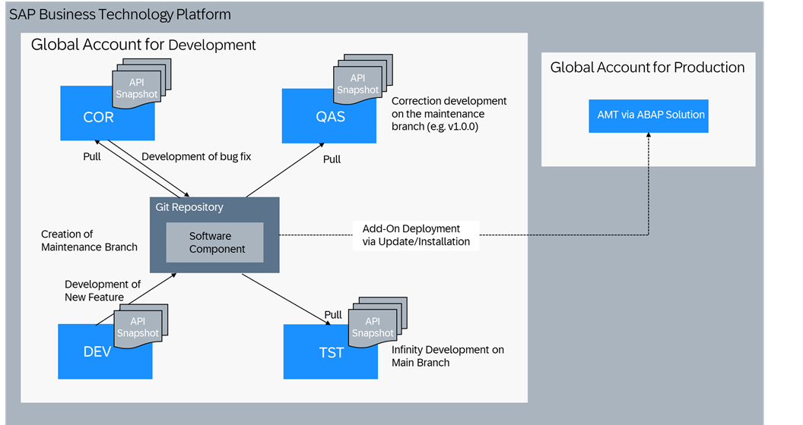
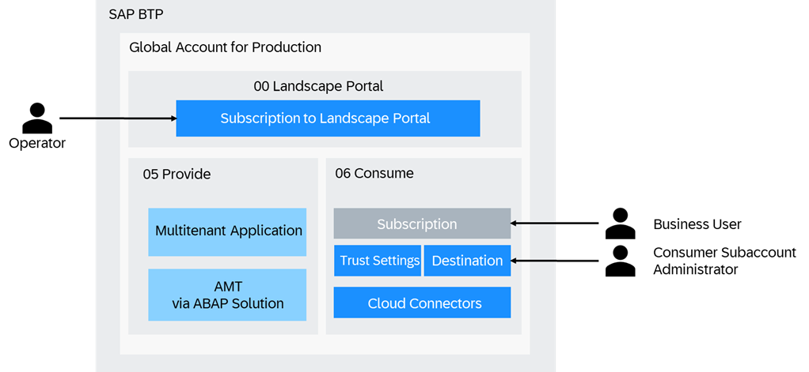
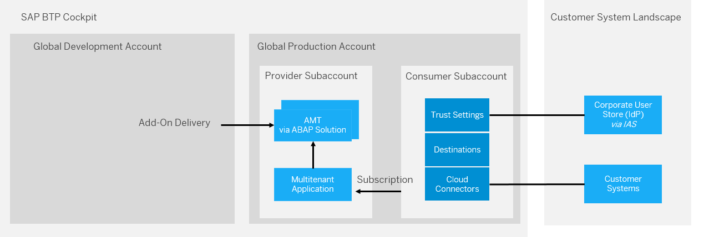

<!-- loio4ca756395fc24e56a42b77632a6bd862 -->

# System Landscape/Account Model

> ### Note:  
> If you use gCTS transport delivery instead of add-on delivery, no discounted development licenses are available: ABAP systems created for development purposes \(development, test, demo\) cost the same as ABAP systems created for production purposes. For creation on system AMT instead of `saas_oem`, the standard service plan is used since no add-on is installed.
> 
> Additionally, the same global account is used for development/production purposes because gCTS repositories are only available across the same global account.

ABAP systems for development and for production purposes are created based on different partner contracts and licenses.

Discounted development licenses can be used for development, test, and demo purposes.

> ### Note:  
> You have to acquire a development license for partners. See [SAP PartnerEdge Test, Demo & Development Price List](http://help.sap.com/disclaimer?site=https://partneredge.sap.com/en/library/assets/partnership/sales/order_license/pl_pl_part_price_list.html).

Production licenses are used whenever one of your customers is consuming the solution provided by you in one of your systems.

> ### Note:  
> You have to acquire a production license for partners. See [Resources for OEM Partners](http://help.sap.com/disclaimer?site=https://partneredge.sap.com/en/partnership/manage/op_resource/oem.html).

To separate development and production purposes, you have to create different global accounts:

-   **Global account for development**

    The global account for development is used for add-on/UI development and testing. Also, add-on assembly and add-on test installation triggered by the add-on build pipeline are performed in this global account.

    All ABAP systems created in this global account are used for development, test, or demo purposes.

-   **Global account for production**

    All ABAP systems created in this global account are used for production purposes. That means, the systems are used to provide the SaaS solution to your customers. Consumer subaccounts are also created in the global account for production.

> ### Recommendation:  
> We recommend creating subaccounts for the different stages of the SaaS solution enablement.
> 
> Using different subaccounts for the different phases has multiple advantages: Trust settings and destination/connectivity settings can be adjusted for each subaccount. That means, you can connect the development subaccount to the developer user identity provider and the test subaccount to the test user identity provider. In terms of connectivity, the development subaccount can be connected to the development on-premise system and the test subaccount can be connected to the test on-premise system.

<a name="loio4ca756395fc24e56a42b77632a6bd862__section_wtx_qvj_xnb"/>

## Global Account for Development

1.  **00 Landscape Portal**

    We recommend creating a dedicated subaccount for the Landscape Portal. This subaccount will contain your Landscape Portal & CI/CD service subscriptions for you to freely choose between regions for your other subaccounts.

2.  **01 Develop: Development subaccount including development space**

    ABAP development system DEV and correction system COR are created in this subaccount. You need to subscribe to SAP Business Application Studio to develop SAP Fiori UIs and implement multitenant applications. See [Setup of UI Development in SAP Business Application Studio](https://help.sap.com/products/BTP/65de2977205c403bbc107264b8eccf4b/37a896bfac604076ae825a1d37b0bd0a.html?version=Cloud).

3.  **02 Test: Test subaccount including test space**

    ABAP test system TST and quality assurance system QAS are created in this subaccount. See [Use Case 2: One Development and Correction Codeline in a 5-System Landscape](use-case-2-one-development-and-correction-codeline-in-a-5-system-landscape-4e53874.md). Since development is structured with software components that are stored in a repository for each global account, these software components can automatically be imported to the test system on a regular basis automated by the CI/CD server. See [\(Deprecated\) Test Integration \(SAP\_COM\_0510\)](deprecated-test-integration-sap-com-0510-b04a9ae.md). The CI/CD server uses a Git repository to read the pipeline definition and configuration.

4.  **03 Build/Assemble: Subaccount for add-on assembly including build/assemble space**

    > ### Note:  
    > The ABAP environment platform version of the assembly system is used to determine the minimum platform version for the add-on product version that is created.
    > 
    > Such a system should not be nominated for the pre-upgrade option of the ABAP environment because this would lead to the add-on product only being able to installed in systems with the pre-upgrade release. When using Build Product Version \(recommended\), the add-on definition is configured directly in the app.

    For the add-on build process, an assembly system BLD is provisioned in this subaccount by the CI/CD server. See [Software Assembly Integration \(SAP\_COM\_0582\)](software-assembly-integration-sap-com-0582-26b8df5.md) When using the Build Product Version app \(recommended\), the add-on definition is configured directly in the app.

5.  **04 Build/Test: Subaccount for add-on installation test including build/test space**

    After the add-on has been assembled during the build of an add-on version, an installation test is required to verify that the add-on can be installed without errors into a system. As part of the add-on build pipeline, an `abap/saas_oem` system ATI is provisioned in this subaccount and the add-on is installed. When using the Build Product Version app \(recommended\), the add-on definition is configured directly in the app.

6.  **05 Provide: Provider subaccount including provider space**

    During the development phase, the multitenant application is deployed to this space for testing purposes. The ABAP solution service can then provision `abap/saas_oem` systems AMT, tenants, and users in this account, once a consumer subscribes to the provided SaaS solution.

7.  **06 Consume: Consumer subaccount**

    To test the subscription to the SaaS solution during the development phase of the multitenant application, a consumer subaccount is created in the global account for development. This allows your consumers to have their own configuration of:

    -   Trust settings \(custom identity provider\)

        > ### Note:  
        > If you want to integrate an existing corporate identity provider for authentication/authorization in subaccounts of the global account for development, see [Trust and Federation with Identity Providers](https://help.sap.com/products/BTP/65de2977205c403bbc107264b8eccf4b/cb1bc8f1bd5c482e891063960d7acd78.html?version=Cloud). To restrict access based on certain criteria, such as the IP address, you need to use the Identity Authentication service. See [SAP Cloud Identity Services - Identity Authentication](https://help.sap.com/viewer/6d6d63354d1242d185ab4830fc04feb1/Cloud/en-US/d17a116432d24470930ebea41977a888.html).

    -   Connectivity via SAP Cloud Connector. See [Connectivity in the Cloud Foundry Environment](https://help.sap.com/viewer/cca91383641e40ffbe03bdc78f00f681/Cloud/en-US/34010ace6ac84574a4ad02f5055d3597.html).
    -   Destinations. See [Managing Destinations](https://help.sap.com/viewer/cca91383641e40ffbe03bdc78f00f681/Cloud/en-US/84e45e071c7646c88027fffc6a7bb787.html).
    -   Subscriptions

    > ### Note:  
    > You can use a booster \(see [Booster for Landscape Portal](booster-for-landscape-portal-8d34e0f.md)\) to automatically perform the setup of subaccounts 00 Landscape Portal, 03 Build/Assemble and 04 Build/Test.

### Development Flow

For development and maintenance processes, the steps mentioned below, that are similar to the ones described in [Use Case 2: One Development and Correction Codeline in a 5-System Landscape](use-case-2-one-development-and-correction-codeline-in-a-5-system-landscape-4e53874.md), are performed.

-   ABAP system COR and QAS have the same software state, unless a new change is tested and released. This means, transport requests are released in ABAP system DEV only if development is completed and it’s planned to import the changes to the production ABAP system.
-   Upon cutoff date, development is finished. All development that is released at this time must be tested and be of good quality. From then on, you must fix defects in the COR system and maintain them in parallel in the DEV system. In case of released APIs in the involved software components, API snapshots should be created at this point. This is required for API compatibility checks to function properly. [Checking the Compatibility of Released APIs.](https://help.sap.com/docs/abap-cloud/abap-development-tools-user-guide/checking-compatibility-of-released-apis)

    The API snapshots can be generated manually in system TST or they are generated automatically in an add-on build system. The snapshots should be downloaded and then be uploaded into the DEV system.

-   Upon release date, all defects must be fixed. If, during testing in the QAS system, you make the decision that a complete functionality isn’t delivered, developers must delete, revert, or disable the functionality in the COR system and release the corresponding transport requests. You can't remove objects from the release branch, e.g. by deselecting transport requests. To revert objects to a previous transported state, use the Compare editor of the Eclipse History view. If you want to withdraw the functionality in the DEV system as well, it’s considered a correction and you have to perform double maintenance of corrections into the DEV system. See [Double Maintenance of Corrections into Development](double-maintenance-of-corrections-into-development-1241b14.md).
-   Once correction system COR and quality assurance system QAS are used for maintenance development, you can also upload the API snapshots created for the latest release or support package version in these systems.
-   Users in ABAP system COR are locked during ongoing development and only unlocked when a correction has to be implemented
-   For the consumption as a SaaS solution, instead of importing a release branch into a productive system, software components are installed via add-on delivery packages into multitenancy-enabled production systems AMT provisioned via the ABAP Solution service. See [ABAP Solution Service](abap-solution-service-1697387.md).

<a name="loio4ca756395fc24e56a42b77632a6bd862__section_mbj_tvj_xnb"/>

## Global Account for Production

1.  **00 Landscape Portal**

    Since the Landscape Portal service is only available in region eu10, we recommend creating a dedicated subaccount in this region. This subaccount will contain your Landscape Portal & CI/CD service subscriptions for you to freely choose other regions for your other subaccounts.

    > ### Note:  
    > If you plan to create any of the other subaccounts in eu10, then you can simply reuse one of those subaccounts.

2.  **05 Provide: Provider subaccount including provider space**

    The multitenant application is deployed to the provider subaccount in the global account for production.

    The ABAP solution service can then provision `abap/saas_oem` systems \(AMT\), tenants, and users in this account once a consumer subscribes to the provided SaaS solution.

3.  **06 Consume: Consumer subaccount**

    For each customer, a consumer subaccount is created in the global account for production.

    

    This allows consumers to have their own configuration of:

    -   Trust settings \(custom identity provider\).

        > ### Note:  
        > If you want to integrate an existing corporate identity provider for authentication/authorization in subaccounts of the global account for production, see [Trust and Federation with Identity Providers](https://help.sap.com/docs/btp/sap-business-technology-platform/trust-and-federation-with-identity-providers?version=Cloud). To restrict access based on certain criteria, such as the IP address, you need to use the Identity Authentication service. See [SAP Cloud Identity Services - Identity Authentication](https://help.sap.com/viewer/6d6d63354d1242d185ab4830fc04feb1/Cloud/en-US/d17a116432d24470930ebea41977a888.html).

    -   Connectivity via SAP Cloud Connector. See [Connectivity in the Cloud Foundry Environment](https://help.sap.com/viewer/cca91383641e40ffbe03bdc78f00f681/Cloud/en-US/34010ace6ac84574a4ad02f5055d3597.html).

    -   Destinations. See [Managing Destinations](https://help.sap.com/viewer/cca91383641e40ffbe03bdc78f00f681/Cloud/en-US/84e45e071c7646c88027fffc6a7bb787.html).

    -   Subscriptions

        > ### Restriction:  
        > As of now, you can only expose SaaS applications for subscription from consumer subaccounts in the provider global accounts.

