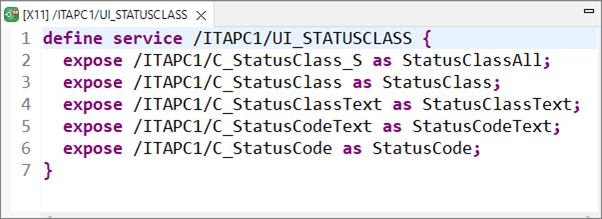
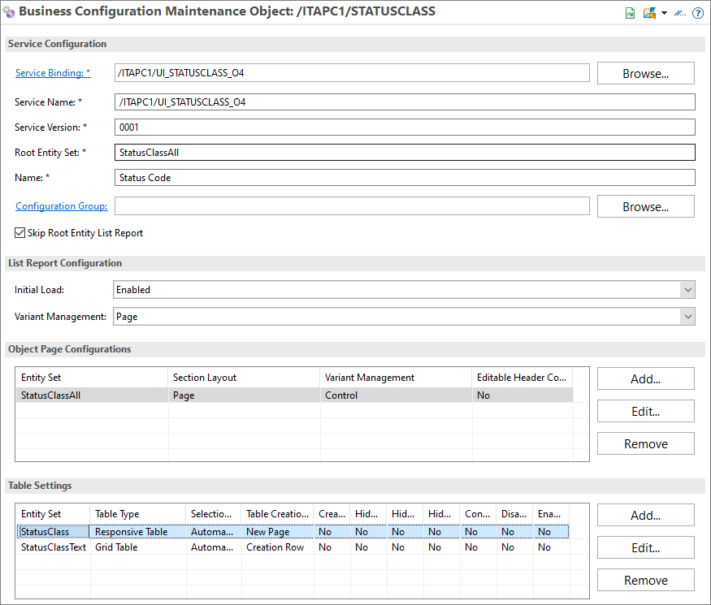

<!-- loiofea9a53fc15440c7951120e3f94bbb3a -->

# Table Creation Mode

If a new entry is added to a table, the *Custom Business Configurations* navigates to the object page of the new entry by default. This can be changed so that a `navigation is not triggered`.

This configuration is done with the *Table Creation Mode* attribute in the *Table Settings* section of the [definition](https://help.sap.com/docs/BTP/5371047f1273405bb46725a417f95433/8ea18fd0f93f4cd48578d2c75f3c8c89.html).

In the following example the business object consists of five entities:

  

For entity `StatusClass` the app shall navigate to the object page when creating a new table entry because the entity has many attributes which the user must maintain. Therefore *Table Creation Mode* is set to *New Page*.

The app shall not navigate to the object page when creating a new table entry for the entity `StatusClassText` because the user only needs to specify language key and text. Therefore *Table Creation Mode* is set to*Creation Row* and *Table Type* to *Grid Table*.

  

