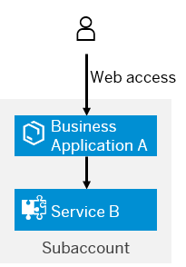

<!-- loio92d82380f45a45c4b157f92a61307da1 -->

# Technical Communication with Tightly Coupled Developments

When a business application and a service are developed for the same subaccount, the two developments are tightly coupled together. The service is designed to be used with this particular application.


<a name="loio92d82380f45a45c4b157f92a61307da1__context_gjb_5nb_4fb"/>

## Context

In this example, the call between the application and the service uses technical communication instead of the current user. The figure that follows illustrates this scenario.

> ### Note:  
> With service, we do not mean a development that has been registered as a service with the Cloud Controller, but rather the role one application takes in relationship to another. Both developments can be applications, but one application takes on the role of a business application enabling business users to perform tasks. The other application plays the role of a service, enabling the development of the business application.
> 
> We also assume that both applications have their own application router. Having separate application routers means that the applications can define their own authorization models.

   
  
<a name="loio92d82380f45a45c4b157f92a61307da1__fig_qly_nxw_42b"/>Two Developments Tightly Coupled Using Technical Communication

  

Like a trust arrangement, you must configure service B to grant the authority to business application A to use the `$XSAPPNAME.Create` scope. Likewise, you must configure business application A to accept such declarations of authority. This configuration is part of the `xs-security.json` of the UAA service instances of the two developments.


<a name="loio92d82380f45a45c4b157f92a61307da1__steps_p4k_vnb_4fb"/>

## Procedure

1.  As the service developer, declare the grant of authority to business application A in the `scopes` section of the `xs-security.json` for service B.

    > ### Sample Code:  
    > ```json
    > {
    >     "xsappname"     : "servb",
    >     "tenant-mode"   : "shared",
    >     "scopes"        : [
    >                         {
    >                           "name"                 : "$XSAPPNAME.Create",
    >                           "description"          : "create",
    >                           "grant-as-authority-to-apps" : ["$XSAPPNAME(application,appa)"]
    >                         }
    >                       ]
    > }
    > ```

    Under `scopes`, the scope `$XSAPPNAME.Create` grants authority to business application A to create data. Here the granted app is business application A and has been given the authorization to create data. When you create the UAA service instance for business application A, the system creates an OAuth client for business application A to call over to service B. When you bind the service, you make business application A aware of the client. In the security descriptor for the UAA service instance of business application A, accept this grant.

    > ### Note:  
    > `$XSAPPNAME` is replaced at runtime with the application name. The parameters that follow `$XSAPPNAME` are the service plan for the XSUAA service and `xsappname` as defined in the `xs-security.json`. These parameters help uniquely identify other applications in the subaccount.

2.  Create the UAA service instance for service B.

    For example:

    ***cf create-service xsuaa application servb-uaa -c /servb/security/xs-security.json***

3.  As the business application developer, accept the authority of other applications in the `authorities` section of the `xs-security.json` in business application A.

    > ### Sample Code:  
    > ```json
    > {
    >     "xsappname"     : "appa",
    >     "tenant-mode"   : "shared",
    >     "authorities":["$ACCEPT_GRANTED_AUTHORITIES"],
    > }
    > ```

    In this example, business application A accepts all authorities granted by any other application. You can explicitly define which authorities you want business application to accept. For example:

    `"authorities":["$XSAPPNAME(application,servb).Create]"`.

    > ### Note:  
    > For the sake of this example, we've removed any scopes and role templates for application A. Naturally, we recommend that you protect application A with appropriate scopes and deliver role templates.

4.  Create the UAA service instance for business application A.

    For example:

    ***cf create-service xsuaa application appa-uaa -c /appa/security/xs-security.json***

5.  Deploy the developments.

6.  As an adminístrator, create a role from the role templates for business application A and assign the role to a user.

    In the example, we created here, there are no role template to create roles from.

    For more information, see [Administration: Managing Authentication and Authorization](https://help.sap.com/viewer/65de2977205c403bbc107264b8eccf4b/Cloud/en-US/1ff47b2d980e43a6b2ce294352333708.html).

7.  As an end user, access business application A.

    When you access business application A, business application A accesses service B on your behalf. Because service B granted the `"$XSAPPNAME.create` scope to business application A, business application A is allowed to access the resource.


