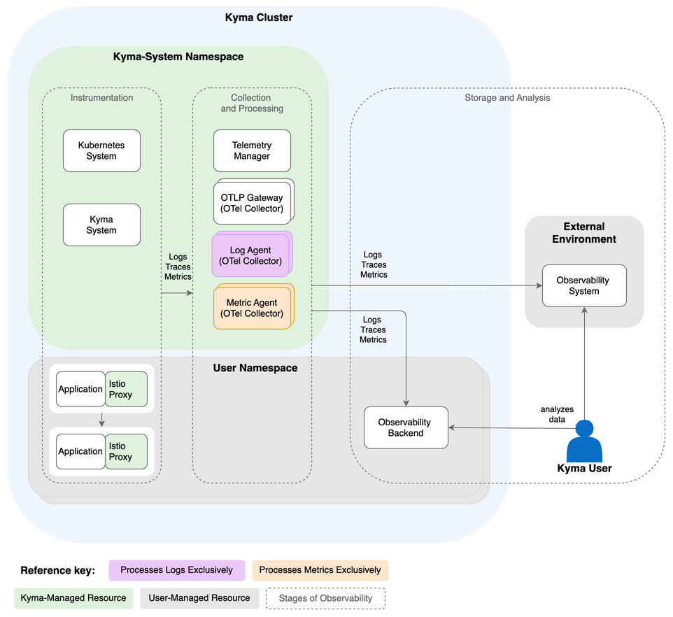
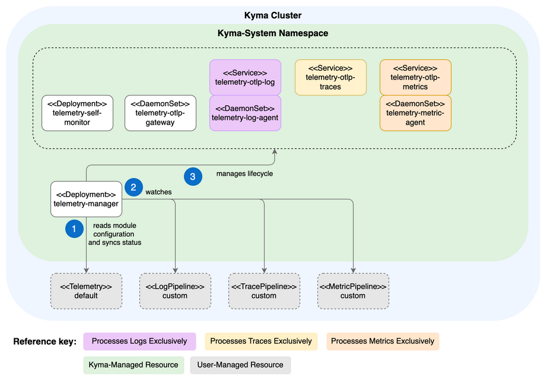
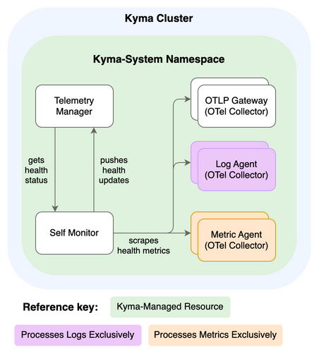

<!-- loio04d79d5517204da68029f43b9f052396 -->

# Telemetry Architecture

The Telemetry module consists of a manager component, which continuously watches the user-provided pipeline resources and deploys the respective OTel Collectors. Learn more about the architecture and how the components interact.

<a name="loio04d79d5517204da68029f43b9f052396__section_telemetry_benefits"/>

## Overview

The Telemetry API provides a robust, preconfigured OpenTelemetry \(OTel\) Collector setup that abstracts its underlying complexities. This approach delivers several key benefits:

-   Compatibility: Maintains stability and functionality even as underlying OTel Collector features evolve, reducing the need for constant updates on your end.

-   Migratability: Facilitates smooth transitions when you switch underlying technologies or architectures.

-   Native Kubernetes Support: Offers seamless integration with Secrets, for example, served by the SAP BTP Service Operator, and the Telemetry Manager automatically handles the full lifecycle of all components.

-   Focus: Reduces the need to understand intricate underlying OTel Collector concepts, allowing you to focus on your application development.

<a name="loio04d79d5517204da68029f43b9f052396__section_telemetry_manager"/>

## Telemetry Manager

Telemetry Manager, the core component of the module, is a Kubernetes [operator](https://kubernetes.io/docs/concepts/extend-kubernetes/operator/) that implements the Kubernetes controller pattern and manages the whole lifecycle of all other Telemetry components. It performs the following tasks:

1.  Watch the module configuration for changes and sync the module status to it.

2.  Watch the user-created Kubernetes resources `LogPipeline`, `TracePipeline`, and `MetricPipeline`. In these resources, you specify what data of a signal type to collect and where to ship it.

3.  Manage the lifecycle of the self monitor and of the components handling the incoming telemetry data: the OTLP Gateway and the signal-specific agents.

<a name="loio04d79d5517204da68029f43b9f052396__section_otlp_gateway"/>

## OTLP Gateway

If at least one valid pipeline of any type \(`LogPipeline`, `TracePipeline`, or `MetricPipeline`\) exists, Telemetry Manager deploys the OTLP Gateway.

The OTLP Gateway acts as the central endpoint where your applications push telemetry data \(logs, traces, and metrics\) using the OTLP format. It enriches and filters this data, then dispatches it to the backends you configure in your pipeline resources. The gateway runs as an [OTel Collector](https://opentelemetry.io/docs/collector/)-based [DaemonSet](https://kubernetes.io/docs/concepts/workloads/controllers/daemonset/) with one instance per cluster node.

Applications can send data to the gateway using these service endpoints:

-   gRPC: `http://telemetry-otlp.kyma-system:4317`
-   HTTP: `http://telemetry-otlp.kyma-system:4318`

<a name="loio04d79d5517204da68029f43b9f052396__section_agents"/>

## Agents

Agents collect telemetry data directly from each node in your cluster. Unlike the OTLP Gateway, which receives pushed data, agents actively pull data from sources on the node.

Depending on your `LogPipeline` and `MetricPipeline` configuration, Telemetry Manager deploys the following agents as an [OTel Collector](https://opentelemetry.io/docs/collector/)-based [DaemonSet](https://kubernetes.io/docs/concepts/workloads/controllers/daemonset/):

-   The Log Agent collects logs from the stdout/stderr output of all containers on a node. For details, see [Logs Architecture](logs-architecture-9124dfd.md).
-   The Metric Agent scrapes Prometheus-annotated workloads on each node. For details, see [Metrics Architecture](metrics-architecture-59d31e9.md).

<a name="loio04d79d5517204da68029f43b9f052396__section_gsq_bjm_ngc"/>

## Self Monitor

The Telemetry module includes a [Prometheus](https://prometheus.io/)-based self monitor that collects and evaluates health metrics from the OTLP Gateway and signal-specific agents. Telemetry Manager uses this data to report the current health status in your pipeline resources.

You can also use these health metrics in your own observability backend to set up alerts and dashboards for your telemetry pipelines. For details, see [Monitor Pipeline Health](monitor-pipeline-health-b56ed5c.md).

