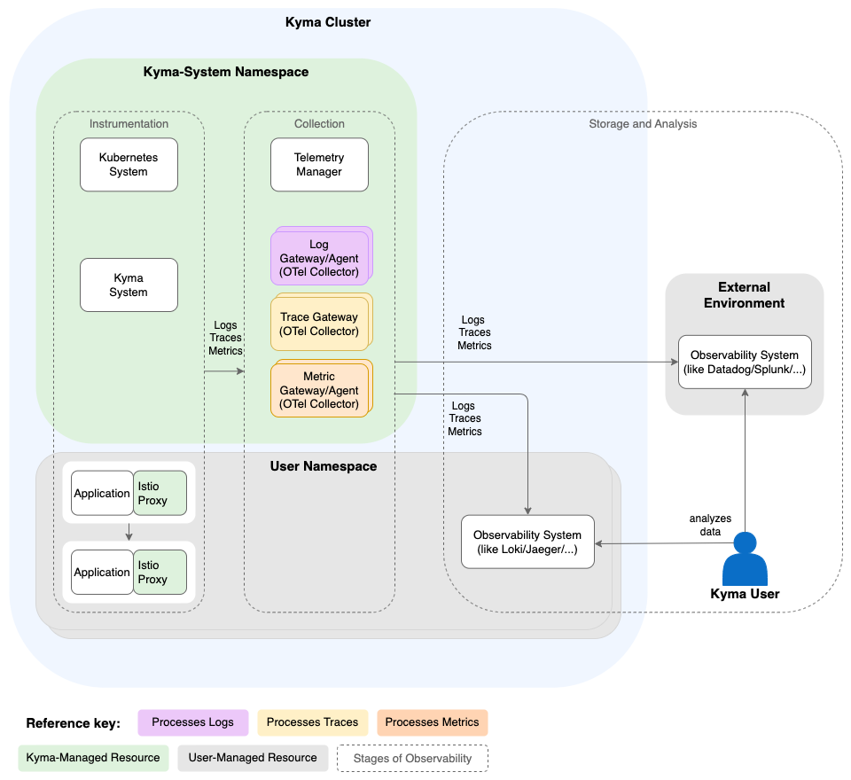

<!-- loio04d79d5517204da68029f43b9f052396 -->

# Telemetry Architecture

The Telemetry module consists of a manager component, which continuously watches the user-provided pipeline resources and deploys the respective OTel Collectors. Learn more about the architecture and how the components interact.

<a name="loio04d79d5517204da68029f43b9f052396__section_telemetry_benefits"/>

## Overview

The Telemetry API provides a robust, preconfigured OpenTelemetry \(OTel\) Collector setup that abstracts its underlying complexities. This approach delivers several key benefits:

-   Compatibility: Maintains stability and functionality even as underlying OTel Collector features evolve, reducing the need for constant updates on your end.

-   Migratability: Facilitates smooth transitions when you switch underlying technologies or architectures.

-   Native Kubernetes Support: Offers seamless integration with Secrets, for example, served by the SAP BTP Service Operator, and the Telemetry Manager automatically handles the full lifecycle of all components.

-   Focus: Reduces the need to understand intricate underlying OTel Collector concepts, allowing you to focus on your application development.

<a name="loio04d79d5517204da68029f43b9f052396__section_hx1_vps_fgc"/>

## Telemetry Manager

Telemetry Manager, the core component of the module, is a Kubernetes [operator](https://kubernetes.io/docs/concepts/extend-kubernetes/operator/) that implements the Kubernetes controller pattern and manages the whole lifecycle of all other Telemetry components. It performs the following tasks:

1.  Watch the module configuration for changes and sync the module status to it.

2.  Watch the user-created Kubernetes resources `LogPipeline`, `TracePipeline`, and `MetricPipeline`. In these resources, you specify what data of a signal type to collect and where to ship it.

3.  Manage the lifecycle of the self monitor and the user-configured agents and gateways. For example, only if you defined a `LogPipeline` resource, the log gateway is deployed.

<a name="loio04d79d5517204da68029f43b9f052396__section_fjk_1qs_fgc"/>

## Gateways and Agents

Gateways and agents handle the incoming telemetry data. The Telemetry Manager deploys them based on your pipeline configuration.

The gateways are based on an [OTel Collector](https://opentelemetry.io/docs/collector/) [Deployment](https://kubernetes.io/docs/concepts/workloads/controllers/deployment/) and act as central endpoints in the cluster to which your applications push data in the [OTLP](https://opentelemetry.io/docs/specs/otel/protocol/) format. From here, the data is enriched and filtered, and then dispatched configured in your pipeline resources.

Agents run as [DaemonSet](https://kubernetes.io/docs/concepts/workloads/controllers/daemonset/) and pull data from the respective Node.

-   **Log Gateway and Agent**

    The log gateway provides a central OTLP endpoint for logs. You can also enable the log agent, which collects logs from the `stdout/stderr` output of all containers on a Node. For details, see [Logs Architecture](logs-architecture-9124dfd.md).

    As an alternative to the OTLP-based log feature, you can choose using a log agent based on a [Fluent Bit](https://fluentbit.io/) installation running as a [DaemonSet](https://kubernetes.io/docs/concepts/workloads/controllers/daemonset/). It reads all containers’ logs in the runtime and ships them according to your `LogPipeline` configuration. For details, see [Application Logs \(Fluent Bit\)](https://github.com/kyma-project/telemetry-manager/blob/main/docs/user/02-logs.md).

-   **Trace Gateway**

    The trace gateway provides a central [OTLP](https://opentelemetry.io/docs/specs/otel/protocol/) endpoint to which your applications can push the trace signals. Kyma modules like Istio or Serverless contribute traces transparently. For details, see [Traces Architecture](traces-architecture-5f650d7.md).

-   **Metric Gateway and Agent**

    The metric gateway provides a central OTLP endpoint for metrics. You can also enable the metric agent, which scrapes Prometheus-annotated workloads on each Node. For details, see [Metrics Architecture](metrics-architecture-59d31e9.md).

<a name="loio04d79d5517204da68029f43b9f052396__section_gsq_bjm_ngc"/>

## Self Monitor

The Telemetry module includes a [Prometheus](https://prometheus.io/)-based self monitor that collects and evaluates health metrics from the gateways and agents. Telemetry Manager uses this data to report the current health status in your pipeline resources.

You can also use these health metrics in your own observability backend to set up alerts and dashboards for your telemetry pipelines. For details, see [Monitor Pipeline Health](monitor-pipeline-health-b56ed5c.md).

