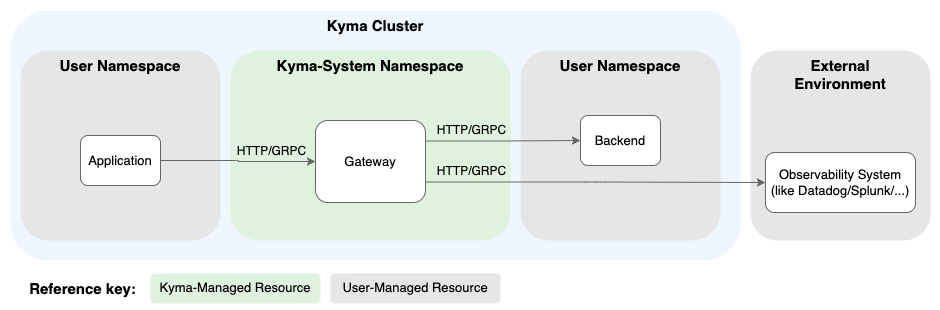

<!-- loio61567b79e6db41cd81de5f58ec077201 -->

# Telemetry Gateways

The Telemetry gateways in Kyma take care of data enrichment, filtering, and dispatching, as well as native support for Istio communication.


<a name="loio61567b79e6db41cd81de5f58ec077201__section_features"/>

## Features

The traces, metrics, and \(OTLP-based\) logs features are based on a gateway, which is provisioned as soon as you define any pipeline resource. All telemetry data of the related domain passes the gateway, so it acts as a central point and provides the following benefits:

-   [Data Enrichment](telemetry-gateways-61567b7.md#loio61567b79e6db41cd81de5f58ec077201__section_telemetry_data_enrichment) to achieve a certain data quality

-   Filtering to apply namespace filtering and remove noisy system data \(individually for logs, traces, and metrics\)

-   Dispatching to the configured backends \(individually for logs, traces, and metrics\)


When the Istio module is added to your Kyma cluster, the gateways support mTLS for the communication from the workload to the gateway, as well as for communication to backends running in the cluster. For details, see [Istio Support](telemetry-gateways-61567b7.md#loio61567b79e6db41cd81de5f58ec077201__section_telemetry_istio_support).

The gateways are based on the [OTel Collector](https://opentelemetry.io/docs/collector/) and come with a concept of pipelines consisting of receivers, processors, and exporters, with which you can flexibly plug pipelines together \(see [Configuration](https://opentelemetry.io/docs/collector/configuration/)\). Kyma’s `MetricPipeline` provides a hardened setup of an OTel Collector and also abstracts the underlying pipeline concept. Such abstraction has the following benefits:

-   Compatibility: An abstraction layer supports compatibility when underlying features change.

-   Migratability: Smooth migration experiences when switching underlying technologies or architectures.

-   Native Kubernetes support: API provided by Kyma supports an easy integration with Secrets, for example, served by the [SAP BTP Service Operator](https://github.com/SAP/sap-btp-service-operator#readme). Telemetry Manager takes care of the full lifecycle.

-   Focus: The user doesn’t need to understand the underlying concepts.


The Telemetry module focuses on full configurability of backends integrated by OTLP. If you need more features than provided by the Kyma `MetricPipeline`, bring your own collector setup.


<a name="loio61567b79e6db41cd81de5f58ec077201__section_usage"/>

## Usage

You can set up a pipeline with a backend that subsequently instantiates a gateway. For details, see [Traces](traces-f98cda5.md) and [Metrics](metrics-44ac6c5.md). To see whether you've set up your gateways and their push endpoints successfully, check the status of the default Telemetry resource:

```
kubectl -n kyma-system get telemetries.operator.kyma-project.io default -oyaml
```

In the status of the returned resource, you see the pipeline health as well as the available push endpoints:

```
  endpoints:
    metrics:
      grpc: http://telemetry-otlp-metrics.kyma-system:4317
      http: http://telemetry-otlp-metrics.kyma-system:4318
    traces:
      grpc: http://telemetry-otlp-traces.kyma-system:4317
      http: http://telemetry-otlp-traces.kyma-system:4318

```

For every signal type, there's a dedicated endpoint to which you can push data using [OTLP](https://opentelemetry.io/docs/specs/otel/protocol/). OTLP supports GRPC and HTTP-based communication, each having its individual port on every endpoint. Use port `4317` for GRPC and `4318` for HTTP.



Applications that support OTLP typically use the [OTel SDK](https://opentelemetry.io/docs/languages/) for instrumentation of the data.

You can either configure the endpoints hardcoded in the SDK setup, or you use standard [environment variables](https://opentelemetry.io/docs/languages/sdk-configuration/otlp-exporter/#otel_exporter_otlp_traces_endpoint) configuring the OTel exporter, for example:

-   Traces GRPC: `export OTEL_EXPORTER_OTLP_TRACES_ENDPOINT="http://telemetry-otlp-traces.kyma-system:4317"` 
-   Traces HTTP: `export OTEL_EXPORTER_OTLP_TRACES_ENDPOINT="http://telemetry-otlp-traces.kyma-system:4318/v1/traces"` 
-   Metrics GRPC: `export OTEL_EXPORTER_OTLP_METRICS_ENDPOINT="http://telemetry-otlp-metrics.kyma-system:4317"` 
-   Metrics HTTP: `export OTEL_EXPORTER_OTLP_METRICS_ENDPOINT="http://telemetry-otlp-metrics.kyma-system:4318/v1/metrics"` 


<a name="loio61567b79e6db41cd81de5f58ec077201__section_telemetry_data_enrichment"/>

## Data Enrichment

The Telemetry gateways automatically enrich your data by adding the following attributes:

-   **service.name**: The logical name of the service that emits the telemetry data. The gateway ensures that this attribute always has a valid value.

    If not provided by the user, or if its value follows the pattern `unknown_service:<process.executable.name>` as described in the [specification](https://opentelemetry.io/docs/specs/semconv/resource/#service), then it is generated from Kubernetes metadata. The gateway determines the service name based on the following hierarchy of labels and names:

    1.  `app.kubernetes.io/name`: Pod label value

    2.  `app`: Pod label value

    3.  Deployment/DaemonSet/StatefulSet/Job name

    4.  Pod name

    5.  If none of the above is available, the value is `unknown_service`


-   **k8s.\*** attributes: These attributes encapsulate various pieces of Kubernetes metadata associated with the Pod, including, but not limited to:

    -   Pod name

    -   Deployment/DaemonSet/StatefulSet/Job name

    -   Namespace

    -   Cluster name


-   **k8s.pod.label.<label\_key\>** attributes: In addition to the predefined enrichments, the Telemetry gateways support user-defined enrichments of telemetry data based on Pod labels \(see [Telemetry CRD](https://kyma-project.io/#/telemetry-manager/user/resources/01-telemetry)\). By configuring specific label keys or label key prefixes to include in the enrichment process, you can capture custom application metadata that may be relevant for filtering, grouping, or correlation purposes. All matching Pod labels are added to the telemetry data as resource attributes, using the label key format `k8s.pod.label.<label_key>`.

    The following example configuration enriches the telemetry data with Pod labels that match the specified keys or key prefixes:

    -   `k8s.pod.label.app.kubernetes.io/name`: The value of the exact label key `app.kubernetes.io/name` from the Pod.

    -   `k8s.pod.label.app.kubernetes.io.*`: All labels that start with the prefix *app.kubernetes.io* from the Pod, where *<\*\>* is replaced by the actual label key.


    ```
    apiVersion: operator.kyma-project.io/v1alpha1
    kind: Telemetry
    metadata:
    name: default
    namespace: kyma-system
    spec:
    enrichments:
      extractPodLabels:
      - key: "<myExactLabelKey>" # for example, "app.kubernetes.io/name"
      - keyPrefix: "<myLabelPrefix>" # for example, "app.kubernetes.io"
    
    ```

-   **Cloud provider** attributes: If data is available, the gateway automatically adds [cloud provider](https://opentelemetry.io/docs/specs/semconv/resource/cloud/) attributes to the telemetry data.

    -   `cloud.provider`: Cloud provider name
    -   `cloud.region`: Region where the Node runs \(from Node label `topology.kubernetes.io/region`\)
    -   `cloud.availability_zone`: Zone where the Node runs \(from Node label `topology.kubernetes.io/zone`\)

-   **Host** attributes: If data is available, the gateway automatically adds [host](https://opentelemetry.io/docs/specs/semconv/resource/host/) attributes to the telemetry data:

    -   `host.type`: Machine type of the Node \(from Node label `node.kubernetes.io/instance-type`\)
    -   `host.arch`: CPU architecture of the system the Node is running on \(from Node label `kubernetes.io/arch`\)


<a name="loio61567b79e6db41cd81de5f58ec077201__section_telemetry_istio_support"/>

## Istio Support

The Telemetry module automatically detects whether the Istio module is added to your cluster, and injects Istio sidecars to the Telemetry components. Additionally, the ingestion endpoints of gateways are configured to allow traffic in the permissive mode, so they accept mTLS-based communication as well as plain text.


Clients in the Istio service mesh transparently communicate to the gateway with mTLS. Clients that don’t use Istio can communicate with the gateway in plain text mode. The same pattern applies for the communication to the backends running in the cluster. External clusters use the configuration as specified in the pipelines output section.

