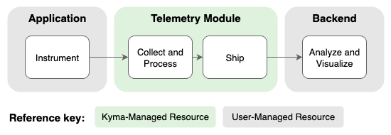

<!-- loio87ec55072f394ac48d91c8c723e26e3b -->

# Telemetry Module

Use the Telemetry module to collect telemetry signals \(logs, traces, and metrics\) from your applications and send them to your preferred observability backend.

<a name="loio87ec55072f394ac48d91c8c723e26e3b__section_telemetry_what_is"/>

## What is Telemetry?

With telemetry signals, you can understand the behavior and health of your applications and infrastructure. The Telemetry module provides a standardized way to collect these signals and send them to your observability backend, where you can analyze them and troubleshoot issues.

The Telemetry module processes three types of signals:

-   Logs: Time-stamped records of events that happen over time.

-   Traces: The path of a request as it travels through your application's components.

-   Metrics: Aggregated numerical data about the performance or state of a component over time.

Telemetry signals flow through the following stages:

1.  You instrument your application so that its components expose telemetry signals.

2.  The signals are collected and enriched with infrastructural metadata.

3.  You send the enriched signals to your preferred observability backend.

4.  The backend stores your data, where you can analyze and visualize it.

The Telemetry module focuses on the collection, processing, and shipment stages of the observability workflow. It offers a vendor-neutral approach based on [OpenTelemetry](https://opentelemetry.io/) and doesn't force you into a specific backend. This means you can integrate with your existing observability platforms or choose from a wide range of available backends that best suit your operational needs.

> ### Tip:  
> Build your first telemetry pipeline with the hands-on lesson [Collecting Application Logs and Shipping them to SAP Cloud Logging](https://learning.sap.com/courses/developing-applications-in-sap-btp-kyma-runtime/collecting-application-logs-and-shipping-to-sap-cloud-logging).

<a name="loio87ec55072f394ac48d91c8c723e26e3b__section_telemetry_features"/>

## Features

To support telemetry for your applications, the Telemetry module provides the following features:

-   **Consistent Telemetry Pipeline API**: Use a streamlined set of APIs based on the [OTel Collector](https://opentelemetry.io/docs/collector/) to collect, filter, and ship your logs, metrics, and traces \(see [Telemetry Pipeline API](telemetry-pipeline-api-1617ebe.md)\). You define a pipeline for each signal type to control how the data is processed and where it's sent. For details, see [Collecting Logs](collecting-logs-7a5b627.md), [Collecting Traces](collecting-traces-f98cda5.md), and [Collecting Metrics](collecting-metrics-44ac6c5.md).

-   **Flexible Backend Integration**: The Telemetry module is optimized for integration with SAP BTP observability services, such as SAP Cloud Logging. You can also send data to any backend that supports the [OpenTelemetry protocol \(OTLP\)](https://opentelemetry.io/docs/specs/otel/protocol/), giving you the freedom to choose your preferred solution \(see [Integrate With Your OTLP Backend](integrate-with-your-otlp-backend-e726417.md)\).

    > ### Recommendation:  
    > For production deployments, we recommend using a central telemetry solution located outside your cluster. For an example, see [Integrate With SAP Cloud Logging](integrate-with-sap-cloud-logging-eac5771.md).
    > 
    > For testing or development, in-cluster solutions may be suitable. For examples such as Dynatrace \(or to learn how to collect data from applications based on the OpenTelemetry Demo App\), see [Integration Guides](https://kyma-project.io/#/telemetry-manager/user/integration/README).

-   **Seamless Istio Integration**: The Telemetry module seamlessly integrates with the Istio module when both are present in your cluster. For details, see [Istio Integration](istio-integration-d31499b.md).

-   **Custom Filtering and Processing**: You can drop any unnecessary Telemetry data right when it's collected \(see [Filter Logs](filter-logs-58445a0.md), [Filter Traces](filter-traces-6a03a1b.md), and [Filter Metrics](filter-metrics-6bd4bfd.md)\). For advanced data manipulation, such as redacting sensitive information or creating complex filters, you can use the OpenTelemetry Transformation Language \(see  <?sap-ot O2O class="- topic/xref " href="4c645988c8224424a470bdc6257b27ff.xml" text="" desc="" xtrc="xref:16" xtrf="file:/home/builder/src/dita-all/jjq1673438782153/loio2080d0faf9d84ce6aa14caa4caa32935_en-US/src/content/localization/en-us/87ec55072f394ac48d91c8c723e26e3b.xml" output-class="" outputTopicFile="file:/home/builder/tp.net.sf.dita-ot/2.3/plugins/com.elovirta.dita.markdown_1.3.0/xsl/dita2markdownImpl.xsl" ?> \).

-   **Automatic Data Enrichment**: The Telemetry module adds resource attributes as metadata, following OTel semantic conventions. This makes your data more consistent, meaningful, and ready for analysis in your observability backend. For details, see [Automatic Data Enrichment](automatic-data-enrichment-6a13459.md).

-   **Instrumentation Guidance**: To generate telemetry data, you must instrument your code. Based on [Open Telemetry](https://opentelemetry.io/) \(OTel\), you get community samples on how to instrument your code using the [Open Telemetry SDKs](https://opentelemetry.io/docs/languages/) in most programming languages.

<a name="loio87ec55072f394ac48d91c8c723e26e3b__section_telemetry_scope"/>

## Scope

The Telemetry module focuses only on the signals of application logs, distributed traces, and metrics. Other kinds of signals are not considered. Also, audit logs are not in scope.

Supported integration scenarios are neutral to the vendor of the target system.

<a name="loio87ec55072f394ac48d91c8c723e26e3b__section_telemetry_architecture"/>

## Architecture

The Telemetry module is built around a central controller, Telemetry Manager, which dynamically configures and deploys data collection components based on your pipeline resources.

To understand how the core components interact, see [Telemetry Architecture](telemetry-architecture-04d79d5.md).

To learn how this model applies to each signal type, see:

-   [Logs Architecture](logs-architecture-9124dfd.md)

-   [Traces Architecture](traces-architecture-5f650d7.md)

-   [Metrics Architecture](metrics-architecture-59d31e9.md)

<a name="loio87ec55072f394ac48d91c8c723e26e3b__section_telemetry_crd"/>

## API/Custom Resource Definitions

You configure the Telemetry module and its pipelines by creating and applying Kubernetes CustomResourceDefinitions \(CRDs\), which extend the Kubernetes API with custom additions.

To understand and configure the module's global settings, refer to the [Telemetry CRD](https://kyma-project.io/#/telemetry-manager/user/resources/01-telemetry).

To define how to collect, process, and ship a specific signal, use the pipeline CRDs:

-   [LogPipeline CRD](https://kyma-project.io/#/telemetry-manager/user/resources/02-logpipeline)

-   [TracePipeline CRD](https://kyma-project.io/#/telemetry-manager/user/resources/04-tracepipeline)

-   [MetricPipeline CRD](https://kyma-project.io/#/telemetry-manager/user/resources/05-metricpipeline)

<a name="loio87ec55072f394ac48d91c8c723e26e3b__section_telemetry_resource_consumption"/>

## Resource Consumption

To learn more about the resources used by the Telemetry module, see [Kyma Modules' Sizing](../50-administration-and-ops/kyma-modules-sizing-3a92490.md).

