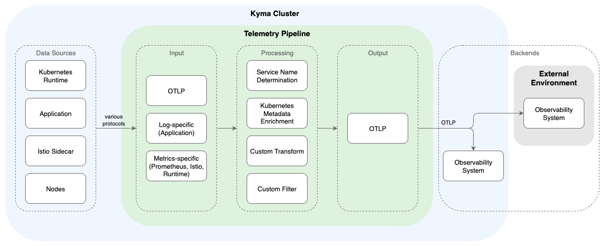

<!-- loio1617ebe10aae4b7287244b1876c85971 -->

# Telemetry Pipeline API

To collect and export telemetry data from your Kyma cluster, you define one or more pipelines for each signal type \(logs, traces, metrics\). You choose which data to collect and to which backend it's sent.


<a name="loio1617ebe10aae4b7287244b1876c85971__section_pipelines_overview"/>

## Pipeline Structure

You define Telemetry pipelines using three dedicated Kubernetes CRDs that extend the Kubernetes API: `LogPipeline`, `TracePipeline`, and `MetricPipeline`.

A pipeline defines how the data flows from the original data sources through the respective inputs and a series of processing steps to the backend you defined as output.



The pipelines use the [OpenTelemetry Protocol](https://opentelemetry.io/docs/specs/otel/protocol/) \(OTLP\) as the primary method to ingest and export data, which gives you the flexibility to integrate with a wide range of observability backends.

While each pipeline is tailored to a specific signal, they all share a common structure:

> ### Sample Code:  
> ```
> apiVersion: telemetry.kyma-project.io/v1alpha1
> kind: <LogPipeline | TracePipeline | MetricPipeline>     # Choose pipeline kind depending on signal type
> metadata:
>   name: my-observability-backend
> spec:
>   input:                 # Enable additional inputs depending on signal type
>     otlp:
>       ...
>   output:
>     otlp:                # Integrate with your observability backend
>       endpoint:
>       ...
> ```


<a name="loio1617ebe10aae4b7287244b1876c85971__section_pipeline_metadata"/>

## Pipeline Types

The `kind` attribute in the CRD specifies the type of telemetry data that the pipeline handles.

-   `LogPipeline`: Collects logs from your application containers' standard output \(`stdout`\) and standard error \(`stderr`\), and from OTLP sources. It parses these logs, extracts useful information, and forwards them to your configured backend.
-   `TracePipeline`: Collects trace data from OTLP sources, which show how requests flow between different components of your application. To collect Istio traces generated by applications or the service mesh, you must enable tracing within Istio using the Istio `Telemetry` CRD.
-   `MetricPipeline`: Collects metrics from OTLP sources, Prometheus-annotated workloads, the Istio service mesh, and the Kubernetes runtime.


<a name="loio1617ebe10aae4b7287244b1876c85971__section_pipeline_input"/>

## Input

In the `spec.input` section, you define the sources of your telemetry data. This section is the primary difference between the pipeline types.

All pipelines share `otlp` as the default input and can be configured with additional, signal-specific inputs:

By default, the `otlp` input is enabled for all signal types, which provisions a cluster-internal endpoint accepting OTLP data. For details, see [Set Up the OTLP Input](set-up-the-otlp-input-61567b7.md).

Additionally, you can apply specific `input` configurations for each signal type:

-   `LogPipeline`: The `application` input is enabled by default. Additionally, you can collect Istio access logs through the default `otlp` input. For both inputs, you can restrict from which Kubernetes resources you want to collect signals. For details, see [Configure Application Logs](configure-application-logs-412866b.md) and [Configure Istio Access Logs](configure-istio-access-logs-808c167.md).
-   `TracePipeline`: Tracing is a push-based model, so `otlp` is the only available input. The pipeline's OTLP endpoint receives span data pushed from your applications and Istio proxies. For Istio tracing, you can configure the sampling rate and apply individual settings to namespaces or workloads \(see [Configure Istio Tracing](configure-istio-tracing-3f504d8.md)\).
-   `MetricPipeline`: You can select which metrics are collected by enabling inputs: `prometheus` \(for scraping annotated workloads\), `runtime` \(for Kubernetes resource metrics\), and `istio` \(for service mesh metrics\). You can filter all inputs by namespace. For details, see [Collect Prometheus Metrics](collect-prometheus-metrics-0afa66a.md), [Collect Istio Metrics](collect-istio-metrics-aa786e0.md), and [Collect Runtime Metrics](collect-runtime-metrics-2c9fb6e.md).


<a name="loio1617ebe10aae4b7287244b1876c85971__section_data_filtering_and_processing"/>

## Filtering and Processing

You can control the volume and focus of your incoming telemetry data by filtering it based on Kubernetes resources like namespaces, containers, and workloads. For details, see [Filter Logs](filter-logs-58445a0.md), [Filter Traces](filter-traces-6a03a1b.md), and [Filter Metrics](filter-metrics-6bd4bfd.md).

Furthermore, you can transform and filter the received data by defining custom rules with the OpenTelemetry Transformation Language \(OTTL\). For details, see [Transform and Filter with OTTL](transform-and-filter-with-ottl-4c64598.md).

All pipelines automatically enrich telemetry data with Kubernetes resource attributes, such as Pod name, namespace, and labels. With this context information, you can easily identify the source of telemetry data in your backend. For details, see [Automatic Data Enrichment](automatic-data-enrichment-6a13459.md).


<a name="loio1617ebe10aae4b7287244b1876c85971__section_pipeline_output"/>

## Output

In the `spec.output` section, you define the destination for your telemetry data. Each pipeline resource supports exactly one output, which sends data using OTLP.

You must specify the endpoint address of your observability backend. You can also configure the protocol \(gRPC or HTTP\) and the authentication details required to connect securely. For details, see [Integrate With Your OTLP Backend](integrate-with-your-otlp-backend-e726417.md).

To send the same signal to multiple backends, create a separate pipeline resource for each destination. For details, see [Route Specific Inputs to Different Backends](set-up-the-otlp-input-61567b7.md#loio61567b79e6db41cd81de5f58ec077201__section_filter_input_for_backends).

