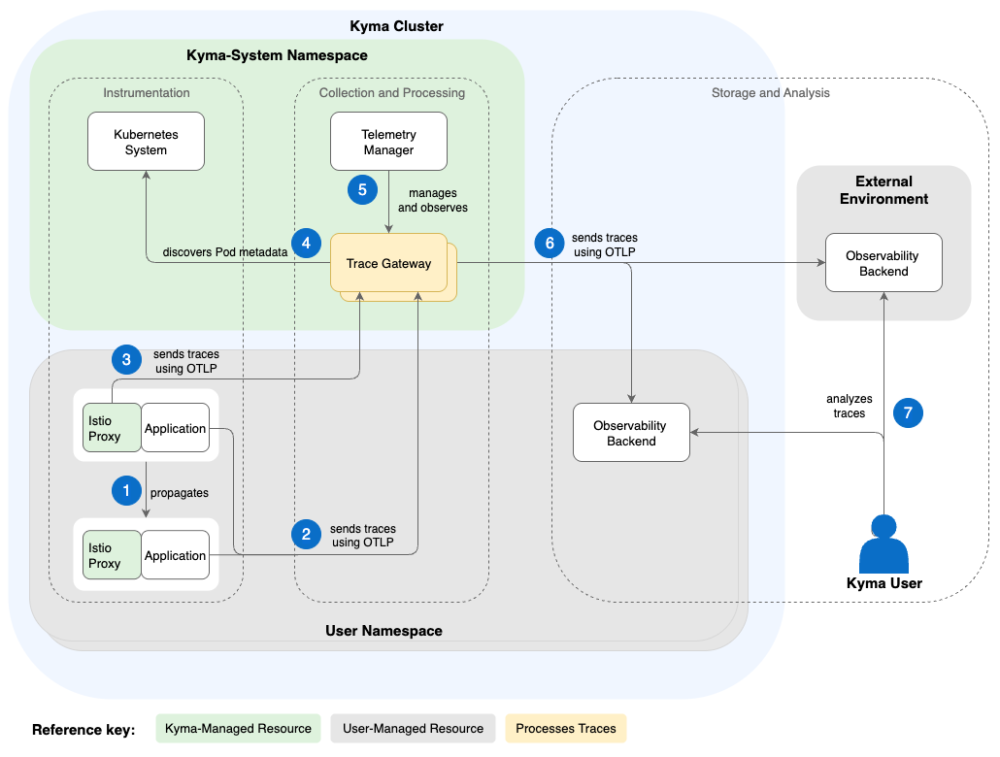

<!-- loio5f650d76609142158a08348872e431aa -->

# Traces Architecture

The Telemetry module provides a central Deployment of an [OTel Collector](https://opentelemetry.io/docs/collector/) acting as a gateway in the cluster. The gateway exposes endpoints that receive trace data from your applications and the service mesh. To control the gateway's behavior and data destination, you define a `TracePipeline`.

1.  An end-to-end request is triggered and populated across the distributed application. Every involved component propagates the trace context using the [W3C Trace Context](https://www.w3.org/TR/trace-context/) protocol.

2.  After contributing a new span to the trace, the involved components send the related span data \([OTLP](https://opentelemetry.io/docs/specs/otlp/)\) to the central trace gateway using the `telemetry-otlp-traces` service.

3.  Istio sends the related span data to the trace gateway as well.

4.  The trace gateway discovers metadata that’s typical for sources running on Kubernetes, like Pod identifiers, and then enriches the span data with that metadata.

5.  Telemetry Manager configures the gateway according to the `TracePipeline` resource, including the target backend for the trace gateway. Also, it observes the trace flow to the backend and reports problems in the `TracePipeline` status.

6.  The trace gateway sends the data to the observability backend that’s specified in your `TracePipeline` resource - either within the cluster, or, if authentication is set up, to an external observability backend.

7.  You can analyze the trace data with your preferred observability backend.

<a name="loio5f650d76609142158a08348872e431aa__section_telemetry_manager"/>

## Telemetry Manager

The `TracePipeline` resource is watched by Telemetry Manager, which is responsible for generating the custom parts of the OTel Collector configuration.

1.  Telemetry Manager watches all `TracePipeline` resources and related Secrets.
2.  Furthermore, Telemetry Manager takes care of the full lifecycle of the OTel Collector Deployment itself. Only if you defined a `TracePipeline`, the collector is deployed.
3.  Whenever the configuration changes, it validates the configuration and generates a new configuration for OTel Collector, where a ConfigMap for the configuration is generated.
4.  Referenced Secrets are copied into one Secret that is mounted to the OTel Collector as well.

<a name="loio5f650d76609142158a08348872e431aa__section_trace_gateway"/>

## Trace Gateway

In your cluster, the trace gateway is the central component to which all components can send their individual spans. The gateway collects, enriches, and dispatches the data to the configured backend. For more information, see [Set Up the OTLP Input](set-up-the-otlp-input-61567b7.md).

