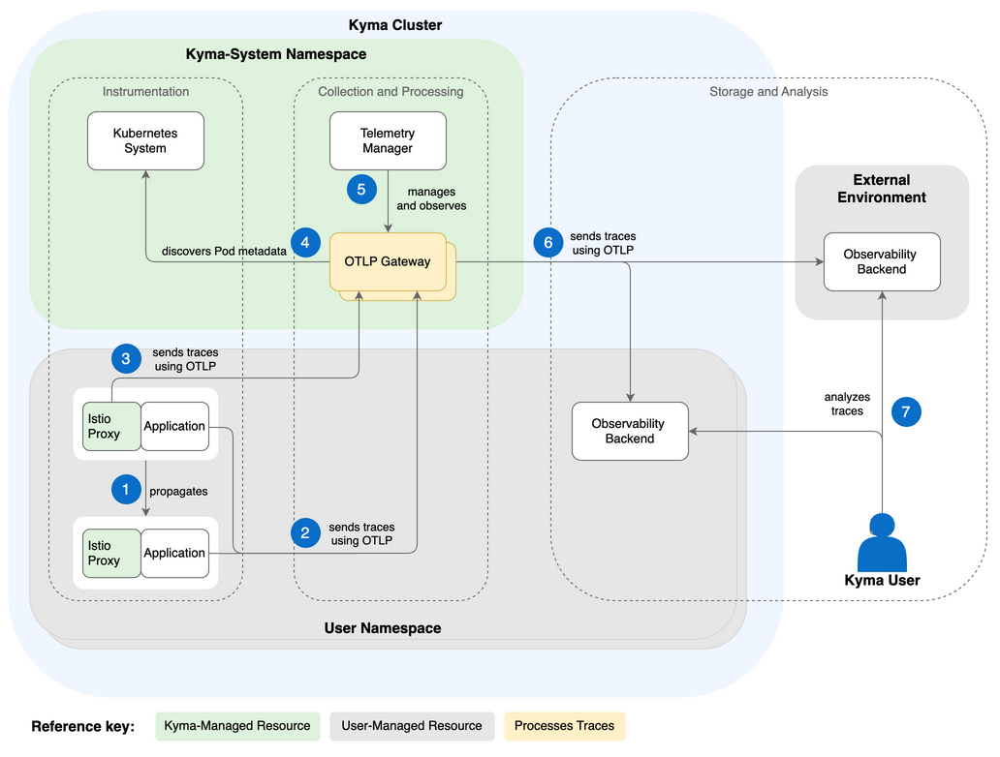
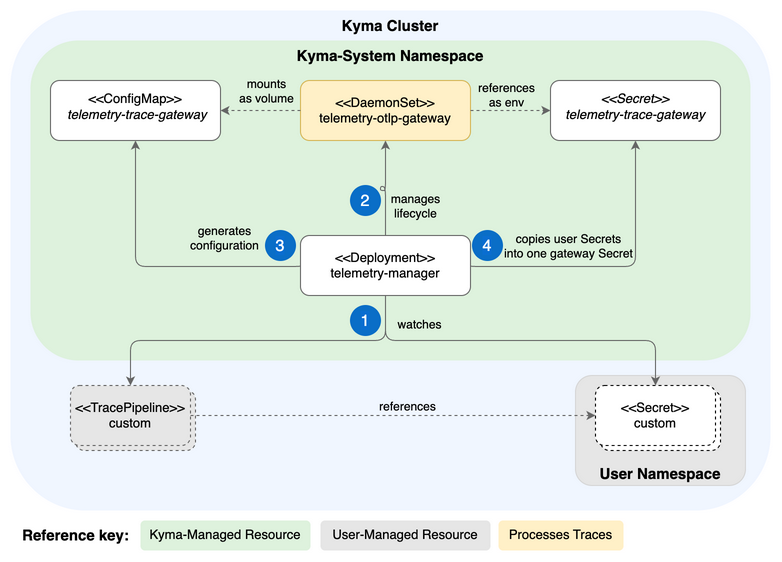

<!-- loio5f650d76609142158a08348872e431aa -->

# Traces Architecture

For trace collection, the Telemetry module provides the OTLP Gateway. To control its behavior and data destination, you define a `TracePipeline`. The OTLP Gateway is a DaemonSet with one instance per node that receives OTLP traces pushed from your applications.

For details, see [OTLP Gateway](telemetry-architecture-04d79d5.md#loio04d79d5517204da68029f43b9f052396__section_otlp_gateway).

1.  An end-to-end request is triggered and populated across the distributed application. Every involved component propagates the trace context using the [W3C Trace Context](https://www.w3.org/TR/trace-context/) protocol.

2.  After contributing a new span to the trace, the involved components send the related span data \([OTLP](https://opentelemetry.io/docs/specs/otlp/)\) to the OTLP Gateway using the `telemetry-otlp` service. Because the Service uses node-local routing, the OTLP Gateway instance on the same node always receives the data.

3.  Istio sends the related span data to the OTLP Gateway as well.

4.  The OTLP Gateway discovers metadata that's typical for sources running on Kubernetes, like Pod identifiers, and then enriches the span data with that metadata.

5.  Telemetry Manager configures the gateway according to the `TracePipeline` resource, including the target backend. Also, it observes the trace flow to the backend and reports problems in the `TracePipeline` status.

6.  The OTLP Gateway sends the data to the observability backend that's specified in your `TracePipeline` resource - either within your cluster, or, if authentication is set up, to an external observability backend.

7.  You can analyze the trace data with your preferred observability backend.

<a name="loio5f650d76609142158a08348872e431aa__section_telemetry_manager"/>

## Telemetry Manager

The `TracePipeline` resource is watched by Telemetry Manager, which is responsible for generating the custom parts of the OTLP Gateway configuration.

1.  Telemetry Manager watches all `TracePipeline` resources and related Secrets.
2.  Furthermore, Telemetry Manager takes care of the full lifecycle of the OTLP Gateway DaemonSet.
3.  Whenever the configuration changes, Telemetry Manager validates it and generates a new configuration for the OTLP Gateway, which is stored in a ConfigMap.
4.  Referenced Secrets are copied into a single Secret that is mounted to the OTLP Gateway Pods.

<a name="loio5f650d76609142158a08348872e431aa__section_trace_gateway"/>

## OTLP Gateway

In your cluster, the OTLP Gateway is the central component to which all components can send their individual spans. The gateway collects, enriches, and dispatches the data to the configured backend. The OTLP Gateway handles all signal types \(traces, metrics, and logs\) in a single unified DaemonSet. For more information, see [Set Up the OTLP Input](set-up-the-otlp-input-61567b7.md).

