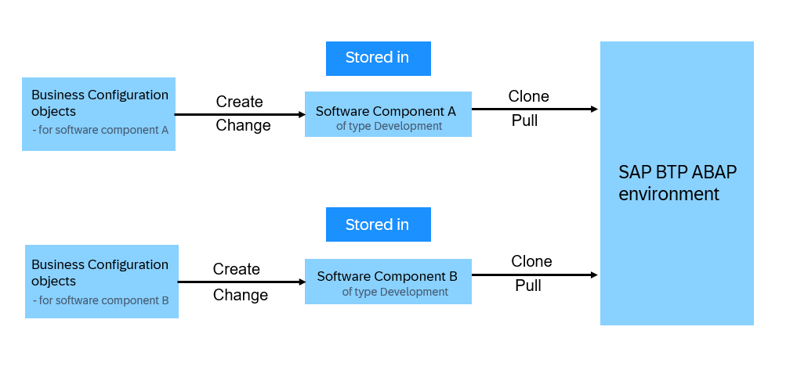
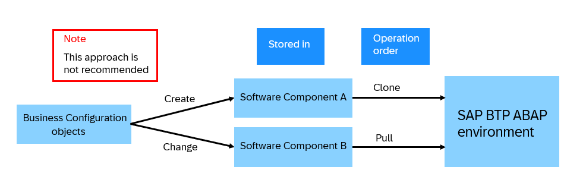
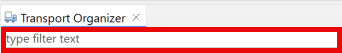

<!-- loio7d7c3441f9a84208b3efe20a0356f3fb -->

# Transport of Business Configuration

Business configuration is client-dependent, just like master or transactional data, and after being imported, it is only available in the client where you have executed the import.

You usually maintain business configuration content in a non-productive environment and import it into test and productive environments. To do so, you record business configuration changes on transport requests of type *Customizing*. Once you release the request, all the changes are pushed into the remote repository associated with the used software component, just as for ABAP Workbench transport requests. Therefore, you can import business configuration content by pulling that same software component in the target system/client 100.

Depending on your scenario, you can use one of the following transport patterns:

-   Isolated tenants – no transport

    If you use an isolated tenant, you don't have to clone and transport a software component of type *Business Configuration*. You can still create content, but it is not imported or exported. Since a customizing transport request is a technical prerequisite for business configuration changes, the changes are written to a local customizing transport request. That means, you just have to create a transport request. The system then generates a local request and sets its category to *Default*. See [Working in the Export Customizing Transports App](../50-administration-and-ops/working-in-the-export-customizing-transports-app-cc16fd0.md).

    > ### Note:  
    > All consumer tenants \(≥200\) in multitenant systems are isolated tenants because the administration of software components is not supported in these tenants.

-   Simple – transports via software component of type *Business Configuration*. See [Transport Business Configuration via Software Component of Type Business Configuration](transport-business-configuration-via-software-component-of-type-business-configuration-03a3611.md).

    You can transport business configuration for simple solutions via a software component of type *Business Configuration*. Since you can only clone one software component of this type in each system, all business configuration content is pushed to the same remote repository.

    In this scenario, you have to create and manage customizing transport requests with the *Export Customizing Transports* SAP Fiori app. See [Export Customizing Transports](../50-administration-and-ops/export-customizing-transports-a772a0f.md).

-   Multiple software components/Git repositories – transports via software components/Git repositores of type *Development*. See [Transport Business Configuration via Software Components of Type Development](transport-business-configuration-via-software-components-of-type-development-d801854.md).

    If you want to work on multiple separated development projects in parallel in one development system with decoupled release schedules and in multiple software components, it is not advisable to use a software component of type *Business Configuration* because you may need to transport different sets of business configuration content independently from one another. Instead, transport the configuration together with the development via the corresponding software components of type *Development*.

    > ### Note:  
    > We recommend storing business configuration objects in one software component. If you need different software components for the business configuration, you need to make sure to always store single business configuration objects in the same software component.

    **Explanation**

    

    In the picture below the business configuration object creation and changes are stored on different software components, which is not recommended. This results in the necessity to clone the software components in the right order to get the latest changes correctly imported into the system. For the case that you forgot which software component stores a business configuration object, you must determine the software collection. You will use this software collection to also store additional changes.

    

    There are two ways to determine the software collection:

    1.  In the development system, where you created the business configuration objects, you can use the filter in the Transport Organizer View in ABAP development tools for Eclipse.
        -   Logon to system.
        -   Access the **Transport Organizer** view.
        -   Adjust the tree configuration to make sure all relevant transport requests are selected.
        -   In the Filter section, type the name of the object, or the description of the type \(e.g. Business Role\):

            

    2.  In every system the relevant software components are cloned: Search in the Manage Software Components app:
        -   Navigate into the different software components one by one.
        -   Choose the relevant branch.
        -   Go over the list of commits added to the software component.
        -   You must find the commit, with which the business configuration object was stored on the software component. There are two ways:
            -   Identify commits from the description, where you assume the business configuration object was committed with.
            -   Search the commits one by one.

        -   Search inside the list of **Committed Objects** for the business configuration object.
            -   You must provide parts of the object name in the search field in capital letters.

> ### Remember:  
> Commits of systems that are already deleted will not show the **Committed Objects** list. Therefore, they cannot be searched.

**Recommendations** 

1.  Provide a well-defined text for transport requests. This text is used as a commit description along with the transport request number. Thus, it's easier to find commits containing business configuration objects during a search.
2.  If you store an existing business configuration object on a transport request, follow the four-eyes principle. Let another person double-check the chosen software component to ensure correctness.

In all of these scenarios you may create and manage customizing transport requests with the SAP Fiori app **Export Customizing Transports**. See [Export Customizing Transports](https://help.sap.com/docs/sap-btp-abap-environment/abap-environment/export-customizing-transports).

To use the *Manage Software Components* app, business role `SAP_BR_ADMINISTRATOR` has to be assigned.

To use the *Export Customizing Transports* app, business role `SAP_BR_BPC_EXPERT` or `SAP_BR_ADMINISTRATOR` have to be assigned.

1.  In the *Manage Software Components* app, create a software component of type *Business Configuration or Development* according to your scenario if transport of business configuration is required. Clone it to the tenant where you want the business configuration to be created. See [How to Create Software Components](https://help.sap.com/docs/sap-btp-abap-environment/abap-environment/how-to-create-software-components) and [How to Clone Software Components](https://help.sap.com/docs/sap-btp-abap-environment/abap-environment/how-to-clone-software-components).

    > ### Note:  
    > If you have already started development, such components may already be available.

2.  In the *Export Customizing Transports* app, create a transport request. See [Working in the Export Customizing Transports app](https://help.sap.com/docs/sap-btp-abap-environment/abap-environment/working-in-export-customizing-transports-app). The system automatically sets its category to *Default*. Any user that is assigned to one of the transport request's tasks can use the request for change recording. In case a transport is required, assign the *transport target* according to the software component that has been created. An empty transport target results in a local transport.

    > ### Restriction:  
    > There can only be one open transport request of type *Default* at a time.

3.  Release the transport request. See [Working in the Export Customizing Transports app](https://help.sap.com/docs/sap-btp-abap-environment/abap-environment/working-in-export-customizing-transports-app).

    > ### Note:  
    > In exceptional cases, for example for an urgent preimport that must be performed in parallel to the default request, you can create additional customizing transport requests. To create an additional customizing transport request in the *Export Customizing Transports* app, change the transport category from *Default* `(SAP_CUS_TRANSPORT_CATEGORY = DEFAULT_CUST)`to*Manual* `(SAP_CUS_TRANSPORT_CATEGORY = MANUAL_CUST)`.

