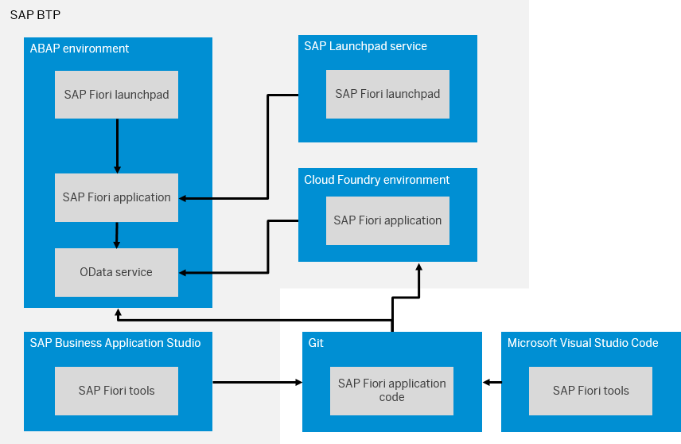
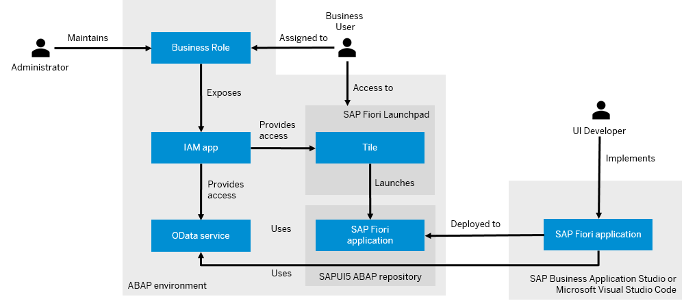
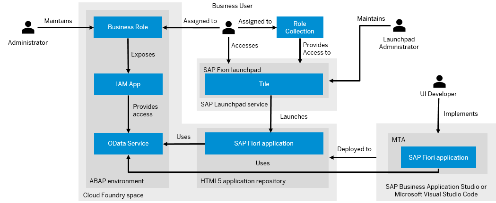

<!-- loiob74a89d3565b4abeb88efb581a081c8d -->

# UI Development

Learn more about the different options to develop SAP Fiori applications for an OData service, where to store the application, and how to enable business users to access the application from SAP Fiori launchpad.

<a name="loiob74a89d3565b4abeb88efb581a081c8d__section_ofq_hts_ctb"/>

## Overview

You can develop SAP Fiori applications for OData services that are exposed as a UI service. See [OData Service Consumption](https://help.sap.com/viewer/923180ddb98240829d935862025004d6/Cloud/en-US/f2cbcacaf8b74540b0708fc143875bc3.html).

> ### Note:  
> SAP Fiori is a design system that enables you to create business apps with a consumer-grade user experience, turning casual users into SAP experts with simple screens that run on any device. You can build apps that follow the SAP Fiori design principle using a combination of SAPUI5 and SAP Fiori elements. See [SAP Fiori](https://help.sap.com/viewer/product/SAP_FIORI_OVERVIEW/5_OVERVIEW/en-US).
> 
> SAPUI5 is a development framework that allows you to build a front-end application that follows the SAP Fiori design guidelines. SAPUI5 apps are built using HTML5, JS, XML, OData, and JSON, and are based on the Model, View, Controller \(or MVC\) design pattern. See [SAPUI5](https://help.sap.com/viewer/product/SAPUI5/External/en-US).
> 
> SAP Fiori elements is a framework that comprises the most commonly used floorplan templates. It is designed to speed up development by reducing the amount of frontend code needed to build SAP Fiori apps and to ensure UX consistency and compliance with the latest SAP Fiori design guidelines. See [SAP Fiori Elements](https://sapui5.hana.ondemand.com/#/topic/03265b0408e2432c9571d6b3feb6b1fd).

To develop SAP Fiori applications, you can either use SAP Business Application Studio with SAP Fiori tools extensions or Microsoft Visual Studio Code \(VS Code\) with SAP Fiori tools extensions.

> ### Note:  
> SAP Business Application Studio is an SAP Business Technology Platform \(SAP BTP\) service that offers a modern development environment tailored for efficient development of business applications for the SAP Intelligent Enterprise. See [SAP Business Application Studio](https://help.sap.com/products/BTP/65de2977205c403bbc107264b8eccf4b/c736960ff27c45a9b787bde2c1e48d3e.html?locale=en-US&version=Cloud).
> 
> Visual Studio Code is a source-code editor provided by Microsoft for Windows, Linux, and macOS. See [Visual Studio Code](https://help.sap.com/viewer/17d50220bcd848aa854c9c182d65b699/Latest/en-US/17efa217f7f34a9eba53d7b209ca4280.html).
> 
> SAP Fiori tools is a set of extensions for SAP Business Application Studio and Visual Studio Code that makes developing SAP Fiori applications faster and easier. See [SAP Fiori Tools](https://help.sap.com/viewer/product/SAP_FIORI_tools/Latest/en-US).

SAP Business Application Studio and VS Code support integration with Git so that you can use Git as source control system and store the code of SAP Fiori applications in remote git repositories.

> ### Note:  
> Git is a free and open source distributed version control system designed to handle everything from small to very large projects fast and efficiently.

Once you have implemented the SAP Fiori application, you can deploy it to the ABAP or Cloud Foundry environment.

You can launch the deployed apps standalone or embed them into the SAP Fiori launchpad.

> ### Note:  
> SAP Fiori launchpad is the entry point for business users to SAP Fiori apps on mobile and desktop devices. The launchpad comprises a home page where app tiles, which can display live status indicators, such as the number of open tasks, are clustered. Each tile represents a business application that the user can launch. See [SAP Fiori Launchpad - User Guide](https://help.sap.com/viewer/fd8f9fda63fa4c7a92bb1d4b4ac5582c/Cloud/en-US/2e034767ee0c4d43a5159ce4a4c014f5.html).

The ABAP environment comes with an embedded SAP Fiori launchpad and provides access to SAP Fiori apps that are deployed to the ABAP environment. Apps deployed to the Cloud Foundry environment can be added to a launchpad provided by theSAP Build Work Zone, standard edition. You can also add apps that are deployed to the ABAP environment to launchpads provided by the SAP Build Work Zone, standard edition. See [Integrating Content with SAP Build Work Zone, standard edition](../50-administration-and-ops/integrating-content-with-sap-build-work-zone-standard-edition-ac97434.md).

> ### Note:  
> The SAP Build Work Zone, standard edition is an SAP BTP service that enables you to build a portal-like central entry point and provides enterprise-wide, efficient, secure, and role-based access to SAP and non-SAP applications. See [https://help.sap.com/docs/WZ\_STD](https://help.sap.com/docs/WZ_STD).

<a name="loiob74a89d3565b4abeb88efb581a081c8d__section_evh_23r_stb"/>

## SAP Fiori Applications in the ABAP environment

If you want to deploy an SAP Fiori application to the ABAP environment, the following users are involved:

-   A UI developer implements the SAP Fiori application against the OData service and defines the tile as part of the application. Once this is done, the developer deploys the SAP Fiori application to the SAPUI5 ABAP repository.

    > ### Note:  
    > The SAPUI5 ABAP repository is part of the ABAP environment and is the umbrella term for the single SAPUI5 repository of each application. Technically, the SAPUI5 ABAP repository is based on the Business Server Page \(BSP\) repository. Each SAPUI5 repository is represented by an individual BSP application. The SAPUI5 ABAP repository is also used for delivering SAPUI5 apps of the ABAP environment.

-   An administrator in the ABAP environment provides access to the OData service and the tile via a business role.
-   A business user that is assigned to the business role can access the tile from SAP Fiori launchpad and launch the application.

<a name="loiob74a89d3565b4abeb88efb581a081c8d__section_u5t_g3r_stb"/>

## SAP Fiori Application in the Cloud Foundry environment

If you want to deploy an SAP Fiori application to the Cloud Foundry environment, the following users are involved:

-   A UI developer implements the SAP Fiori application against the OData service as part of a multi-target application \(MTA\).

    An MTA is logically a single application comprised of multiple parts created with different technologies, which share the same lifecycle. The developers of the MTA describe the desired result using the MTA model, which contains MTA modules, MTA resources, and interdependencies between them.

-   The developer defines the tile as part of the application. Once this is done, the MTA is deployed to the Cloud Foundry space. By doing so, the SAP Fiori application of the MTA is deployed to the HTML5 application repository. The developer can deploy the MTA either manually or as part of a CI/CD pipeline. See [Continuous Integration and Delivery \(CI/CD\)](https://help.sap.com/products/BTP/65de2977205c403bbc107264b8eccf4b/fe74df55b0f54e99bf6e13a3b53e1db0.html?version=Cloud).

    The HTML5 application repository is an SAP BTP service that enables central storage of HTML5 applications' static content on the SAP BTP, Cloud Foundry environment. See [HTML5 Application Repository](https://help.sap.com/products/BTP/65de2977205c403bbc107264b8eccf4b/f8520f572a6445a7bfaff4a1bbcbe60a.html?version=Cloud).

-   An administrator in the ABAP environment provides access to the OData service via a business role. A launchpad administrator enables access to the tile via a role collection.
-   A business user that is assigned to the business role and role collection can access the tile from SAP Fiori launchpad and launch the application.

**Related Information**  

[SAP Business Application Studio](https://help.sap.com/viewer/product/SAP%20Business%20Application%20Studio/Cloud/en-US)

[SAP Fiori Tools](https://help.sap.com/viewer/product/SAP_FIORI_tools/Latest/en-US)

[SAP Fiori Overview](https://help.sap.com/viewer/product/SAP_FIORI_OVERVIEW/5_OVERVIEW/en-US?task=discover_task)

[Visual Studio Code](https://help.sap.com/viewer/17d50220bcd848aa854c9c182d65b699/Latest/en-US/17efa217f7f34a9eba53d7b209ca4280.html)

[Test Automation](https://developers.sap.com/group.fiori-elements-mockserver-opa.html)

