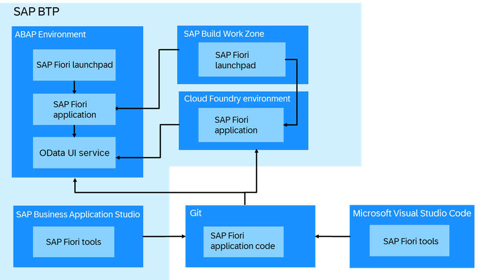
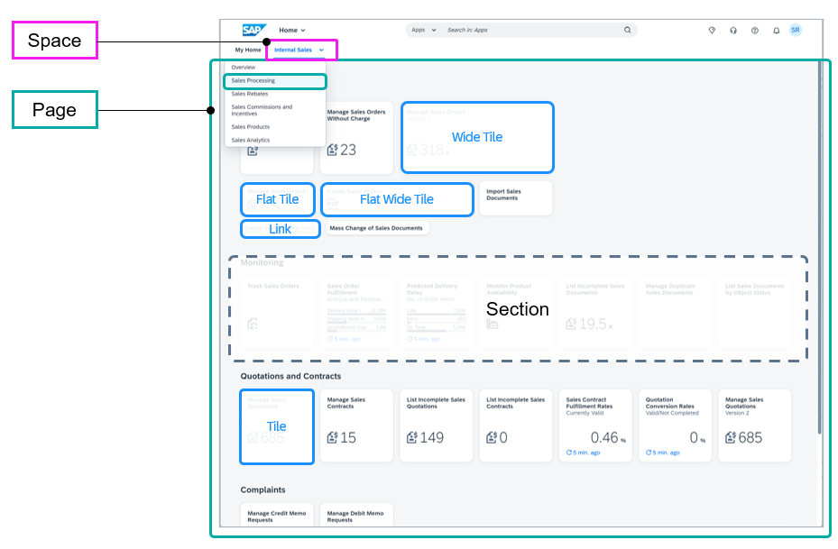
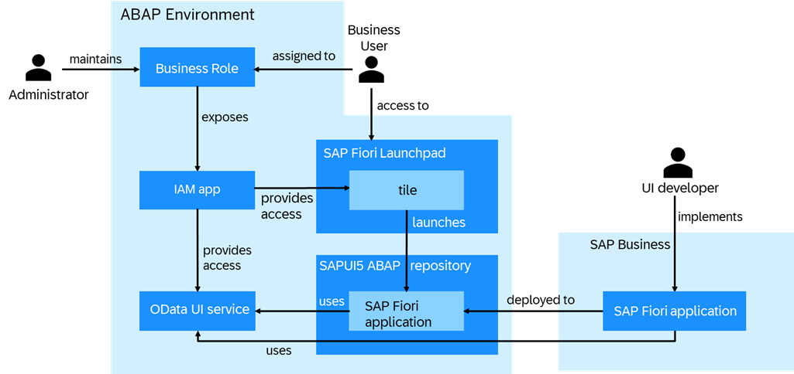
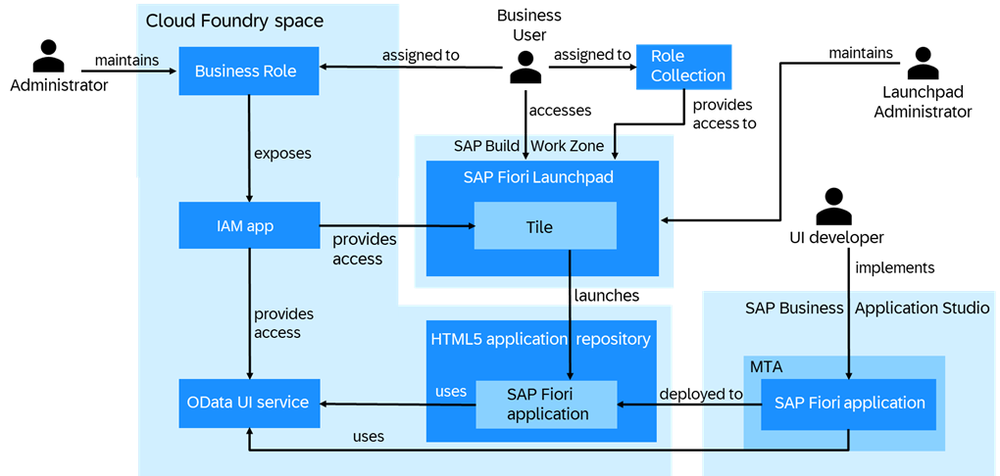

<!-- loiob74a89d3565b4abeb88efb581a081c8d -->

# UI Development

Learn more about the different options to develop SAP Fiori applications for an existing OData UI service, where to store the application, and how to enable business users to access the application from SAP Fiori launchpad.

<a name="loiob74a89d3565b4abeb88efb581a081c8d__section_ofq_hts_ctb"/>

## Overview

You can develop SAP Fiori applications for OData UI services that are exposed as a UI service. See [OData service Consumption](https://help.sap.com/docs/abap-cloud/abap-rap/odata-service-consumption?version=sap_btp).

-   SAP Fiori is a design system that enables you to create business apps with a consumer-grade user experience, turning casual users into SAP experts with simple screens that run on any device. Apps that follow the Fiori design principle can be built using a combination of SAP UI5 and SAP Fiori Elements. See [SAP Fiori](https://help.sap.com/docs/SAP_FIORI_OVERVIEW).

-   SAPUI5 is a development framework that a developer would use to actually build a front-end application that follows the Fiori design guidelines. UI5 apps are built using HTML5, JS, XML, OData and JSON, and are based on the Model, View, Controller \(or MVC\) design pattern. See [SAPUI5](https://help.sap.com/docs/SAPUI5?version=External).

-   SAP Fiori Elements is a framework that comprises the most commonly used floorplan templates and is designed to speed up development by reducing the amount of frontend code needed to build SAP Fiori apps, and driving UX consistency and compliance with the latest SAP Fiori design guidelines. See [SAP Fiori Elements](https://sapui5.hana.ondemand.com/#/topic/03265b0408e2432c9571d6b3feb6b1fd).

An OData UI service makes it possible to consume a RAP business object with a Fiori elements UI or other UI clients. That means, a Fiori UI application reads the information in the metadata and creates the matching UI for the service.

SAP does not provide UI services for consumption but instead business object interfaces or ABAP Core Data Services that are released with **Contract C1: Use System-Internally** that can be utilized.

Not all business object interfaces and CDS views are suitable for UI consumption. Only those explicitly annotated with the `@ObjectModel.supportedCapabilities: [#UI_PROVIDER_PROJECTION_SOURCE]` annotation are intended for UI use \(see `ObjectModel.supportedCapabilities`\). These business object interfaces/CDS views come with the following qualities:

-   Text relations: Available for all ID fields with associated texts.
-   Value helps: Provided for all ID fields that have texts.
-   Additional fields: Exposes commonly used fields and associations.
-   Draft enablement: Available for business object interfaces when create, update, and delete behaviors are implemented.

For a UI developer to implement an SAP Fiori application using these business object interfaces/CDS views, a custom OData UI service must be created first.

In order to develop SAP Fiori applications on top of OData UI services, you use SAP Business Application Studio or Visual Studio Code with SAP Fiori tools extensions. SAP Business Application Studio supports integration with Git so that you can use Git as source control system and store the code of SAP Fiori applications in remote git repositories. Once you have implemented the custom SAP Fiori application, you can deploy it to the ABAP environment or the Cloud Foundry environment. You can launch the deployed apps standalone or embed them into the SAP Fiori launchpad. The ABAP environment comes with an embedded Fiori Launchpad and provides access to Fiori apps that are stored on the SAPUI5 ABAP repository. Apps stored in the HTML5 application repository can be added to a launchpad provided by the SAP Build Work Zone. It is also possible to add apps stored on the SAPUI5 ABAP repository to launchpads provided by the SAP Build Work Zone. See [Integration Scenario](https://help.sap.com/docs/btp/sap-business-technology-platform/integration-scenarios?version=Cloud)"

Spaces and pages structure the way apps and other content appears in the SAP Fiori launchpad. They offer more flexibility to influence the launchpad layout for different user groups. Each user can see one or more spaces that contain one or more pages. The pages show apps clustered in different sections.

A *Space* is assigned to a business role and offers a structured layout of the business role content. Each space must consist of at least one page.

A *Page* holds the actual layout information for the corresponding space. It groups the apps visualized by tiles into different sections from the work perspective of the end user.

The following graphic illustrates the concept of spaces and pages.

Read [Managing Launchpad Spaces and Pages](https://help.sap.com/docs/btp/user-interface-configurations/managing-launchpad-spaces-and-pages?version=Cloud) for an in-depth description of the concept in the SAP Business Technology Platform. For more information on how to use spaces and pages in SAP Build Work Zone, please refer to [Manual Configuration of Spaces and Pages](https://help.sap.com/docs/build-work-zone-standard-edition/sap-build-work-zone-standard-edition/manual-configuration-of-spaces-and-pages?q=Space).

<a name="loiob74a89d3565b4abeb88efb581a081c8d__section_evh_23r_stb"/>

## SAP Fiori Applications in the ABAP environment

If you want to deploy an SAP Fiori application to the ABAP environment, the following users are involved:

-   A UI developer implements the SAP Fiori application against the OData UI service and defines the tile as part of the application. Once this is done, the developer deploys the SAP Fiori application to the SAPUI5 ABAP repository.

    > ### Note:  
    > The SAPUI5 ABAP repository is part of the ABAP environment and is the umbrella term for the single SAPUI5 repository of each application. Technically, the SAPUI5 ABAP repository is based on the Business Server Page \(BSP\) repository. Each SAPUI5 repository is represented by an individual BSP application. The SAPUI5 ABAP repository is also used for delivering SAPUI5 apps of the ABAP environment.

-   An administrator in the ABAP environment provides access to the OData UI service and the tile via a business role.
-   A business user that is assigned to the business role can access the tile from SAP Fiori launchpad and launch the application.

<a name="loiob74a89d3565b4abeb88efb581a081c8d__section_u5t_g3r_stb"/>

## SAP Fiori Applications in the Cloud Foundry environment

If you want to deploy an SAP Fiori application to the Cloud Foundry environment, the following users are involved:

-   A UI developer implements the SAP Fiori application against the OData UI service as part of a multi-target application \(MTA\).

    An MTA is logically a single application comprised of multiple parts created with different technologies, which share the same lifecycle. The developers of the MTA describe the desired result using the MTA model, which contains MTA modules, MTA resources, and interdependencies between them.

-   The developer defines the tile as part of the application. Once this is done, the MTA is deployed to the Cloud Foundry space. By doing so, the SAP Fiori application of the MTA is deployed to the HTML5 application repository. The developer can deploy the MTA either manually or as part of a CI/CD pipeline. See [Continuous Integration and Delivery \(CI/CD\)](https://help.sap.com/products/BTP/65de2977205c403bbc107264b8eccf4b/fe74df55b0f54e99bf6e13a3b53e1db0.html?version=Cloud).

    The HTML5 application repository is an SAP BTP service that enables central storage of HTML5 applications' static content on the SAP BTP, Cloud Foundry environment. See [HTML5 Application Repository](https://help.sap.com/products/BTP/65de2977205c403bbc107264b8eccf4b/f8520f572a6445a7bfaff4a1bbcbe60a.html?version=Cloud).

-   An administrator in the ABAP environment provides access to the OData UI service via a business role. A launchpad administrator enables access to the tile via a role collection.
-   A business user that is assigned to the business role and role collection can access the tile from SAP Fiori launchpad and launch the application.

**Related Information**  

[SAP Business Application Studio](https://help.sap.com/viewer/product/SAP%20Business%20Application%20Studio/Cloud/en-US)

[SAP Fiori Tools](https://help.sap.com/viewer/product/SAP_FIORI_tools/Latest/en-US)

[SAP Fiori Overview](https://help.sap.com/viewer/product/SAP_FIORI_OVERVIEW/5_OVERVIEW/en-US?task=discover_task)

[Visual Studio Code](https://help.sap.com/viewer/17d50220bcd848aa854c9c182d65b699/Latest/en-US/17efa217f7f34a9eba53d7b209ca4280.html)

[Test Automation](https://developers.sap.com/group.fiori-elements-mockserver-opa.html)

