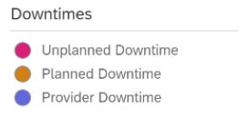

<!-- loio32c4f7d3f0224fc2be3a1103297db59f -->

# Update Product Version

As a provider, you can use the *Update Product Version* app to update the version of your product on specific systems.

<a name="loio32c4f7d3f0224fc2be3a1103297db59f__section_umt_xqz_1tb"/>

## Prerequisites

You need to have the “LandscapePortalAdmin” user role assigned to your user account to access this app.

<a name="loio32c4f7d3f0224fc2be3a1103297db59f__section_vzk_yqz_1tb"/>

## Working in the Update Product Version App

1.  Sign in to the *Landscape Portal* from your provider subaccount.

2.  Scroll down to *Product* and click on the *Update Product Version* tile to open the app.

3.  On the right side of the screen, you can find the *Planning Calendar*.

    The planning calendar gives an overview of planned and unplanned downtimes of service-relevant infrastructure as well as already scheduled product version updates.

    Calendar legend:

    

    You can use the calendar to help you find a fitting time slot for your product version update so as to make sure that it doesn’t conflict with other downtimes.

4.  On the left side, under *Product and Product Version Selection*, select which product and version you want to update from the drop-down menu.

    > ### Note:  
    > The product version can only be updated to a higher version. It is not possible to update the product version to a lower version.

5.  In the *Available Systems* section, select at least one system in which you want to update the product version. You can also select multiple systems at once.

6.  Click the *Update* button. A dialog box will open. Fill in the remaining details:

    -   **Title**: Choose a title for your update.
    -   **From**: Select the time the update can begin.
    -   **To**: The estimated time at which the product version update will be completed.

        The information you enter here will be added to the planning calendar. After the product version update has been successfully completed, the ‘To’ value will be automatically updated according to the actual duration of the update.

    Confirm with *Schedule*.

7.  Check the list under *Product Version Update Status*. Here, all update requests as well as their current status and progress are displayed. The update you just scheduled has been added to the list.

    -   As long as an update is in status "scheduled" or "error", you can still cancel it using the trash icon.
    -   If the update process is stuck with an error, you can cancel it using the trash icon. In this case, the process is technically aborted and an automatic cleanup is performed to execute a revoke or a rollback behind the scenes.

> ### Note:  
> The product version update status list is refreshed automatically every 30 seconds. The planning calendar as well as the systems list can be refreshed manually by clicking the reload button.

