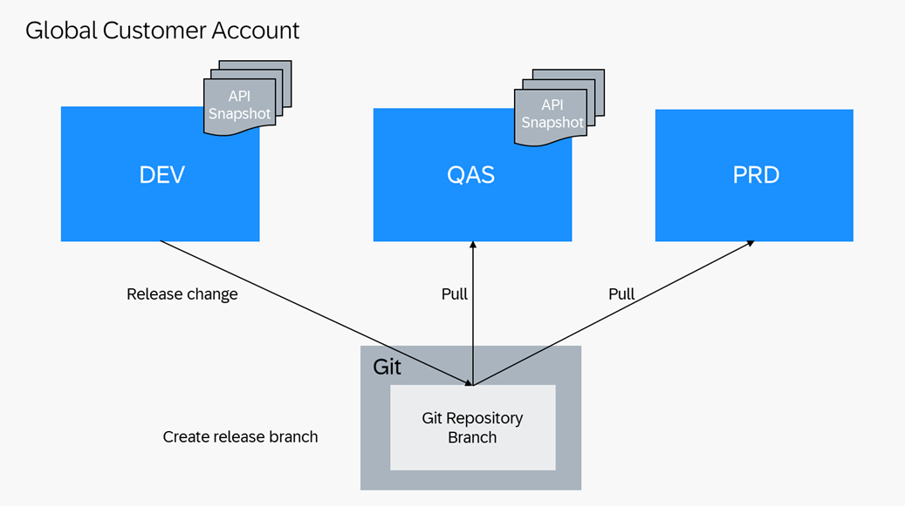

<!-- loio2276142117a54197bb05fb8481c10a08 -->

# Use Case 1: One Codeline in a 3-System Landscape

You can apply this setup if you have occasional development activities for larger applications where testing needs to run in parallel to development or should take place in a non-development system to ensure the solution also runs in a non-development system. In this setup, you either need to be able to pause development for a fix that has to be delivered before the next release or you have to deliver fixes as part of the next possible release.

This landscape consists of a development, quality assurance, and production system. Software component branches are provided remotely in a Git repository branch and checked out locally in such systems. In case of released APIs in the involved software components, API Snapshots are generated locally after release decisions.

<a name="loio2276142117a54197bb05fb8481c10a08__section_ltg_rbt_wlb"/>

## For Go Live/Development After Go Live \(Including Deferrable Corrections\)

**Starting situation for Go Live**

The Go Live process is characterized by creating different systems only when needed for the first time, however, you can provision the systems already beforehand. Furthermore, the software component of a planned solution does not exist from the beginning. The resulting release branch is YYYY-01. Apart from this, the Go Live process does not differ from the release development processes afterwards.

**Starting situation after Go Live**

-   Development system DEV is based on the main branch
-   Quality Assurance system QAS and production system PRD are based on the latest release branch YYYY-<nn\>. In case of a first release after the Go Live, YYYY-<nn\> is YYYY-01

-   Software component relations are defined for dependencies between leading- and reuse software components in the YYYY-<nn\> release
-   In case of released APIs: In the quality assurance system QAS and development system DEV a check-relevant API snapshot named YYYY-<nn\> was generated manually with all released APIs extracted as per the current release

System QAS has always the same software state as the PRD system, unless a new change is tested and released. This means, transport requests are released in development ABAP systems only if development is completed and it is planned to import the changes to the production system.

This process can also be used for deferrable corrections, which do not need to reach production before the next development release. These corrections are handled like regular development.

<table>
<tr>
<th valign="top">

Step

</th>
<th valign="top">

System

</th>
<th valign="top">

Role

</th>
<th valign="top">

Task

</th>
<th valign="top">

Tool

</th>
</tr>
<tr>
<td valign="top" rowspan="2">

0

</td>
<td valign="top" rowspan="2">

DEV

</td>
<td valign="top" rowspan="2">

Release Manager

</td>
<td valign="top">

At Go Live only: Create the software component and clone it initially

</td>
<td valign="top">

*Manage Software Components* app

</td>
</tr>
<tr>
<td valign="top">

If required, create a customizing transport request and tasks for the relevant business configuration expert\(s\).

</td>
<td valign="top">

*Export Customizing Transports* app

</td>
</tr>
<tr>
<td valign="top">

1a

</td>
<td valign="top">

DEV

</td>
<td valign="top">

Developer

</td>
<td valign="top">

Develop new functionality or a deferrable correction. All changes are collected in workbench transport requests. [During development ATC checks are running](https://help.sap.com/docs/abap-cloud/abap-development-tools-user-guide/working-with-atc-during-development) and exemptions requested for false-positive findings \([Requesting ATC Exemptions](https://help.sap.com/docs/abap-cloud/abap-development-tools-user-guide/requesting-atc-exemptions)\). Make sure to maintain new dependencies between software components in software component relations \([Editing Software Component Relations](https://help.sap.com/docs/abap-cloud/abap-development-tools-user-guide/editing-software-component-relations)\).

</td>
<td valign="top">

ABAP Development Tools for Eclipse

</td>
</tr>
<tr>
<td valign="top">

1b

</td>
<td valign="top">

DEV

</td>
<td valign="top">

Business Configuration Expert

</td>
<td valign="top">

Maintain business configuration. All changes are collected in customizing transport requests

</td>
<td valign="top">

*Maintain Business Configurations* app

</td>
</tr>
<tr>
<td valign="top">

2

</td>
<td valign="top">

DEV

</td>
<td valign="top">

Quality Manager

</td>
<td valign="top">

[Approve or reject ATC exemptions](https://help.sap.com/docs/abap-cloud/abap-development-tools-user-guide/approving-and-rejecting-atc-exemptions)

</td>
<td valign="top">

ABAP development tools for Eclipse: ATC Exemptions

</td>
</tr>
<tr>
<td valign="top">

3

</td>
<td valign="top">

DEV

</td>
<td valign="top">

Release Manager

</td>
<td valign="top">

Release the transport request\(s\). During transport release ATC checks are running \([Working with ATC During Transport Release](https://help.sap.com/docs/abap-cloud/abap-development-tools-user-guide/working-with-atc-during-transport-release)\). The changes are now in the main branch.

</td>
<td valign="top">

ABAP Development Tools for Eclipse: Transport Organizer

</td>
</tr>
<tr>
<td valign="top">

4

</td>
<td valign="top">

QAS

</td>
<td valign="top">

Release Manager

</td>
<td valign="top">

At Go Live: Pull software component\(s\) into system QAS.

After Go Live: Check out main branch of software component\(s\)

</td>
<td valign="top">

*Manage Software Components* app

</td>
</tr>
<tr>
<td valign="top">

5

</td>
<td valign="top">

QAS

</td>
<td valign="top">

Tester

</td>
<td valign="top">

Test the change and report test result. During testing ATC checks are running, see [Working with ATC During Development.](https://help.sap.com/docs/abap-cloud/abap-development-tools-user-guide/working-with-atc-during-development)

</td>
<td valign="top">

ABAP development tools for Eclipse and custom SAP Fiori apps as well as external test tools, see [Automate the Software Lifecycle Process](https://help.sap.com/docs/btp/sap-business-technology-platform/automate-software-lifecycle-management-process?version=Cloud)

External documentation tool

</td>
</tr>
<tr>
<td valign="top">

 

</td>
<td valign="top">

 

</td>
<td valign="top">

 

</td>
<td valign="top">

If changes are required, repeat steps 1-4

</td>
<td valign="top">

 

</td>
</tr>
<tr>
<td valign="top">

6

</td>
<td valign="top">

QAS

</td>
<td valign="top">

Release Manager

</td>
<td valign="top">

Release decision: the changes are successfully tested and approved

</td>
<td valign="top">

External documentation tool

</td>
</tr>
<tr>
<td valign="top">

7

</td>
<td valign="top">

QAS

</td>
<td valign="top">

Tester

</td>
<td valign="top">

Test the change and report the test result. During testing ATC checks are running, see [Working with ATC During Transport Release](https://help.sap.com/docs/abap-cloud/abap-development-tools-user-guide/working-with-atc-during-transport-release).

</td>
<td valign="top">

ABAP development tools for Eclipse and custom SAP Fiori apps as well as external test tools. For more information, see [Automate the Software Lifecycle Management Process](https://help.sap.com/docs/btp/sap-business-technology-platform/automate-software-lifecycle-management-process?version=Cloud)

External documentation tool

</td>
</tr>
<tr>
<td valign="top">

8

</td>
<td valign="top">

QAS

</td>
<td valign="top">

Release Manager

</td>
<td valign="top">

Check out the new release branch YYYY-<nn+1\>

</td>
<td valign="top">

*Manage Software Components* app

</td>
</tr>
<tr>
<td valign="top">

9

</td>
<td valign="top">

PRD

</td>
<td valign="top">

Release Manager

</td>
<td valign="top">

In case of Released APIs: Create and generate a new API snapshot YYYY-<nn+1\> for the new release. Set the new API snapshot as check-relevant so that it will be used as reference for API compatibility checks.

</td>
<td valign="top">

[Manage API Snapshots app](https://help.sap.com/docs/sap-btp-abap-environment/abap-environment/manage-api-snapshots?version=Cloud)

</td>
</tr>
<tr>
<td valign="top">

10

</td>
<td valign="top">

DEV

</td>
<td valign="top">

Release Manager

</td>
<td valign="top">

Check out the new release branch YYYY<nn+1\> for each software component \(at Go Live: YYYY-01\) into system PRD

</td>
<td valign="top">

*Manage Software Components*

</td>
</tr>
</table>

<a name="loio2276142117a54197bb05fb8481c10a08__section_tnb_gzt_wlb"/>

## Urgent Corrections

-   Development system DEV is based on the main branch
-   Quality assurance system QAS and production system PRD are based on the latest release branch YYYY-<nn\>. In case of a correction after the Go Live before the second release, YYYY-<nn\> is YYYY-01
-   In case of released APIs: In the quality assurance system QAS and development system DEV, a check-relevant API snapshot named YYYY-<nn\> is generated with all released APIs extracted

This process differs from the previous one in the branch it is developed in. As the correction is too urgent to release it with the next development release only, it is done in the release branch. To achieve this separation, all current development activities need to be paused because the DEV system needs to check out the latest release branch instead of the main branch. That means all open transports in DEV need to be released first to save the work in progress to the main branch, so that feature development can be resumed later after the correction.

<table>
<tr>
<th valign="top">

Step

</th>
<th valign="top">

System

</th>
<th valign="top">

Role

</th>
<th valign="top">

Task

</th>
<th valign="top">

Tool

</th>
</tr>
<tr>
<td valign="top" rowspan="2">

1

</td>
<td valign="top" rowspan="2">

DEV

</td>
<td valign="top" rowspan="2">

Release Manager

</td>
<td valign="top">

Check out the release branch YYYY-<nn\> for each software component

</td>
<td valign="top">

*Manage Software Components* app

</td>
</tr>
<tr>
<td valign="top">

If required, create a customizing transport request and tasks for the relevant business configuration expert\(s\)

</td>
<td valign="top">

*Export Customizing Transports* app

</td>
</tr>
<tr>
<td valign="top">

2

</td>
<td valign="top">

DEV

</td>
<td valign="top">

Release Manager

</td>
<td valign="top">

In case of Released APIs: Set API Snapshot created for the release YYYY-<nn\> as check-relevant. For release YYYY-01 all API snapshots will be set to not check-relevant as no API snapshot is available for comparison.

</td>
<td valign="top">

[Manage API Snapshots app](https://help.sap.com/docs/sap-btp-abap-environment/abap-environment/manage-api-snapshots?version=Cloud)

</td>
</tr>
<tr>
<td valign="top">

3a

</td>
<td valign="top">

DEV

</td>
<td valign="top">

Developer

</td>
<td valign="top">

Fix existing functionality. All changes are collected in workbench transport requests. [During Development ATC checks are running](https://help.sap.com/docs/abap-cloud/abap-development-tools-user-guide/working-with-atc-during-development) and exemptions requested for false-positive findings, see [Requesting ATC Exemptions](https://help.sap.com/docs/abap-cloud/abap-development-tools-user-guide/requesting-atc-exemptions).

</td>
<td valign="top">

[Manage API Snapshots app](https://help.sap.com/docs/sap-btp-abap-environment/abap-environment/manage-api-snapshots?version=Cloud)

</td>
</tr>
<tr>
<td valign="top">

3b

</td>
<td valign="top">

DEV

</td>
<td valign="top">

Business Configuration Expert

</td>
<td valign="top">

Maintain business configuration. All changes are collected in customizing transport requests

</td>
<td valign="top">

Custom Business Configurations app

</td>
</tr>
<tr>
<td valign="top">

4

</td>
<td valign="top">

DEV

</td>
<td valign="top">

Quality Manager

</td>
<td valign="top">

[Approve or reject ATC exemptions](https://help.sap.com/docs/abap-cloud/abap-development-tools-user-guide/approving-and-rejecting-atc-exemptions) 

</td>
<td valign="top">

ABAP Development

Tools for Eclipse: ATC Exemptions

</td>
</tr>
<tr>
<td valign="top">

5

</td>
<td valign="top">

DEV

</td>
<td valign="top">

Release Manager

</td>
<td valign="top">

Releases the transport requests. [During transport release ATC checks](https://help.sap.com/docs/abap-cloud/abap-development-tools-user-guide/working-with-atc-during-transport-release)\) are running.

</td>
<td valign="top">

ABAP Development Tools for Eclipse: Transport Organizer or *Export Customizing Transports* app

</td>
</tr>
<tr>
<td valign="top">

6

</td>
<td valign="top">

QAS

</td>
<td valign="top">

Release Manager

</td>
<td valign="top">

Pull the software component\(s\) to get the correction into the already checked out release branch YYYY-<nn\>

</td>
<td valign="top">

*Manage Software Components* app

</td>
</tr>
<tr>
<td valign="top">

7

</td>
<td valign="top">

QAS

</td>
<td valign="top">

Tester

</td>
<td valign="top">

Test the change and report the test result. During Testing ATC checks are running, see [Working with ATC During Transport Release](https://help.sap.com/docs/abap-cloud/abap-development-tools-user-guide/working-with-atc-during-transport-release)

</td>
<td valign="top">

ABAP Development Tools for Eclipse and custom SAP Fiori apps as well as external test tools, see [Automate the Software Lifecycle Management Process](https://help.sap.com/docs/btp/sap-business-technology-platform/automate-software-lifecycle-management-process?version=Cloud).

External documentation tool

</td>
</tr>
<tr>
<td valign="top">

 

</td>
<td valign="top">

 

</td>
<td valign="top">

 

</td>
<td valign="top">

If changes are required, repeat steps 2-7

</td>
<td valign="top">

 

</td>
</tr>
<tr>
<td valign="top">

8

</td>
<td valign="top">

QAS

</td>
<td valign="top">

Release Manager

</td>
<td valign="top">

Fix is successfully tested and approved

</td>
<td valign="top">

External documentation tool

</td>
</tr>
<tr>
<td valign="top">

9

</td>
<td valign="top">

PRD

</td>
<td valign="top">

Release Manager

</td>
<td valign="top">

Pull the software component\(s\) to get the correction into the already checked out release branch YYYY-<nn\>

</td>
<td valign="top">

*Manage Software Components* app

</td>
</tr>
<tr>
<td valign="top">

10

</td>
<td valign="top">

DEV

</td>
<td valign="top">

Release Manager

</td>
<td valign="top">

Check out the main branch in system DEV for each software component

</td>
<td valign="top">

*Manage Software Components* app

</td>
</tr>
<tr>
<td valign="top">

11

</td>
<td valign="top">

DEV

</td>
<td valign="top">

Release Manager

</td>
<td valign="top">

In case of Released APIs: Set API Snapshot created for the latest release as check relevant. For release YYYY-01 all API snapshots shall be set to not check-relevant as no API snapshot is available for comparison.

</td>
<td valign="top">

[Manage API Snapshots app](https://help.sap.com/docs/btp/sap-business-technology-platform/manage-api-snapshots?version=Cloud)

</td>
</tr>
<tr>
<td valign="top">

12

</td>
<td valign="top">

DEV

</td>
<td valign="top">

Developer, Business Configuration Expert

</td>
<td valign="top">

Perform the same changes as for the correction in the main branch and release them

</td>
<td valign="top">

ABAP Development Tools for Eclipse

*Maintain Business Configurations* app

*Export Customizing Transports* app

</td>
</tr>
</table>

