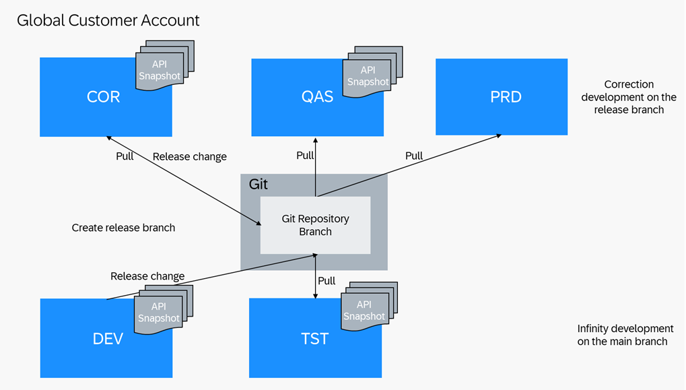

<!-- loio4e53874043e544ce8f41fea26f674134 -->

# Use Case 2: One Development and Correction Codeline in a 5-System Landscape

You can apply this setup if you have permanent/infinite development activities for large applications with many developers, where development cannot be paused to implement an urgent correction. Software component branches are provided remotely in a Git repository branch and checked out locally in such systems. In case of released APIs in the involved software components, API snapshots are generated locally after release decisions. Corrections need to run in parallel to development and on a released state. You need to separate testing from development to ensure the solutions also runs in a non-development system before being delivered to production.

General considerations:

-   Systems COR and QAS have the same software state as production system PRD, unless a new change is tested and released. This means transport requests are released in the DEV system only if development is completed and if it is planned to import the changes to the production system.
-   Releases are planned and communicated to development in advance:
    -   Upon cut-off date, development is finished. All development that is released at this time must be tested and be of good quality. From then on, you have to fix defects in the COR system and maintain them in parallel in the DEV system.
    -   Upon release date, all defects must be fixed. If you make the decision during testing in the QAS system that a complete functionality is not delivered, developers must delete, revert, or disable the functionality in the COR system and release the corresponding transport requests. You cannot remove objects from the release branch, e.g. by deselecting transport requests. To revert objects to an older transported state, use the compare editor of the Eclipse *History* view. If the withdrawal of the functionality should be performed in the DEV system as well, it is considered as a correction and you have to perform double maintenance of corrections into the DEV system. The released software state from the COR system is imported into the production system\(s\) PRD.

-   System COR is usually locked for development. First, this means developers cannot do changes by default and there are two approaches how to handle this:

<table>
<tr>
<th valign="top">

 

</th>
<th valign="top">

User Locking

</th>
<th valign="top">

Read-Only + Write Developer Role

</th>
</tr>
<tr>
<td valign="top">

How-to Details

</td>
<td valign="top">

Unlock user on demand

</td>
<td valign="top">

Assign write role on demand

</td>
</tr>
<tr>
<td valign="top">

Pros

</td>
<td valign="top">

No additional role needed

</td>
<td valign="top">

No generic read user needed

No logon with different user for read access needed

User-specific auditing

</td>
</tr>
<tr>
<td valign="top">

Cons

</td>
<td valign="top">

Generic read user needed if you want to provide read access

</td>
<td valign="top">

Additional role needed

</td>
</tr>
</table>

Second, developers are also not allowed to create transport requests and tasks on their own, but it’s the release manager who creates them for all developers. This separation is achieved by giving business catalog `SAP_A4C_BC_TRN_MNG_PC` \(Development - Transport Management\) to the release manager instead of the developer role in correction system COR.

<a name="loio4e53874043e544ce8f41fea26f674134__section_rhr_jv5_wlb"/>

## For Go Live/Development after Go Live \(Including Deferrable Corrections\)

**Starting Situation for Go Live:**

Recently created development system DEV and other already existing ABAP systems cannot be based on some branch yet, as the software component does not exist yet.

The Go Live process is characterized by creating different systems only when needed for the first time, however, you can provision the systems already beforehand. Additionally, the future solution’s software component does not exist from the start. The resulting release branch is YYYY-01. Apart from this, the Go Live process does not differ from the release development processes.

**Starting Situation after Go Live:**

-   Development system DEV and test system TST are on the main branch
-   Correction system COR, quality assurance system QAS, and production system PRD are on release branch YYYY-<nn\>
-   Software component relations are defined for dependencies between leading- and reuse software components in the YYYY-<nn\> release
-   In case of released APIs: In the development system DEV, test system TST, correction system COR and quality assurance system QAS, a check-relevant API snapshot named YYYY-<nn\> was generated manually with all released APIs extracted

This process can also be used for deferrable corrections, which do not need to reach production before the next development release. These corrections are handled like normal development.

<table>
<tr>
<th valign="top">

Step

</th>
<th valign="top">

System

</th>
<th valign="top">

Role

</th>
<th valign="top">

Task

</th>
<th valign="top">

Tool

</th>
</tr>
<tr>
<td valign="top" rowspan="2">

0

</td>
<td valign="top" rowspan="2">

DEV

</td>
<td valign="top" rowspan="2">

Release Manager

</td>
<td valign="top">

At Go Live only: create a software component of type *Development* and, if required, a software component of type *Business Configuration*. Pull the software component\(s\) into the system.

</td>
<td valign="top">

*Manage Software Components* app

</td>
</tr>
<tr>
<td valign="top">

If required, create a customizing transport request and create tasks for the relevant business configuration expert\(s\)

</td>
<td valign="top">

*Export Customizing Transports* app

</td>
</tr>
<tr>
<td valign="top">

1a

</td>
<td valign="top">

DEV

</td>
<td valign="top">

Developer

</td>
<td valign="top">

Develop a new functionality or a deferrable correction. All changes are collected in Workbench transport requests. During Development ATC checks are running \([Working with ATC During Development](https://help.sap.com/docs/btp/sap-abap-development-user-guide/working-with-atc-during-development?version=Cloud)\) and exemptions requested for false-positive findings \([Requesting ATC Exemptions](https://help.sap.com/docs/abap-cloud/abap-development-tools-user-guide/requesting-atc-exemptions)\). Make sure to maintain new dependencies between software components in software component relations, see [Editing Software Component Relations](https://help.sap.com/docs/abap-cloud/abap-development-tools-user-guide/editing-software-component-relations).

</td>
<td valign="top">

ABAP Development Tools for Eclipse

</td>
</tr>
<tr>
<td valign="top">

1b

</td>
<td valign="top">

DEV

</td>
<td valign="top">

Business Configuration Expert

</td>
<td valign="top">

Maintain business configuration. All changes are collected in customizing transport requests

</td>
<td valign="top">

*Maintain Business Configurations* app

</td>
</tr>
<tr>
<td valign="top">

2

</td>
<td valign="top">

DEV

</td>
<td valign="top">

Quality Manager

</td>
<td valign="top">

[Approve or reject ATC exemptions](https://help.sap.com/docs/abap-cloud/abap-development-tools-user-guide/approving-and-rejecting-atc-exemptions) 

</td>
<td valign="top">

ABAP Development Tools for Eclipse: ATC Exemptions

</td>
</tr>
<tr>
<td valign="top">

3

</td>
<td valign="top">

DEV

</td>
<td valign="top">

Release Manager

</td>
<td valign="top">

Once development is finished, release the transport request\(s\). During transport release, ATC checks are running, see [Working with ATC During Transport Release](https://help.sap.com/docs/abap-cloud/abap-development-tools-user-guide/working-with-atc-during-transport-release). The changes are now in the main branch

</td>
<td valign="top">

ABAP Development Tools for Eclipse: Transport Organizer or Export Customizing Transports app

</td>
</tr>
<tr>
<td valign="top">

4

</td>
<td valign="top">

TST

</td>
<td valign="top">

Release Manager

</td>
<td valign="top">

Pull the software component\(s\) into system TST

</td>
<td valign="top">

*Manage Software Components* app

</td>
</tr>
<tr>
<td valign="top">

5

</td>
<td valign="top">

TST

</td>
<td valign="top">

Tester

</td>
<td valign="top">

Test the change and report the test result. [During Testing ATC checks are running](https://help.sap.com/docs/sap-btp-abap-environment/abap-environment/manage-api-snapshots?version=Cloud).

</td>
<td valign="top">

ABAP Development Tools for Eclipse and custom SAP Fiori apps as well as external test tools. Refer to [Automate the Software Lifecycle Management Process](https://help.sap.com/docs/btp/sap-business-technology-platform/automate-software-lifecycle-management-process?version=Cloud) 

External documentation tool

</td>
</tr>
<tr>
<td valign="top">

 

</td>
<td valign="top">

 

</td>
<td valign="top">

 

</td>
<td valign="top">

If changes are required, repeat steps 1-5

</td>
<td valign="top">

 

</td>
</tr>
<tr>
<td valign="top">

6

</td>
<td valign="top">

TST/DEV

</td>
<td valign="top">

Release Manager

</td>
<td valign="top">

Before Cutoff: In case of Released APIs, Create and generate a new API snapshot YYYY-<nn+1\> for the new release. Set the new API snapshot as check-relevant so that it will be used as reference for API compatibility checks.

> ### Caution:  
> Currently API snapshots need to be generated locally per system. Please be careful to not release new APIs between the release decision and snapshot creation.

</td>
<td valign="top">

[Manage API Snapshots app](https://help.sap.com/docs/sap-btp-abap-environment/abap-environment/manage-api-snapshots?version=Cloud) 

</td>
</tr>
<tr>
<td valign="top">

7

</td>
<td valign="top">

QAS or any other

</td>
<td valign="top">

Release Manager

</td>
<td valign="top">

Cutoff: at cutoff date, create a release branch YYYY-<nn+1\> for each software component \(at Go Live: YYYY-01\) \(release candidate\)

</td>
<td valign="top">

*Manage Software Components* app

</td>
</tr>
<tr>
<td valign="top">

8

</td>
<td valign="top">

QAS

</td>
<td valign="top">

Release Manager

</td>
<td valign="top">

Check out the release branch YYYY-<nn+1\> of each software component \(at Go Live: YYYY-01\) into system QAS

</td>
<td valign="top">

*Manage Software Components* app

</td>
</tr>
<tr>
<td valign="top">

9

</td>
<td valign="top">

QAS

</td>
<td valign="top">

Tester

</td>
<td valign="top">

Test the release candidate and report the test result. [During testing ATC checks are running.](https://help.sap.com/docs/abap-cloud/abap-development-tools-user-guide/working-with-atc-during-transport-release) 

</td>
<td valign="top">

ABAP Development Tools for Eclipse with ADT and custom SAP Fiori apps as well as external test tools. Refer to [Automate the Software Lifecycle Management Process](https://help.sap.com/docs/btp/sap-business-technology-platform/automate-software-lifecycle-management-process?version=Cloud).

External documentation tool

</td>
</tr>
<tr>
<td valign="top">

10

</td>
<td valign="top">

COR

</td>
<td valign="top">

Release Manager

</td>
<td valign="top">

Check out the branch YYYY-<nn+1\> of each software component \(at Go Live: YYYY-01\) into system COR

</td>
<td valign="top">

*Manage Software Components* app

</td>
</tr>
<tr>
<td valign="top" rowspan="2">

11

</td>
<td valign="top" rowspan="2">

COR

</td>
<td valign="top" rowspan="2">

Release Manager

</td>
<td valign="top">

Enable the respective development users for development in system COR, depending on the process you decided for, either by unlocking or assigning a different role

</td>
<td valign="top">

*Maintain Business Users* app

</td>
</tr>
<tr>
<td valign="top">

If required, create a customizing transport request and create tasks for the relevant business configuration expert\(s\)

</td>
<td valign="top">

*Export Customizing Transports* app

</td>
</tr>
<tr>
<td valign="top">

12a

</td>
<td valign="top">

COR

</td>
<td valign="top">

Developer

</td>
<td valign="top">

Implement development-related corrections. [During testing ATC checks are running.](https://help.sap.com/docs/abap-cloud/abap-development-tools-user-guide/working-with-atc-during-transport-release) and exemptions requested for false-positive findings \([Requesting ATC Exemptions](https://help.sap.com/docs/abap-cloud/abap-development-tools-user-guide/requesting-atc-exemptions)\).

</td>
<td valign="top">

ABAP Development Tools for Eclipse

</td>
</tr>
<tr>
<td valign="top">

12b

</td>
<td valign="top">

COR

</td>
<td valign="top">

Business Configuration Expert

</td>
<td valign="top">

Implement corrections to business configuration content

</td>
<td valign="top">

*Maintain Business Configurations* app

</td>
</tr>
<tr>
<td valign="top">

13

</td>
<td valign="top">

COR

</td>
<td valign="top">

Quality Manager

</td>
<td valign="top">

[Approve or reject ATC exemptions](https://help.sap.com/docs/abap-cloud/abap-development-tools-user-guide/approving-and-rejecting-atc-exemptions) 

</td>
<td valign="top">

ABAP Development

Tools for Eclipse: ATC Exemptions

</td>
</tr>
<tr>
<td valign="top">

14

</td>
<td valign="top">

COR

</td>
<td valign="top">

Release Manager

</td>
<td valign="top">

Release the development transport request\(s\). [During testing ATC checks are running](https://help.sap.com/docs/abap-cloud/abap-development-tools-user-guide/working-with-atc-during-transport-release). The changes are now in the release candidate.

</td>
<td valign="top">

ABAP Development Tools for Eclipse: Transport Organizer or *Export Customizing Transports* app

</td>
</tr>
<tr>
<td valign="top">

15

</td>
<td valign="top">

QAS

</td>
<td valign="top">

Release Manager

</td>
<td valign="top">

Pull the software component\(s\) to get the correction into the already checked out release branch YYYY-<nn+1\> \(@Go Live: YYYY-01\)

</td>
<td valign="top">

*Manage Software Components* app

</td>
</tr>
<tr>
<td valign="top">

16

</td>
<td valign="top">

QAS

</td>
<td valign="top">

Tester

</td>
<td valign="top">

Test the change and report the test result. [During testing ATC checks are running.](https://help.sap.com/docs/abap-cloud/abap-development-tools-user-guide/working-with-atc-during-transport-release)

</td>
<td valign="top">

ABAP Development Tools for Eclipse and custom SAP Fiori apps as well as external test tools. Refer to [Automate the Software Lifecycle Management Process](https://help.sap.com/docs/btp/sap-business-technology-platform/automate-software-lifecycle-management-process?version=Cloud)

External documentation tool

</td>
</tr>
<tr>
<td valign="top">

 

</td>
<td valign="top">

 

</td>
<td valign="top">

 

</td>
<td valign="top">

If changes are required, repeat steps 12 -16

</td>
<td valign="top">

 

</td>
</tr>
<tr>
<td valign="top">

17

</td>
<td valign="top">

QAS

</td>
<td valign="top">

Release Manager

</td>
<td valign="top">

Release decision: the changes are successfully tested and approved

</td>
<td valign="top">

External documentation tool

</td>
</tr>
<tr>
<td valign="top">

18

</td>
<td valign="top">

QAS/COR

</td>
<td valign="top">

Release Manager

</td>
<td valign="top">

In case of Released APIs: Generate the API snapshot YYYY-<nn+1\> for the new release in the correction code line. Set the new API snapshot as check-relevant so that it will be used as reference for API compatibility checks.

> ### Caution:  
> Currently API snapshots need to be generated locally per system. Please be careful to not release new APIs between the release decision and snapshot creation.

</td>
<td valign="top">

[Manage API Snapshots app](https://help.sap.com/docs/sap-btp-abap-environment/abap-environment/manage-api-snapshots?version=Cloud)

</td>
</tr>
<tr>
<td valign="top">

19

</td>
<td valign="top">

PRD

</td>
<td valign="top">

Release Manager

</td>
<td valign="top">

Check out the release branch YYYY-<nn+1\> of each software component \(at GoLive: YYYY-01\) into system PRD

</td>
<td valign="top">

*Manage Software Components* app

</td>
</tr>
<tr>
<td valign="top" rowspan="2">

20

</td>
<td valign="top">

COR

</td>
<td valign="top" rowspan="2">

Release Manager

</td>
<td valign="top">

Disable the respective development users for development in system COR

</td>
<td valign="top">

*Maintain Business Users* app

</td>
</tr>
<tr>
<td valign="top">

DEV

</td>
<td valign="top">

If required, create a customizing transport request for the double maintenance of the correction, and create tasks for the relevant business configuration expert\(s\)

</td>
<td valign="top">

*Export Customizing Transports* app

</td>
</tr>
<tr>
<td valign="top">

21a

</td>
<td valign="top">

DEV

</td>
<td valign="top">

Developer

</td>
<td valign="top">

Perform double maintenance of your development-related corrections in the main branch. During Development ATC checks are running [During testing ATC checks are running.](https://help.sap.com/docs/abap-cloud/abap-development-tools-user-guide/working-with-atc-during-transport-release) and exemptions requested for false-positive findings \([Requesting ATC Exemptions](https://help.sap.com/docs/abap-cloud/abap-development-tools-user-guide/requesting-atc-exemptions)\).

</td>
<td valign="top">

ABAP Development Tools for Eclipse

</td>
</tr>
<tr>
<td valign="top">

21b

</td>
<td valign="top">

DEV

</td>
<td valign="top">

Business Configuration Expert

</td>
<td valign="top">

Perform double maintenance of your business configuration corrections in the main branch.

</td>
<td valign="top">

*Maintain Business Configurations* app

</td>
</tr>
<tr>
<td valign="top">

21c

</td>
<td valign="top">

DEV

</td>
<td valign="top">

Quality Manager

</td>
<td valign="top">

[Approve or reject ATC exemptions](https://help.sap.com/docs/abap-cloud/abap-development-tools-user-guide/approving-and-rejecting-atc-exemptions)

</td>
<td valign="top">

ABAP Development Tools for Eclipse: ATC Exemptions

</td>
</tr>
<tr>
<td valign="top">

21d

</td>
<td valign="top">

DEV

</td>
<td valign="top">

Release Manager

</td>
<td valign="top">

Release the transport request\(s\). [During transport release ATC checks are running](https://help.sap.com/docs/abap-cloud/abap-development-tools-user-guide/working-with-atc-during-transport-release). The corrections are now implemented both in the main branch and in the current release branch.

</td>
<td valign="top">

ABAP Development Tools for Eclipse: Transport Organizer or *Export Customizing Transports* app

</td>
</tr>
<tr>
<td valign="top">

22

</td>
<td valign="top">

TST

</td>
<td valign="top">

Release Manager

</td>
<td valign="top">

Pull the software component\(s\) to get the correction into the already checked out main branch

</td>
<td valign="top">

*Manage Software Components* app

</td>
</tr>
</table>

<a name="loio4e53874043e544ce8f41fea26f674134__section_b22_5z5_wlb"/>

## Skipping a Release

If issues during the test phase of YYYY-<nn+1\> cannot be fixed in a reasonable time frame until the next release date, you can skip that release, especially if you have a tight release schedule \(“continuous delivery” model\). In that case, you have to perform double maintenance for the unfinished corrections from YYYY-<nn+1\> in the main branch of the development ABAP system, release them, and create the new release branch YYYY-<nn+2\> derived from that main branch. That way, branch YYYY-<nn+2\> contains finished new development as well as the unfinished corrections from branch YYYY-<nn+1\>. Afterwards, you can bring system COR and QAS to branch YYYY-<nn+2\> and continue with that.

> ### Note:  
> Branches cannot be deleted or marked as obsolete. Therefore, it’s important to use other tools to inform consumers about not using branch YYYY-<nn+1\>.

<a name="loio4e53874043e544ce8f41fea26f674134__section_vck_wz5_wlb"/>

## Urgent Corrections

**The starting situation:** 

-   Development system DEV and test system TST are on the main branch

-   Correction system COR, quality assurance system QAS, and production system PRD are on release branch YYYY-<nn\>

-   In case of released APIs: In the development system DEV, test system TST, correction system COR and quality assurance system QAS a check-relevant API snapshot named YYYY-<nn\> is generated with all released APIs extracted

This process is a subset of the previous development process and can be applied to corrections that are too urgent to release with the next development release.

<table>
<tr>
<th valign="top">

Step

</th>
<th valign="top">

System

</th>
<th valign="top">

Role

</th>
<th valign="top">

Task

</th>
<th valign="top">

Tool

</th>
</tr>
<tr>
<td valign="top" rowspan="2">

1

</td>
<td valign="top" rowspan="2">

COR

</td>
<td valign="top" rowspan="2">

Release Manager

</td>
<td valign="top">

Enable the respective development users for development in system COR, depending on the process you decided for, either by unlocking or assigning a different role.

</td>
<td valign="top">

*Maintain Business Users* app

</td>
</tr>
<tr>
<td valign="top">

If required, create a customizing transport request, and create tasks for the relevant Business Configuration Expert\(s\)

</td>
<td valign="top">

*Export Customizing Transports* app

</td>
</tr>
<tr>
<td valign="top">

2a

</td>
<td valign="top">

COR

</td>
<td valign="top">

Developer

</td>
<td valign="top">

Create a Workbench transport request and implement the correction. [During Development ATC checks are running](https://help.sap.com/docs/abap-cloud/abap-development-tools-user-guide/requesting-atc-exemptions) and exemptions requested for false-positive findings \([Requesting ATC Exemptions](https://help.sap.com/docs/abap-cloud/abap-development-tools-user-guide/requesting-atc-exemptions)\).

</td>
<td valign="top">

ABAP Development Tools for Eclipse

</td>
</tr>
<tr>
<td valign="top">

2b

</td>
<td valign="top">

COR

</td>
<td valign="top">

Business Configuration Expert

</td>
<td valign="top">

Maintain business configuration. All changes are collected in customizing transport requests

</td>
<td valign="top">

*Maintain Business Configurations* app

</td>
</tr>
<tr>
<td valign="top">

3

</td>
<td valign="top">

COR

</td>
<td valign="top">

Quality Manager

</td>
<td valign="top">

[Approve or reject ATC exemptions](https://help.sap.com/docs/abap-cloud/abap-development-tools-user-guide/approving-and-rejecting-atc-exemptions) 

</td>
<td valign="top">

ABAP Development Tools for Eclipse: ATC Exemptions

</td>
</tr>
<tr>
<td valign="top">

4

</td>
<td valign="top">

COR

</td>
<td valign="top">

Release Manager

</td>
<td valign="top">

Release the transport request\(s\). [During transport release ATC checks are running](https://help.sap.com/docs/abap-cloud/abap-development-tools-user-guide/working-with-atc-during-transport-release) The changes are now in the release candidate

</td>
<td valign="top">

ABAP Development Tools for Eclipse: Transport Organizer or *Export Customizing Transports* app

</td>
</tr>
<tr>
<td valign="top">

5

</td>
<td valign="top">

QAS

</td>
<td valign="top">

Release Manager

</td>
<td valign="top">

Pull the already checked out branch YYYY-<nn+1\> of each software component into system QAS

</td>
<td valign="top">

*Manage Software Components* app or external tool calling the pull service of communication scenario [Test Integration \(SAP\_COM\_0510\)](https://help.sap.com/docs/btp/sap-business-technology-platform/test-integration-sap-com-0510?version=Cloud) 

</td>
</tr>
<tr>
<td valign="top">

6

</td>
<td valign="top">

QAS

</td>
<td valign="top">

Tester

</td>
<td valign="top">

Test the change and report the test result. [During transport release ATC checks are running](https://help.sap.com/docs/abap-cloud/abap-development-tools-user-guide/working-with-atc-during-transport-release).

</td>
<td valign="top">

ABAP Development Tools for Eclipse and custom SAP Fiori apps as well as external test tools, see [Automate the Software Lifecycle Management Process](https://help.sap.com/docs/btp/sap-business-technology-platform/automate-software-lifecycle-management-process?version=Cloud).

External documentation tool

</td>
</tr>
<tr>
<td valign="top">

 

</td>
<td valign="top">

 

</td>
<td valign="top">

 

</td>
<td valign="top">

If changes are required, repeat steps 2-6

</td>
<td valign="top">

 

</td>
</tr>
<tr>
<td valign="top">

7

</td>
<td valign="top">

QAS

</td>
<td valign="top">

Release Manager

</td>
<td valign="top">

As the correction was successfully tested before it gets approved now.

</td>
<td valign="top">

External documentation tool

</td>
</tr>
<tr>
<td valign="top">

8

</td>
<td valign="top">

PRD

</td>
<td valign="top">

Release Manager

</td>
<td valign="top">

Pull the already checked out release branch YYYY-<nn+1\> of each software component into system PRD

</td>
<td valign="top">

*Manage Software Components* app

</td>
</tr>
<tr>
<td valign="top">

9

</td>
<td valign="top">

COR

</td>
<td valign="top">

Release Manager

</td>
<td valign="top">

Disable the respective development users for development in system COR

</td>
<td valign="top">

*Maintain Business Users* app

</td>
</tr>
<tr>
<td valign="top">

10

</td>
<td valign="top">

DEV

</td>
<td valign="top">

Release Manager

</td>
<td valign="top">

If required, create a customizing transport request for the double maintenance of the corrections, and create tasks for the relevant business configuration expert\(s\)

</td>
<td valign="top">

*Export Customizing Transports*

</td>
</tr>
<tr>
<td valign="top">

11a

</td>
<td valign="top">

DEV

</td>
<td valign="top">

Developer

</td>
<td valign="top">

Perform double maintenance of your development-related corrections in the main branch. [During transport release ATC checks are running](https://help.sap.com/docs/abap-cloud/abap-development-tools-user-guide/working-with-atc-during-transport-release) and exemptions requested for false-positive findings \([Requesting ATC Exemptions](https://help.sap.com/docs/abap-cloud/abap-development-tools-user-guide/requesting-atc-exemptions)\).

</td>
<td valign="top">

ABAP Development Tools for Eclipse

</td>
</tr>
<tr>
<td valign="top">

11b

</td>
<td valign="top">

DEV

</td>
<td valign="top">

Business Configuration Expert

</td>
<td valign="top">

Perform double maintenance of your business configuration corrections in the main branch

</td>
<td valign="top">

*Maintain Business Configurations* app

</td>
</tr>
<tr>
<td valign="top">

11c

</td>
<td valign="top">

DEV

</td>
<td valign="top">

Quality Manager

</td>
<td valign="top">

[Approve or reject ATC exemptions](https://help.sap.com/docs/abap-cloud/abap-development-tools-user-guide/approving-and-rejecting-atc-exemptions) 

</td>
<td valign="top">

ABAP Development Tools for Eclipse: ATC Exemptions

</td>
</tr>
<tr>
<td valign="top">

11d

</td>
<td valign="top">

DEV

</td>
<td valign="top">

Release Manager

</td>
<td valign="top">

Release the transport request\(s\). [During transport release ATC checks are running](https://help.sap.com/docs/abap-cloud/abap-development-tools-user-guide/working-with-atc-during-transport-release). The corrections are now implemented both in the main branch and in the current release branch.

</td>
<td valign="top">

ABAP Development Tools for Eclipse: Transport Organizer or *Export Customizing Transports* app

</td>
</tr>
<tr>
<td valign="top">

12

</td>
<td valign="top">

TST

</td>
<td valign="top">

Release Manager

</td>
<td valign="top">

Pull the software component to get correction into already checked out main branch

</td>
<td valign="top">

*Manage Software Components* app

</td>
</tr>
</table>

