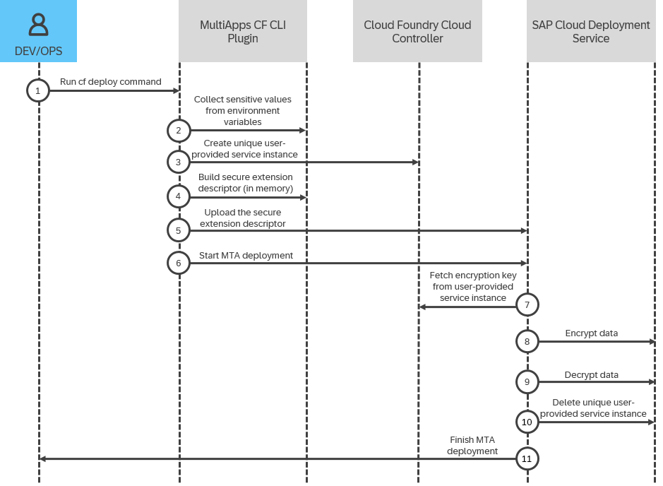

<!-- loio2e50c4eb828a412e985077f31541bcac -->

# Using a Disposable User-Provided Service Instance

Pass sensitive values during MTA deployment by using a disposable user-provided service instance.


## Context

When you need to use sensitive values during MTA deployment, you can use a disposable user-provided service instance to manage the encryption key. In this approach, the lifecycle of the Cloud Foundry user-provided service instance is handled automatically. When you start the deployment with the `--disposable-user-provided-service` flag, a unique user-provided service instance is automatically created with a randomly generated encryption key. This instance is used only for that specific deployment and is automatically deleted when it finished. The whole process is visualized in the diagram below and the actual step-by-step procedure that you have to follow is available in the next section.

This image is interactive. Hover over the circles for more information.




## Procedure

1.  Declare environment variables locally that will store your sensitive values. These environment values must follow the naming conventions described in [Environment Variables and User-Provided Service Instance Specifics](environment-variables-and-user-provided-service-instance-specifics-1b8cb82.md).

    > ### Sample Code:  
    > ```
    > __MTA___configSecret="confidentialInformation"
    > ```

2.  Reference the environment variable in your deployment or extension descriptor.

    > ### Sample Code:  
    > ```
    > _schema-version: "3.1" 
    > ID: example-services.extension 
    > extends: example-services 
    >  
    > modules: 
    > - name: myApp 
    >   type: staticfile 
    >   path: content/archive.zip 
    >   parameters: 
    >     app-name: example-app 
    >     memory: 299M 
    >     disk-quota: 107M 
    >   requires: 
    >     - name: my-resource 
    >       parameters: 
    >         config: 
    >           importantParameter: ${configSecret} 
    >  
    > resources: 
    > - name: my-resource 
    >   type: org.cloudfoundry.managed-service 
    >   parameters: 
    >     service: workflow 
    >     service-plan: standard 
    >     service-name: my-resource-name 
    > ```

3.  Start a deployment by adding the `--require-secure-parameters` and `--disposable-user-provided-service` flags to the `cf deploy` command.

    > ### Sample Code:  
    > ```
    > cf deploy ./ -f -e extension.mtaext,extension-after.mtaext --require-secure-parameters --disposable-user-provided-service
    > ```

    A unique user-provided service instance is created on your behalf in your Cloud Foundry space. A 32-character-long encryption key is generated and added to the service. At the end of the deployment, the user-provided service instance is automatically deleted.


## Results

The values of the parameters referencing the `configSecret` environment variable are replaced with the actual sensitive value during the MTA deployment.

**Related Information**  


[Sensitive Data Handling During MTA Deployment](sensitive-data-handling-during-mta-deployment-4c40fda.md "Securely manage credentials and other sensitive values during MTA deployment.")

[Environment Variables and User-Provided Service Instance Specifics](environment-variables-and-user-provided-service-instance-specifics-1b8cb82.md "Naming conventions and other specifics regarding the environment variables and user-provided service instances used for sensitive data handling during MTA deployment.")

[Creating User-Provided Service Instances](creating-user-provided-service-instances-a44355e.md "User-provided service instances enable you to use services that are not available in the marketplace with your applications running in the Cloud Foundry environment.")

