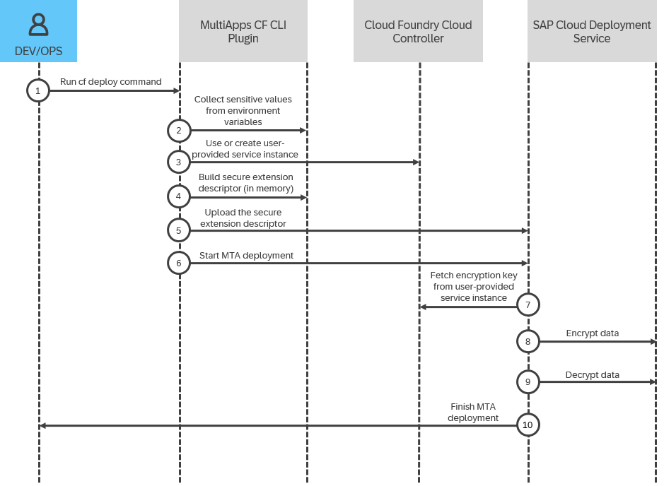

<!-- loio33b5047f978449738b4fa1ed8f6daf29 -->

# Using a Persistent User-Provided Service Instance

Pass sensitive values during MTA deployment by creating or using a persistent user-provided service instance.


## Context

When you need to use sensitive values during MTA deployment, you can use a persistent user-provided service instance to manage the encryption key. In this approach, you are responsible for creating, maintaining, and deleting the Cloud Foundry user-provided service instance that holds the encryption key used to secure your data during deployment. If the instance doesn't exist when you start the deployment, it is created automatically and holds a randomly generated encryption key. However, you remain responsible for managing the service instance throughout its lifecycle, including updating the encryption key if needed and deleting the instance when it's no longer required. The whole process is visualized in the diagram below and the actual step-by-step procedure that you have to follow is available in the next section.

This image is interactive. Hover over the circles for more information.




## Procedure

1.  Declare environment variables locally that will store your sensitive values. These environment values must follow the naming conventions described in [Environment Variables and User-Provided Service Instance Specifics](environment-variables-and-user-provided-service-instance-specifics-1b8cb82.md).

    > ### Sample Code:  
    > ```
    > __MTA___configSecret="confidentialInformation"
    > ```

2.  Reference the environment variable in your deployment or extension descriptor.

    > ### Sample Code:  
    > ```
    > _schema-version: "3.1" 
    > ID: example-services.extension 
    > extends: example-services 
    >  
    > modules: 
    > - name: myApp 
    >   type: staticfile 
    >   path: content/archive.zip 
    >   parameters: 
    >     app-name: example-app 
    >     memory: 299M 
    >     disk-quota: 107M 
    >   requires: 
    >     - name: my-resource 
    >       parameters: 
    >         config: 
    >           importantParameter: ${configSecret}
    >  
    > resources: 
    > - name: my-resource 
    >   type: org.cloudfoundry.managed-service 
    >   parameters: 
    >     service: workflow 
    >     service-plan: standard 
    >     service-name: my-resource-name
    > ```

3.  Create a user-provided service instance that holds a 32-character-long encryption key in your Cloud Foundry space. The name of the user-provided service instance must follow the naming conventions described in [Environment Variables and User-Provided Service Instance Specifics](environment-variables-and-user-provided-service-instance-specifics-1b8cb82.md).

    > ### Sample Code:  
    > ```
    > cf cups __mta-secure-<mtaId> -p '{"encryptionKey": "abdfgtresghytiothewqprtimgnhdrwp"}'
    > ```

    For more information, see [Creating User-Provided Service Instances](creating-user-provided-service-instances-a44355e.md).

    > ### Note:  
    > If the user-provided service instance is not present before the deployment, it will be created automatically and you will be responsible for its management and deletion at the end of the deployment operation.

4.  Start a deployment by adding the `--require-secure-parameters` flag to the `cf deploy` command.

    > ### Sample Code:  
    > ```
    > cf deploy ./ -f -e extension.mtaext,extension-after.mtaext --require-secure-parameters
    > ```

5.  **\(Recommended\)**After the deployment finishes, you can delete the user-provided service instance.


## Results

The values of the parameters referencing the `configSecret` environment variable are replaced with the actual sensitive value during the MTA deployment.

**Related Information**  


[Sensitive Data Handling During MTA Deployment](sensitive-data-handling-during-mta-deployment-4c40fda.md "Securely manage credentials and other sensitive values during MTA deployment.")

[Environment Variables and User-Provided Service Instance Specifics](environment-variables-and-user-provided-service-instance-specifics-1b8cb82.md "Naming conventions and other specifics regarding the environment variables and user-provided service instances used for sensitive data handling during MTA deployment.")

[Creating User-Provided Service Instances](creating-user-provided-service-instances-a44355e.md "User-provided service instances enable you to use services that are not available in the marketplace with your applications running in the Cloud Foundry environment.")

