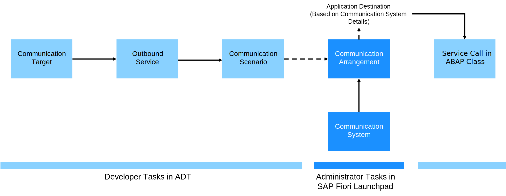

<!-- loio21ee7a4b92274158b7e6b0f8236bff88 -->

# Using Communication Targets

For outbound HTTP communication of newly created applications, we recommend using communication targets and application destinations. With this approach, developers can control which applications can use a particular application destination. This process is called receiver validation.

The creation of an application destination is triggered when a communication arrangement is created based on a communication scenario that references an outbound service of type communication target.

<a name="loio21ee7a4b92274158b7e6b0f8236bff88__section_zft_kp5_xbc"/>

## Communication Targets With Exactly One Assigned Application Destination

The communication target can have either multiple or only exactly one assigned application destination. To call an HTTP service via communication targets in your ABAP code, create an HTTP client from your communication target class and call its execute method.

<a name="loio21ee7a4b92274158b7e6b0f8236bff88__section_bzb_np5_xbc"/>

## Communication Target With Several Assigned Application Destinations

If the communication target has several assigned application destinations, additionally, the following is required:

-   When creating the communication target instance, pass the name of the relevant application destination to the parameter `application_destination`.
-   Before, you need to get the name of the relevant application destination. We recommend storing the application destinations assigned to a communication target in a customizing table. To do so, create an implementation for the BAdI `communication_management` as described in [Calling an HTTP Service via Communication Targets](calling-an-http-service-via-communication-targets-e03a11d.md). From the customizing table, select the relevant application destination in your service call.

> ### Note:  
> -   An application destination is always uniquely assigned to a communication target. When the communication target is created, a unique global communication target class with the same name is generated.
> -   An application can only use an application destination if it has permission to access the corresponding communication target class. This communication class is assigned to the application destination. This is only possible if this application is in the same package, or if the communication target class is part of the relevant package interface or main package interfaces. The violation of a main package or software component interface leads to a runtime error, while other package interface violations lead to warnings.

