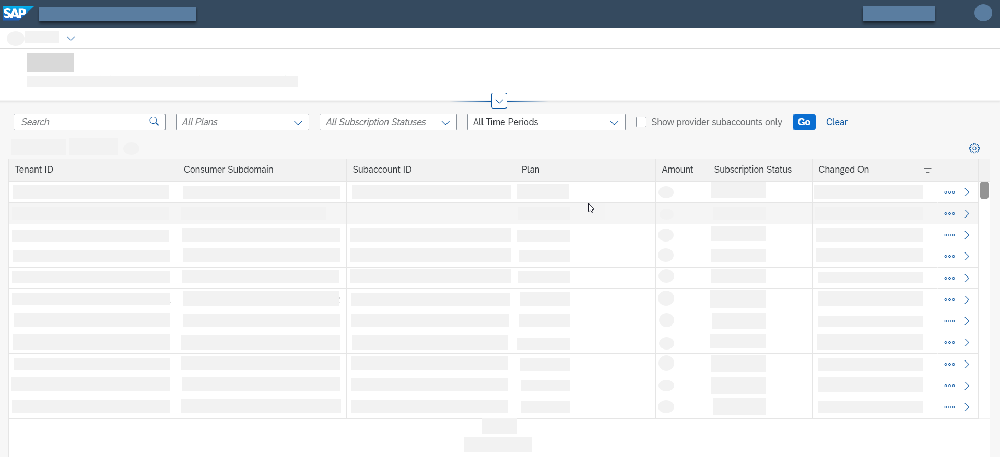

<!-- loio434be695f9e946ccb4c28911dd1e16d0 -->

<link rel="stylesheet" type="text/css" href="../css/sap-icons.css"/>

# Using the Subscription Management Dashboard

Learn how to use the SAP BTP subscription management dashboard to manage your multitenant applications through a user interface.

<a name="loio434be695f9e946ccb4c28911dd1e16d0__section_itk_wfd_5qb"/>

## Context

SaaS and IAS application providers can now use the new subscription management dashboard to manage their multitenant application's subscriptions.

The tool is based on the SaaS Provisioning service APIs that you can now work with using a user interface to simplify your operation and maintenance work.

<a name="loio434be695f9e946ccb4c28911dd1e16d0__section_epl_tzg_gkb"/>

## Main Capabilities

You can do the following in the subscription management dashboard:

-   View all subscriptions to your application and the information about them, such as their state and tenant ID.
-   View each subscription's dependencies and status.
-   Perform operations on subscriptions, for example update the list of dependencies.
-   Control access to the dashboard using dedicated roles.

The dashboard also displays detailed information about any errors that arise during the subscription process. This gives you means to identify the source of issues and fix them.

<a name="loio434be695f9e946ccb4c28911dd1e16d0__section_ut1_kwv_nqb"/>

## Accessing the Dashboard in the SAP BTP Cockpit

### Assign Roles

To access the subscription management dashboard, you must be assigned to one of these roles:

-   **Subscription Management Dashboard Administrator** - Provides access to the dashboard with full read and write capabilities.
-   **Subscription Management Dashboard Viewer** - Provides read-only access to the dashboard.

Add the relevant role to a role collection and assign yourself or another user to it.

> ### Note:  
> You assign roles per tenants. To assign roles in a global account or subaccount tenant, you must be a global account or subaccount admin respectively.

For more information about roles, see [Configure Application Roles and Assign Roles to Users](https://help.sap.com/viewer/65de2977205c403bbc107264b8eccf4b/Cloud/en-US/56a71531fc154717bf221f9e293ba215.html).

> ### Note:  
> If you don't see the roles, you need to update the instance of the SaaS Provisioning service \(technical name: `saas-registry`\) associated with your application \(`application` plan\). This enables the new roles.

### Open the Dashboard

1.  In the left-hand navigation bar of the SAP BTP cockpit, select *Services* \> *Instances and Subscriptions*.

    > ### Note:  
    > Only users who are assigned to one of the roles specified in the previous section can see the link to the dashboard and open it.

2.  In the *Instances* section, find the instance of the SaaS Provisioning service \(technical name: `saas-registry`\) with the `application` plan and click on it.

    Details about the instance open to the right.

3.  In the top-right corner, select  and from the dropdown menu, choose *View Dashboard*.

    A new tab with the subscription management dashboard opens.

<a name="loio434be695f9e946ccb4c28911dd1e16d0__section_rbk_myv_nqb"/>

## Using the Dashboard

The main screen shows a table with details about all of your application's subscriptions.

You can apply various search and filtering criteria such as plan, subscription status, and time periods to get a more specific list of subscriptions.

> ### Tip:  
> Select the *Show provider subaccounts only* checkbox to see only the subaccounts that are in the global account in which your application is deployed. This can be useful because you can only create new subscriptions for these subaccounts.

  

Clicking on a subscription row opens details about the subscription to the right where you can find more information about the subscription and analyze errors if the subscription status is `Failed`.

You can also perform additional operations, such as update subscription dependencies, if you're assigned to the `Subscription Management Dashboard Administrator` role.

This operation updates the subscription with the latest list of dependencies \(if an app provider has added or removed dependencies of a particular subscription, for example.\)

  

You can choose to see your subscription dependencies in a tree or table view. See the following image for the tree view representation:

  

> ### Tip:  
> If you've more than one multitenant application, you can switch between them in the dashboard. Click on the dropdown menu in the upper-left corner and select the application for which you want to view or manage subscriptions.

