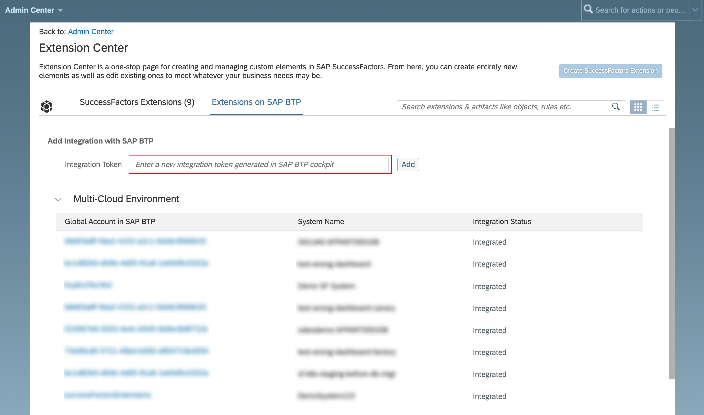

<!-- loioe956ba209f30447cb55140e38c15e345 -->

# Register an SAP SuccessFactors System in a Global Account in SAP BTP

To connect an SAP SuccessFactors system with a global account in SAP BTP, you need to register the system in the corresponding global account.

<a name="loioe956ba209f30447cb55140e38c15e345__prereq_jpy_ttz_w3b"/>

## Prerequisites

-   See [Registering an SAP System](registering-an-sap-system-2ffdaff.md).

-   You are an administrator of the global account where you want to register your SAP SuccessFactors system.

-   You have a dedicated SAP SuccessFactors company instance.

-   You have a user with permissions to access *Extension Center* in SAP SuccessFactors Admin Center that include:

    -   *Admin Access to MDF OData API* permission from the *Metadata Framework* category

    -   *Create Integration with SAP BTP* permission from the *Manage Extensions on SAP BTP* category

    To assign these permissions to your user, you might need the help of an administrator.

    To get a user with the respective permissions, follow these steps:

    1.  Make sure you have an access to the SAP SuccessFactors Admin Center. See [Permission to Access Admin Center](https://help.sap.com/viewer/6c9f794920b947648737d914a669f195/latest/en-US/83c5a81ecd51478db1dcc23835f80339.html).

    2.  Add your user to an already existing group or create a new dedicated group and add your user. See [Creating Dynamic Permission Groups](https://help.sap.com/viewer/b569eee64d3f4159b2b5272ba7d6b127/LATEST/en-US/6adf50f40a86406a917a54ce7fd2131b.html).

    3.  Use an already existing role or create a new dedicated role. See [Creating Permission Roles](https://help.sap.com/viewer/b569eee64d3f4159b2b5272ba7d6b127/LATEST/en-US/6d8998d9504843a58fe299ff6935a268.html).

    4.  Assign the respective permissions to your role. See [Assigning Permissions to a Role](https://help.sap.com/viewer/b569eee64d3f4159b2b5272ba7d6b127/LATEST/en-US/f412b2160c2348b8b357fb3f6290d4b8.html).

    5.  Add your role to the dedicated group. See [Assigning Roles to Groups](https://help.sap.com/viewer/b569eee64d3f4159b2b5272ba7d6b127/LATEST/en-US/fbaadf758e00485893d6f099e9f342fa.html).

    6.  To fully activate the permissions, log out and log in again to the SAP SuccessFactors company instance.

## Context

The registration process is based on a registration token that is used for the pairing of the SAP SuccessFactors company and the corresponding global account in SAP BTP. You create the token in the global account, and then start the automated registration process on the SAP SuccessFactors company side using this token.

> ### Note:  
> When registering SAP SuccessFactors systems, you can have up to 1000 tokens per global account ready to be used. Tokens that are already used to register an SAP SuccessFactors system are not included in this number.
> 
> This means that you cannot have more than 1000 systems in the *Systems* list of type SAP SuccessFactors with an empty status and generated token that is not used yet.

The registration process has the following states displayed in the cockpit:

-   No status displayed in the *Status* column - the registration token for an SAP system has been created but the registration on the respective SAP solution system side has not been performed or completed.

-   *Registered* - the registration token has been used and the automated registration process has been successfully completed. The system can be assigned to a formation on the *Formations* page in the cockpit.
-   *Error while Registering* - the registration has failed. Remove the system and then add it to the *Systems* list and try to register it again
-   *Deregistering* - а deregistration process has started in the SAP BTP cockpit. As a result, the connection between the SAP solution system and the global account in SAP BTP is removed. The system remains in the list and you can register it again later on.

    Once a system is registered, you can deregister it only after removing it from all entitlement configurations and formations it takes part in.

-   *Error while Deregistering* - the deregistration has failed. Try to deregister the system again. If the problem persists, you have to report a case in the `BC-NEO-EXT-SF` component.
-   *Removing* - a system removal process has started in the SAP BTP cockpit. As a result, the link between the SAP solution and SAP BTP is destroyed and the system is removed from the list. To register the system again, first you must add it to the list anew, and then initiate the registration procedure.

    Once a system is registered, you can only remove it if you first deregister it.

    > ### Note:  
    > You will not be able to remove a system if its status is one of the following:
    > 
    > -   *Registered*
    > 
    >     You first need to deregister the system.
    > 
    > -   *Deregistering*
    > 
    > -   *Error while Deregistering*
    > 
    >     Try to deregister the system again.

-   *Error while Removing* - the system removal has failed. Try to deregister the system again. If the problem persists, you have to report a case in the `BC-NEO-EXT-SF` component.

> ### Note:  
> When registering a system or creating a formation, the data you provide in the given input fields is not encrypted with your customer managed key. The data you enter is only encrypted at rest.

<a name="loioe956ba209f30447cb55140e38c15e345__steps_xls_dvz_w3b"/>

## Procedure

1.  In the SAP BTP cockpit, navigate to your global account, and then choose *System Landscape* \> *Systems*.

2.  On the *Systems* page, choose *Add System*.

    1.  Enter a name for the system you want to register.

        > ### Note:  
        > Use only printable ASCII characters.

        > ### Tip:  
        > We recommend that you indicate the type of the system when specifying the system name. For example, <code><i class="varname">&lt;mysystem&gt;</i>-SuccessFactors</code>. This helps you identify the system type when assigning systems to a formation.

    2.  In the *Type* dropdown list, select SAP SuccessFactors.

    3.  Choose *Add*.

    4.  Choose *Get Token*.

        The system generates the registration token.

    5.  Copy the registration token and send it to the tenant administrator for the respective SAP SuccessFactors system. You need it for configuring the integration on the extended SAP SuccessFactors system side.

        You can also get the registration token later, once the system appears in the list on the *Systems* page.

        The registration token is valid for 7 days after it has been generated. When a token is not used within its validity period, it is no longer valid and cannot be used for registering an SAP SuccessFactors system. If the validity of the token expires before you use it to configure the integration on the SAP SuccessFactors system side and complete the registration, you need to get a new token. You can then copy it and use it to complete the registration.

        > ### Note:  
        > A token can be used only once, for registering a single SAP SuccessFactors system.

    6.  Close the wizard.

        The SAP SuccessFactors system appears in the list of systems on the *Systems* page. Its *Status* field is empty because the registration process is not yet completed.

3.  Start the automated integration process on the SAP SuccessFactors company side:

    > ### Note:  
    > If you do not have permissions to access the Extension Center for the corresponding SAP SuccessFactors system, you need to send the registration token to a user with such permissions who will configure the integration on the SAP SuccessFactors system side. For the requires permissions, check the prerequisites.

    1.  In SAP SuccessFactors *Admin Center*, navigate to *Extension Center*.

    2.  On the *Extensions on SAP BTP* tab page, navigate to the *Add Integration with SAP BTP* screen area, and paste the registration token in the *Integration Token* input field.

    3.  Choose *Add*.

    The system appears in the integration list in the *Multi-Cloud Environment* screen area, and the status of the integration is displayed in the *Integration Status* column. To refresh the status of the process, choose the *Check Status* icon. Wait for the integration to finish.

    

4.  In the cockpit, check the status of the registration process. To do so, navigate to your global account, and on the *Systems* page, check if the status of the SAP System has changed to *Registered*.

    If you are already on the *Systems* page, refresh the page to check if the status has changed.

    > ### Note:  
    > You can register a system only once with the same name per global account.

    > ### Note:  
    > You cannot migrate the registered SAP SuccessFactors systems between global accounts.
    > 
    > If you want to start using another global account, you will have to register your SAP SuccessFactors systems again.

**Related Information**  

[Registering an SAP System](registering-an-sap-system-2ffdaff.md "To connect an SAP system with a global account in SAP BTP, you need to register the system.")

[Deregistering or Removing a System](deregistering-or-removing-a-system-0c6f498.md "When you no longer need the system to be paired with your global account, you can deregister or remove it depending on its status.")

