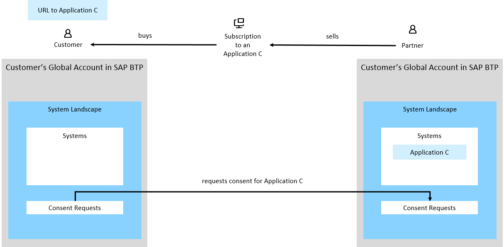
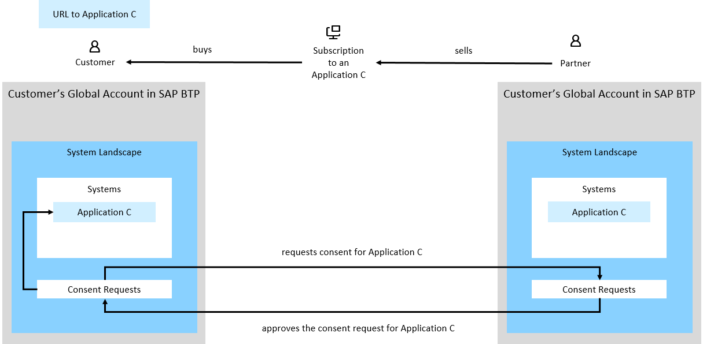
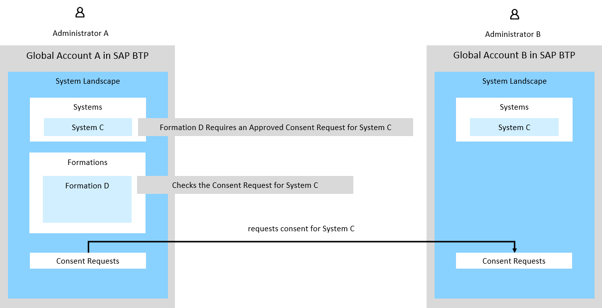
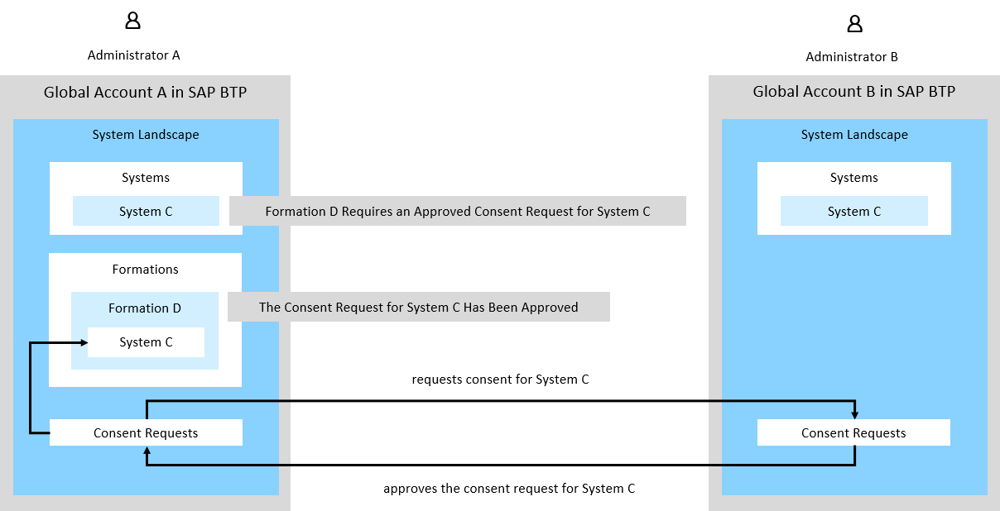

<!-- loio091bc0872f2f4666b8395fcf5eb5411c -->

# Requesting Consent for a System

A consent request helps you get additional authorization to a specific system. There are different use cases for which you need to request consent and depending on these use cases you specify a consent scope.

<a name="loio091bc0872f2f4666b8395fcf5eb5411c__section_npb_mbt_bhc"/>

## Consent Scopes

Consent scopes define the purpose of the consent request, that is the reason why you need additional authorization to a specific system. You specify one or more scopes when you request consent.

**Consent Scopes**

<table>
<tr>
<th valign="top">

Consent Scope

</th>
<th valign="top">

Description

</th>
</tr>
<tr>
<td valign="top">

System Sharing

</td>
<td valign="top">

Use this scope when you are subscribed to an application and you want this application to appear as a system added to the *Systems* page.

</td>
</tr>
<tr>
<td valign="top">

Integration

</td>
<td valign="top">

Use this scope when you have the system in the **Systems** page and you need additional authorizations to include it in a formation.

</td>
</tr>
</table>

## Customers Subscribed to an Application

SAP partners develop multitenant applications and sell subscriptions to their customers. These applications are deployed to the global account in SAP BTP of the SAP partner. When customers buy a subscription to such an application, the SAP partner has a dedicated subaccount for each customer and creates a subscription to the application in every subaccount for every customer. Then, the SAP partner takes the respective URL from *Services* \> *Instances and Subscriptions* of every subscription and sends it to the respective customer.

As an administrator of a customer, you do not have access to the subscription in your global account in SAP BTP. However, you need to use the subscription to the application your company has purchased from the SAP partner in a formation. To do that, you need to have this subscription listed as a system in the *System Landscape* \> *Systems* page.

To have this system listed in the *Systems* page, you need to make a request to the SAP partner in the *System Landscape* \> *Consent Requests* page. Use the consent scope *System Sharing*. See [Request Consent](request-consent-038c3bb.md).

The SAP partner sees the request and then approves or rejects it. When the request has been approved, you see the system of this application listed in the *Systems* page of your global account in SAP BTP. See [Approve or Reject a Consent Request](approve-or-reject-a-consent-request-66429f1.md).

## Permission to Include a System in a Formation

You are an administrator of a global account in SAP BTP and you have system C added in the *Systems* page. You want to include system C in a dedicated formation, but this system requires additional authorization so you need to request a consent. Use the consent scope *Integration*. See [Request Consent](request-consent-038c3bb.md).

After the administrator responsible for the system type approves the request, you can include system C in formation D. See [Approve or Reject a Consent Request](approve-or-reject-a-consent-request-66429f1.md).

See [Integrating SAP Solutions](integrating-sap-solutions-3414bbc.md).

