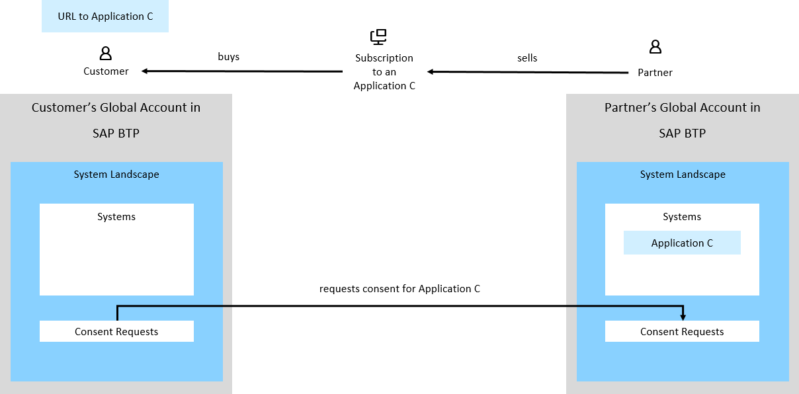
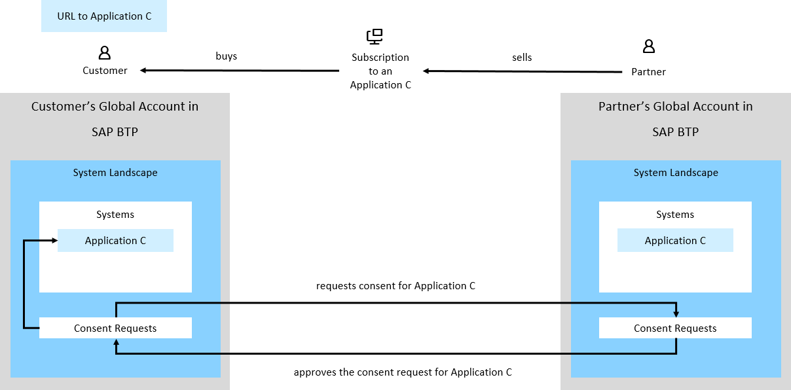
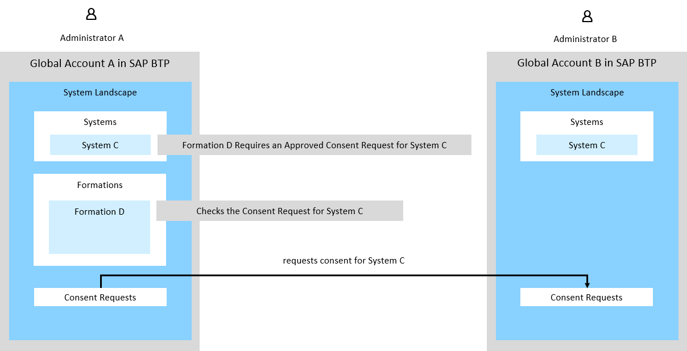
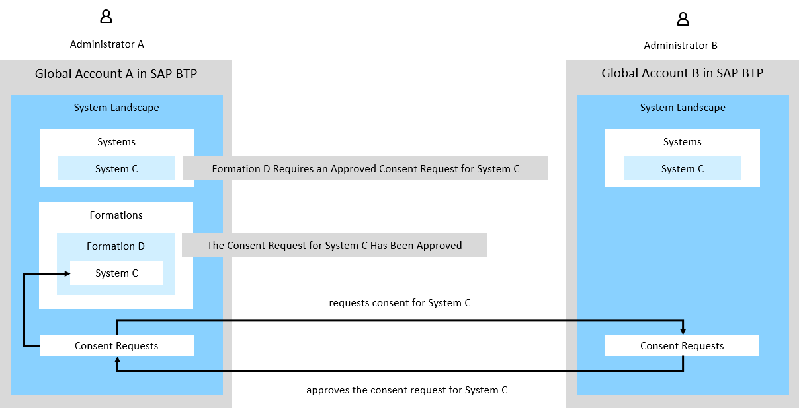

<!-- loio091bc0872f2f4666b8395fcf5eb5411c -->

# Requesting Consent for a System or System Type

A consent request helps you get additional authorization for a specific system or system type. There are different scenarios for which you need to request consent and depending on these scenarios you specify a consent scope. Once the consent request has been sent, the owner of the system or system type gets an incoming consent request to approve or reject.

<a name="loio091bc0872f2f4666b8395fcf5eb5411c__section_npb_mbt_bhc"/>

## Consent Scopes

Consent scopes define the purpose of the consent request, that is the reason why you need additional authorization to a specific system. You specify one or more scopes when you request consent.

**Consent Scopes for Systems**

<table>
<tr>
<th valign="top">

Consent Scope

</th>
<th valign="top">

Description

</th>
</tr>
<tr>
<td valign="top">

System Sharing

</td>
<td valign="top">

Use this scope when you are subscribed to an application and you want this application to appear as a system added to the *Systems* tab in the *Systems* page.

</td>
</tr>
<tr>
<td valign="top">

Integration

</td>
<td valign="top">

Use this scope when you have the system in the *Systems* page and you need additional authorizations to include it in a formation.

If the system you want to include in a formation is not listed in the *Systems* page and it corresponds to an application you are subscribed to, use this scope together with the *System Sharing* scope which will also add this system in the *Systems* page.

</td>
</tr>
</table>

**Consent Scopes for System Types**

<table>
<tr>
<th valign="top">

Consent Scope

</th>
<th valign="top">

Description

</th>
</tr>
<tr>
<td valign="top">

System Type Sharing

</td>
<td valign="top">

Use this scope when you want to add a system of a specific type but this type is not available in the *Systems* page. Once you have your consent request approved, you will be able to add systems of this type.

</td>
</tr>
</table>

## Scenarios

There are various scenarios in which you would need to send consent requests. Pay attention on the scopes defined in each consent request. If you select the wrong scope, your scenario will not work and you would have to send a new consent request with the correct scope. You may need to select more than one scope in the same consent request for a system.

### Systems with System Sharing Scope: Have an Application Subscription as a System in the System Landscape

SAP partners develop multitenant applications and sell subscriptions to their customers. These applications are deployed to the global account in SAP BTP of the SAP partner. When customers buy a subscription to such an application, the SAP partner has a dedicated subaccount for each customer and creates a subscription to the application in every subaccount for every customer. Then, the SAP partner takes the respective URL from *Services* \> *Instances and Subscriptions* of every subscription and sends it to the respective customer.

As an administrator of a customer, you do not have access to the subscription in your global account in SAP BTP. However, you want to add as a system in your system landscape in your global account the subscription to the application your company has purchased from the SAP partner. To do that, you need to send a consent request to the application owner and after they approve it, you will have the system corresponding to your application subscription listed in the *Systems* page.

In this scenario, use the *System Sharing* consent scope. See [Request Consent](request-consent-038c3bb.md).

The SAP partner sees the request and then approves or rejects it. When the request has been approved, you see the system of this application listed in the *Systems* page of your global account in SAP BTP. See [Approve or Reject a Consent Request](approve-or-reject-a-consent-request-66429f1.md).

### Systems with Integration Scope: Permission to Include a System in a Formation

You are an administrator of a global account in SAP BTP and you have system C added in the *Systems* page. You want to include system C in a dedicated formation, but this system requires additional authorization so you need to request a consent. In this scenario, use the consent scope *Integration*. See [Request Consent](request-consent-038c3bb.md).

After the administrator responsible for the system approves the request, you can include system C in formation D. See [Approve or Reject a Consent Request](approve-or-reject-a-consent-request-66429f1.md).

See [Integrating SAP Solutions](integrating-sap-solutions-3414bbc.md).

### System Types with Sharing System Type Scope: Add Systems of a System Type Which Is Not Part of Your System Landscape

You might need an authorization to have a specific system type shared with you so you can add systems of this type. To do that, you have to send a consent request with the namespace of the system type and the **Sharing System Type** scope.

