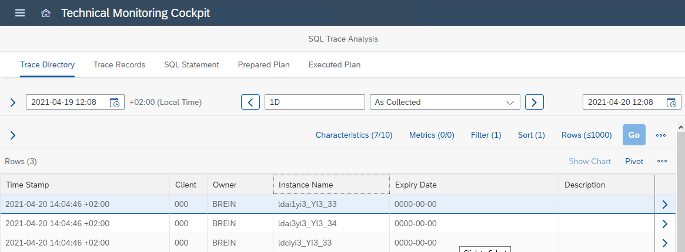

<!-- loiob72f2897ff8647eb9555ff19ab6cfe93 -->

# Analyzing SQL Statements of Your Application

## Context

During developing and operating applications on your ABAP environment, these situations are typical when you take an SQL trace of your ABAP application and turn to the SQL trace analysis:

-   You want to analyze the performance of the SQL statements of your ABAP application in the sequence as they run.

-   When analyzing the performance of an ABAP application, you want to clarify whether the SQL activity of the application is a relevant contribution to the processing time.

## Procedure

1.  Take an SQL trace of your ABAP application using ABAP Development Tools:

    1.  Right-click on your ABAP project on the project explorer and choose *SQL Trace* from the context menu.

    2.  Activate the trace.

    3.  Run the ABAP application that you want to trace.

    4.  Deactivate the trace again and choose *View Trace Directory*.

        This opens the *SQL Trace Analysis* screen of the technical monitoring cockpit.

         

2.  On the *Trace Directory* tab page of the SQL trace analysis, choose the new trace you just took.

    The default view shows you all SQL traces taken by your ABAP user in the last 24 hours.

    The UI philosophy of the *SQL Trace Analysis* screen is: With each move to a tab page to the right, you get more information about what you've selected on the previous tab pages to the left.

3.  Choose the trace that you want to look at and change to the *Trace Records* tab page.

4.  On the *Trace Records* tab page, single out expensive or otherwise interesting SQL statements.

    By default, you see all trace records in chronological order. However, you can apply filter conditions, for example, on the SQL statement text, or sort the entries by duration to put the longer running statements to the top of the list. Note that you can display additional columns that aren't shown by default by choosing *Characteristics* or *Metrics*.

    To go further into detail from here, you have three options on the following three tab pages to the right \(*SQL Statement*, *Prepared Plan*, *Executed Plan*\), which are mostly independent of each other. You can, for example, jump from here directly to the calculation of an executed access plan for your statement.

5.  Choose the *SQL Statement* tab page to get a decent view of your selected SQL statement, pretty-printed and with syntax highlighting.

    The *Application Source Position* field shows you the ABAP code location \(if available\) where the SQL statement originates from. You can choose one of the*Show ABAP Source in …* buttons to display the ABAP source in the web browser or in ABAP Development Tools.

6.  Choose the *Prepared Plan* tab page to display and analyze a newly calculated prepared access plan for your SQL statement.

7.  Choose the *Executed Plan* tab page to display and analyze a newly calculated executed access plan for your SQL statement.

    You can also download the PlanViz \(PLV\) file of the executed access plan containing the comprehensive plan information to display it with other HANA plan visualizing tools like HANA SQL Analyzer.

