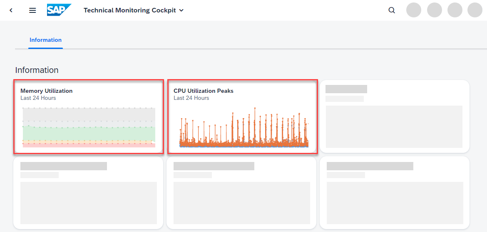

<!-- loio7a9a2a1c0b4c4d0b93246df61c712a71 -->

# Analyzing the SAP HANA Resource Utilization of the ABAP Environment

<a name="loio7a9a2a1c0b4c4d0b93246df61c712a71__context_x2b_ypw_gpb"/>

## Context

When you're planning, for example, system capacities or facing performance issues with hosted applications, you want to understand the resource utilization of your ABAP environment.

<a name="loio7a9a2a1c0b4c4d0b93246df61c712a71__steps_pgv_ypw_gpb"/>

## Procedure

1.  On the SAP Fiori launchpad of your ABAP environment, search for *Database System Overview*.

    The technical monitoring cockpit opens.

2.  To gain insights into the memory utilization of the SAP HANA database, choose the *Memory Utilization* tile.

    

    As a rule of thumb, the sum of memory used for *Code and Stack*, *Database Management*, and *Data* should in average remain below 70% of the available memory - excluding temporary peaks. The memory used for only *Data* should remain below 50% of the available memory.

    For more information about the *Memory Utilization* screen, see [Memory Utilization \(SAP HANA DB\)](https://help.sap.com/viewer/tmc_cloud/5f94a4399d3f4e47a107ed3ddc700ff7.html).

3.  To gain further insights into the CPU consumption of SAP HANA, choose the *CPU Utilization Peaks* tile.

    As a rule of thumb, the average CPU utilization should remain below 70% - excluding temporary peaks. Note that the 100% mark reflects the CPU capacity that is available on the entire SAP HANA host, which is shared with other SAP HANA service instances and therefore is not guaranteed. Depending on the volume of your subscribed SAP HANA capacity, the actual CPU quota might be lower than indicated in the technical monitoring cockpit.

    For more information about the *CPU Utilization Peaks* screen, see [CPU Utilizations Peaks](https://help.sap.com/viewer/tmc_cloud/8e6ecdb71c5144869a9fb7f4b9fd2543.html).

