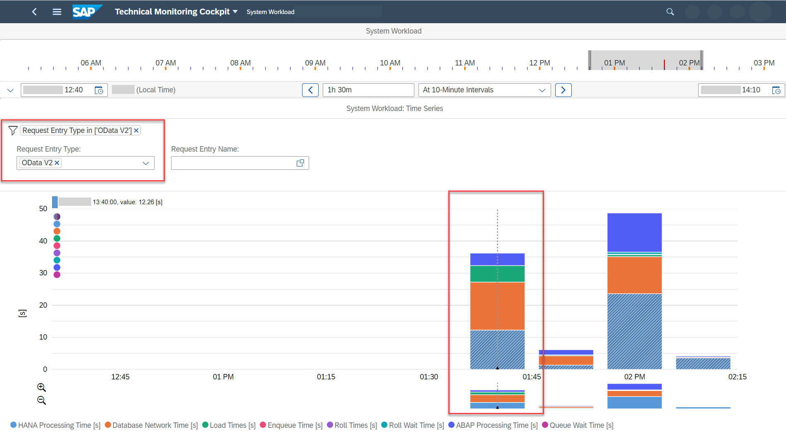
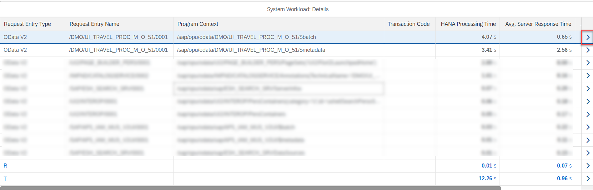
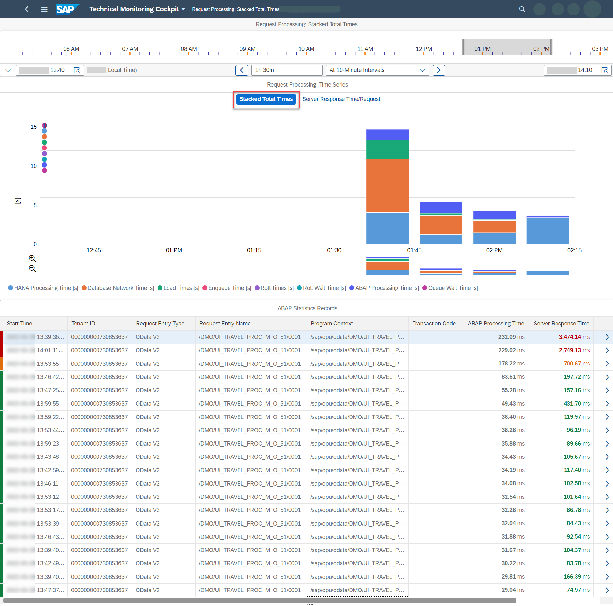
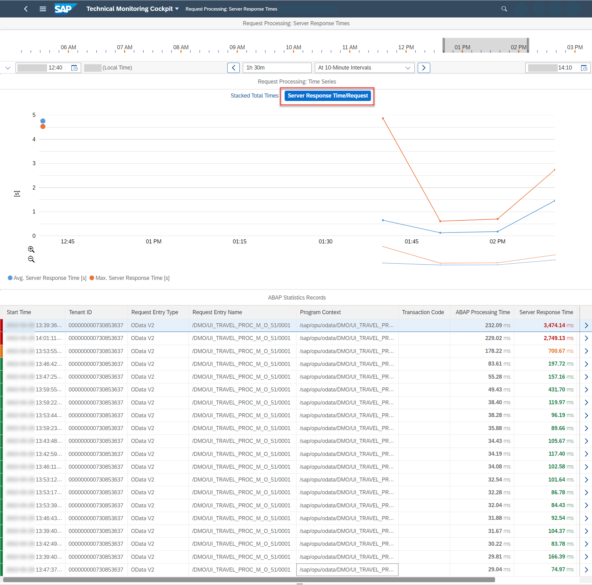
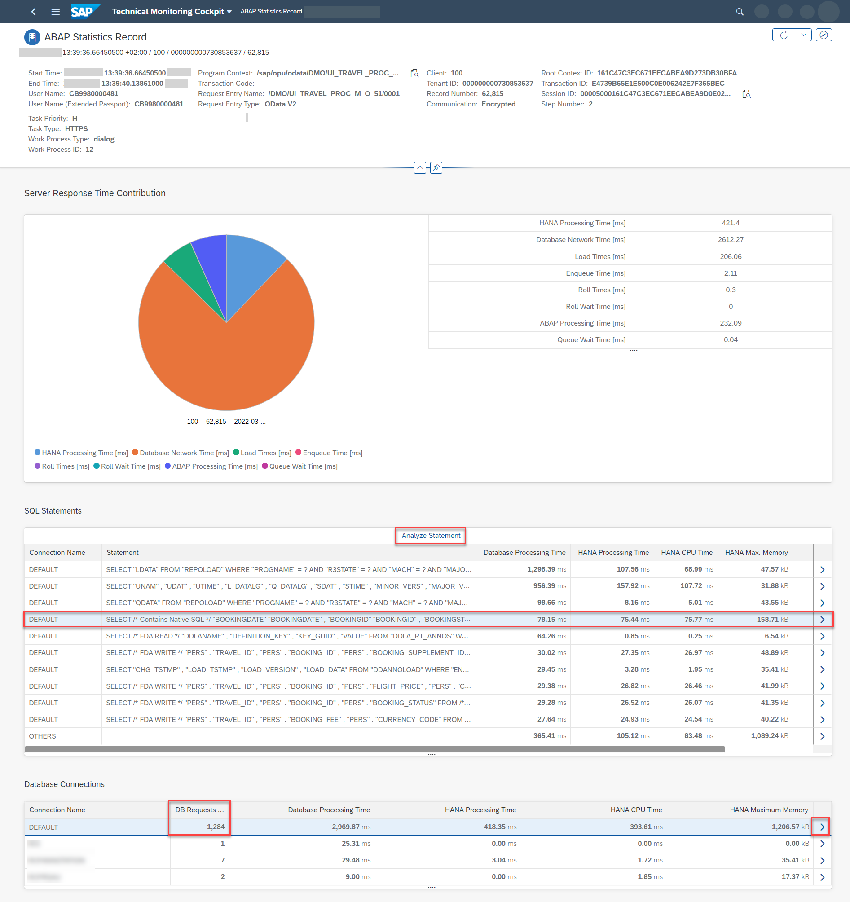
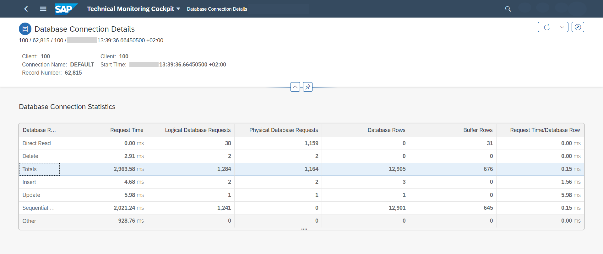
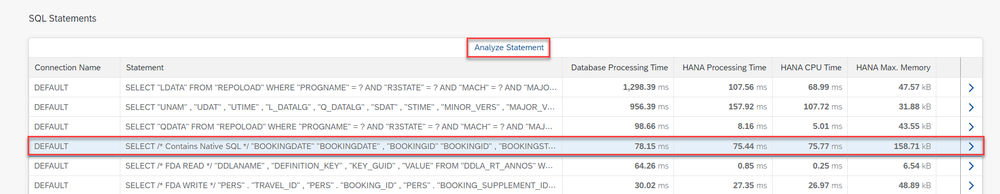
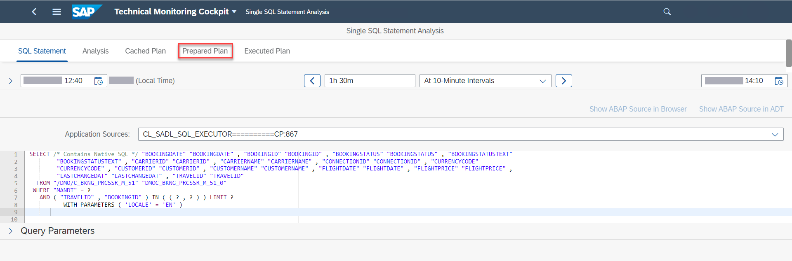
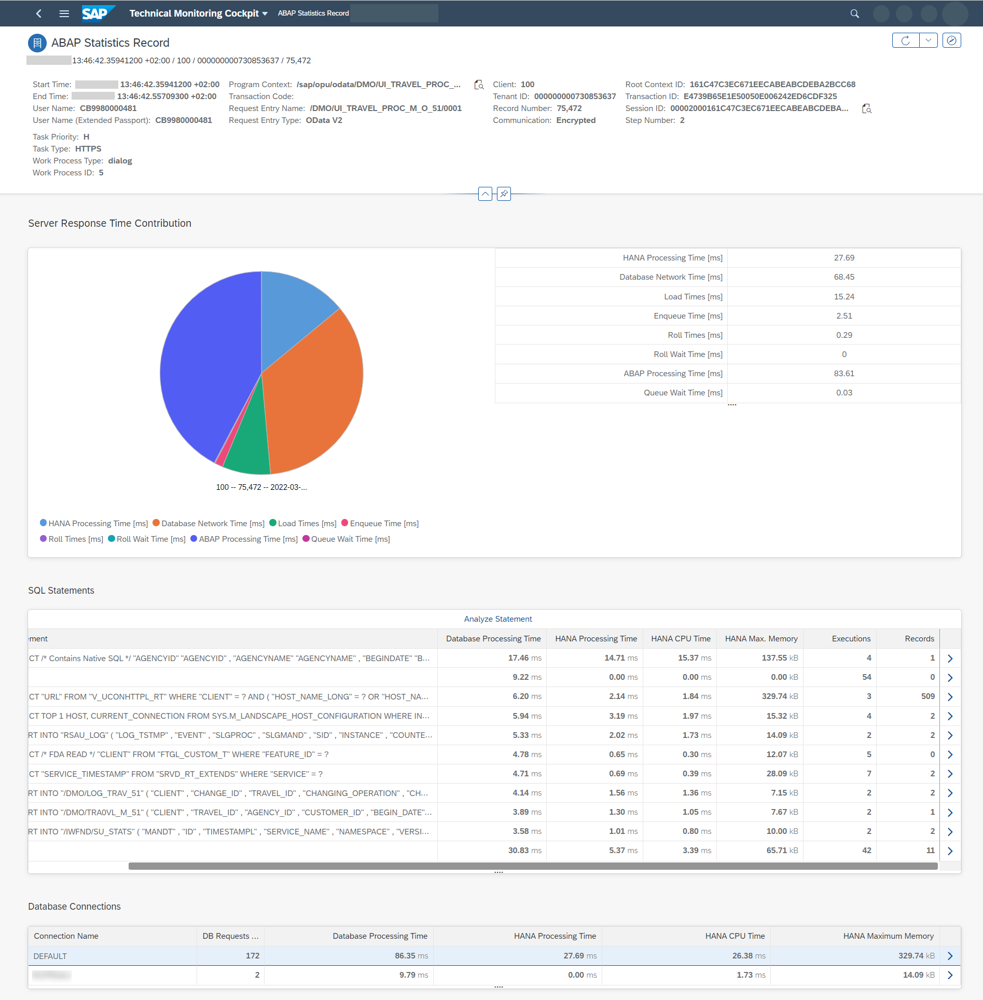

<!-- loioc1c7014bfa44478f8d591fe645a94bcd -->

# Analyzing the System Workload

You want to know more about the ABAP system workload.

<a name="loioc1c7014bfa44478f8d591fe645a94bcd__context_ejk_yvc_gsb"/>

## Context

Using the *System Workload* screen, you benefit from a seamless connection between an overview of your system workload and single ABAP statistics records \(main records and subrecords\) down to SQL statements and their prepared plan. This gives you an excellent starting point for further performance analysis on SAP HANA level in the case of high database response times, which is true especially in the example below. Of course, you might also find records with a high ABAP CPU time where you don't need to further investigate the execution of SQL statements. In that case, a performance analysis on SAP HANA level would not be needed.

> ### Note:  
> This procedure is similar to the analysis of a tenant workload \(see [Analyzing the Workload of a Business Tenant](analyzing-the-workload-of-a-business-tenant-5fb4ce7.md)\). The starting point for the *System Workload* app and its screens is different because here you want to know whether there's an issue with the overall system workload instead of focusing on single tenants.
> 
> However, even if you have just one single tenant, working the *Tenant Workload* app and its screens might also make sense in some cases. The *Tenant Workload* app offers you detail information such as the consumed HANA and ABAP CPU time that you don't get with the *System Workload* app.

In the following example, let's analyze the usage of an application built according to the ABAP RESTful Application Programming Model \(RAP\). We're going to use the well-known demo application for flight booking, which is often used as a reference scenario in SAP contexts.

<a name="loioc1c7014bfa44478f8d591fe645a94bcd__steps_mjk_yvc_gsb"/>

## Procedure

1.  On the SAP Fiori launchpad of your ABAP environment, search for *System Workload*.

    The technical monitoring cockpit opens with the *System Workload* screen.

2.  Let's assume you're interested in the behavior of the OData V2 services and set a filter on *Request Entry Type* for *OData V2*

3.  In the chart, click on the HANA processing time that seems high, for example, at 01:40 p.m.

    

    The *System Workload: Details* section below the chart changes accordingly. Now you see the top contributors to the HANA processing time at the time you clicked in the chart. The contributors are grouped by request entry type and request entry name.

    

4.  You can see that one of the topTo see more details, let’s choose that first highlighted entry in the list. On the subsequent *Request Processing* screen, you can now see the behavior of this specific workload \(the flight processing service\) over time:

    

    The chart shows the stacked total times of the metrics, and - depending on what you click in the chart - the table below shows the relevant detail view, that is, a list of a maximum of 20 single ABAP statistics records for this workload sorted by the metric you chose in the chart. This is very helpful for your further analysis: You're coming from a workload perspective and now get to see the single records the workload consists of.

    The color coding of the single records is based on their deviation from the average server response times \(top to bottom\): Red for very high, orange for above normal, and green for normal server response times.

5.  Let's switch views by choosing the *Server Response Time/Request* button:

    

    Like in the *Stacked Total Times* view, the color rating of the single records is based on their deviation from the average server response times. As you can see, the average server response time per request is around one second here. However, there are some requests with higher times, so let's have a closer look at a "bad" request.

6.  In the table, choose the first red entry \(the one with 3,474.14 ms\).

    On the following *ABAP Statistics Record* screen, you get more detailed information about this record. In the pie chart for the server response time contributions, you can clearly see that the response time is dominated by the database network time:

    

    What's also noticeable is the DEFAULT database connection that apparently fired 1,284 database requests.

7.  Let's dig deeper: In the *Database Connections* section of the *ABAP Staticstics Record* screen, choose the first entry \(connection name DEFAULT\) to get more information.

    The *Database Connection Details* screen opens and you can see that 1,284 logical database requests were fired to fetch almost 13,000 database rows, which explains the high network time: It was caused by the many database requests.

    

8.  Another thing you may want to check in this example is the *SQL Statements* section on the *ABAP Statistics Record* screen: The table shows the top SQL statements contributing to the HANA processing time.

    > ### Note:  
    > The SQL statements are available in the single record by default. You do **not** need to activate any tracing explicitly.

    Let's see if the access on CDS views is OK \(in this case on the booking view\). Place the cursor on the entry so that it's highlighted and simply choose *Analyze Statement* to resolve the SQL statement:

    

    The *Single SQL Statement Analysis* screen opens where you can view the SQL statement as well as its prepared access plans:

    

    From the prepared plan, a HANA expert could now dig deeper and start analyzing the statement in detail.

<a name="loioc1c7014bfa44478f8d591fe645a94bcd__result_x3x_zjw_3tb"/>

## Results

With the drilldown options to all kinds of details that are all in one place in the technical monitoring cockpit, you're able to identify several possible reasons for the high HANA processing time and network time.

Interested in seeing a "good" example of this kind of workload for comparison, with a server response time per request of under one second? The *ABAP Statistics Record* screen in such a case might look like this:

Here, everything's fine: The server response time per request is only 0.197 seconds. The number of database requests is low, and therefore the database network time and processing times are low, too.

**Related Information**  

[https://blogs.sap.com/2023/04/24/analyzing-performance-degradations-in-the-abap-environment-in-the-cloud/](https://blogs.sap.com/2023/04/24/analyzing-performance-degradations-in-the-abap-environment-in-the-cloud/)

