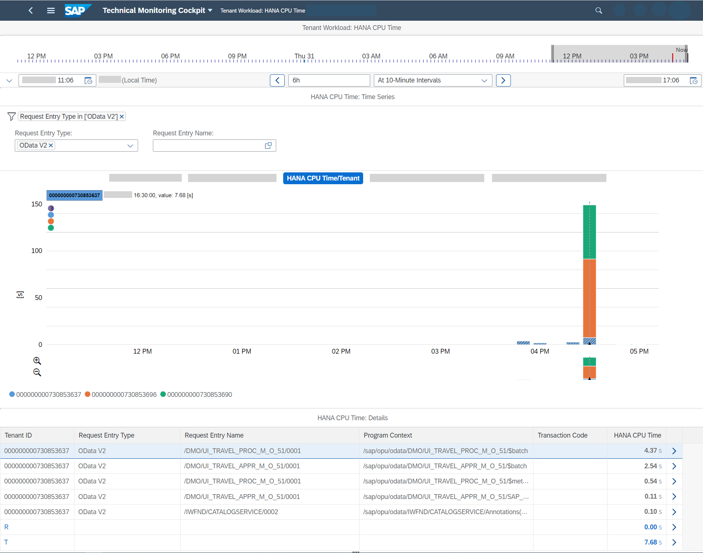
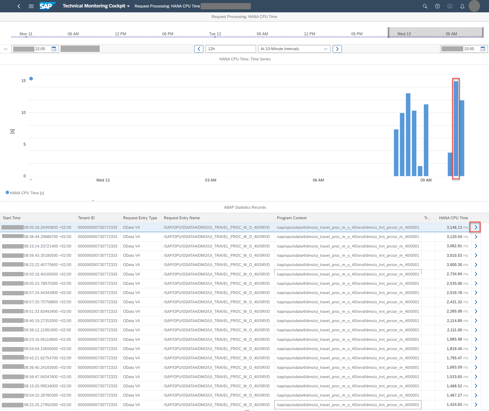
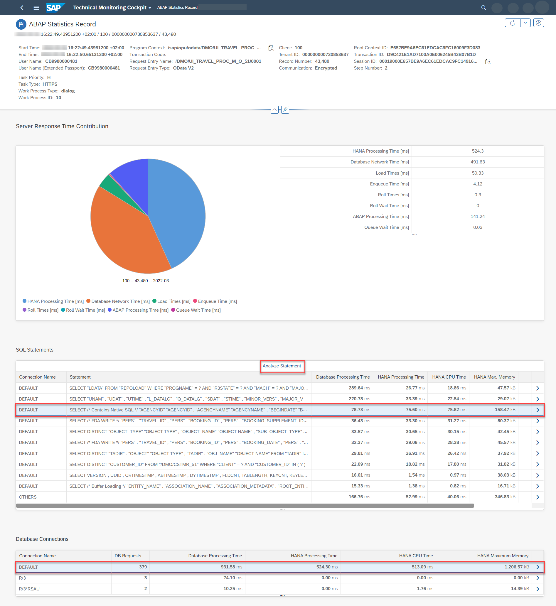
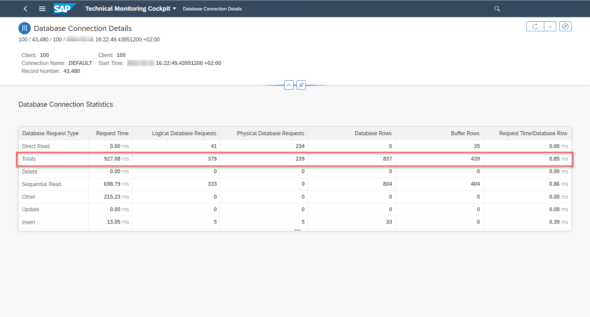
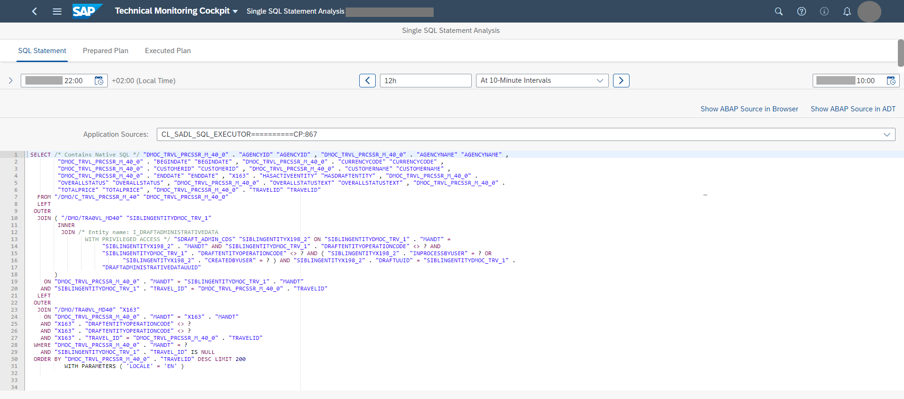

<!-- loio5fb4ce74d2f64874a56a4ac5262a0eba -->

# Analyzing the Workload of a Business Tenant

You want to know more about the workload on your business tenants in the ABAP environment.

<a name="loio5fb4ce74d2f64874a56a4ac5262a0eba__context_ylb_tdk_ltb"/>

## Context

Using the *Tenant Workload* screen, you benefit from a seamless connection between views of workloads by tenant and single ABAP statistics records \(main records and subrecords\) down to SQL statements and their prepared plan. This gives you an excellent starting point for further performance analysis on SAP HANA level in case of high database response times, which is true especially in the example below. Of course, you might also find records with a high ABAP CPU time where you don't need to further investigate the execution of SQL statements. In that case, a performance analysis on SAP HANA level would not be needed.

> ### Note:  
> This procedure is similar to the analysis of your system workload \(see [Analyzing the System Workload](analyzing-the-system-workload-c1c7014.md)\). However, with the Tenant Workload app and its screens you can do the following:
> 
> -   You can focus on single tenants instead of the overall system workload.
> 
> -   Even if you have just one single tenant, working the *Tenant Workload* app and its screens might make sense because it offers you detail information such as the consumed HANA and ABAP CPU time that you don't get with the *System Workload* app. The *System Workload* app provides you with information about the server response time and its contributors, but it doesn’t show you if fast response times were combined with high consumption of ABAP and HANA CPU resources.

In the following example, let's analyze the usage of an application built according to the ABAP RESTful Application Programming Model \(RAP\) in a business tenant. We're going to use the well-known demo application for flight booking, which is often used as a reference scenario in SAP contexts.

<a name="loio5fb4ce74d2f64874a56a4ac5262a0eba__steps_zlb_tdk_ltb"/>

## Procedure

1.  On the SAP Fiori launchpad of your ABAP environment, search for *Tenant Workload*.

    The technical monitoring cockpit opens with the *Tenant Workload* screen.

2.  Using the links above the chart, you can switch to other views. In this example, let's switch to the HANA CPU time by tenant.

3.  Let's assume you're interested in the behavior of the OData V2 services and set a filter on *Request Entry Type* for *OData V2*.

     

4.  As you can see, at 4.30 p.m., the HANA CPU time went up. In the chart, click on the relevant tenant and time. In the *HANA CPU Time: Details* section, you see the top contributors to the HANA CPU time of the chosen time and tenant. The contributors are grouped by request entry type and request entry name.

    The top contributor to the HANA CPU time is the travel processing service. So, on this tenant and time, it's mainly the usage of the flight processing service that is responsible for the consumption of HANA CPU time; the rest contributes only a little bit.

    

5.  To see more details, let’s choose the top contributor in the list. The chart on the subsequent *Request Processing* screen shows the behavior for this specific workload over time \(here, the flight processing service on tenant *730853637*\):

    

    The chart shows the aggregated workload, and - depending on what you click in the chart - the table below shows the relevant detail view, that is, a list of a maximum of 20 single ABAP statistics records for this workload on the tenant sorted by the metric you chose in the chart.. This is very helpful for your further analysis: You're coming from a workload perspective and now get to see the single records of this workload on the relevant tenant.

6.  Let's dig deeper: From the *ABAP Statistics Records* table, choose a single record, in this example, the one that's highlighted.

    On the following *ABAP Statistics Record* screen, you get more detailed information about the record. In the pie chart for the server response time contributions, you can clearly see that the server response time is dominated by the HANA processing time and database network time.

    

    What's also noticeable is the DEFAULT database connection that apparently fired 379 database requests.

7.  Let's have a closer look: In the *Database Connections* section of the *ABAP Staticstics Record* screen, choose the first entry \(connection name DEFAULT\) to get more information. The *Database Connection Details* screen opens and you can see that 379 logical and 239 physical database requests were fired to fetch 837 database rows, which explains the high network time: It was caused by the many database requests.

    

8.  Another thing you may want to check in this example is the *SQL Statements* section on the *ABAP Statistics Record* screen: The table shows the top SQL statements contributing to the HANA processing time.

    > ### Note:  
    > The SQL statements are available in the single record by default. You do **not** need to activate any tracing explicitly.

    To resolve an SQL statement that belongs to a single record, place the cursor on the entry so that it's highlighted and choose *Analyze Statement*.

    The *Single SQL Statement Analysis* screen opens where you can view the SQL statement as well as its prepared access plans:

    

    From the prepared plan, an SAP HANA expert could now dig deeper and start analyzing the statement in detail.

