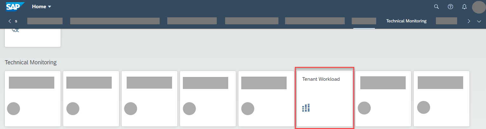
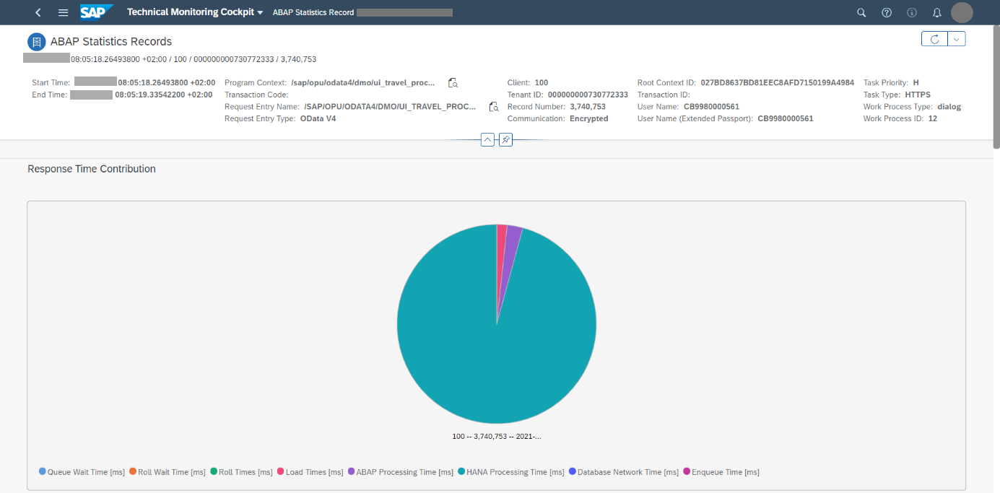
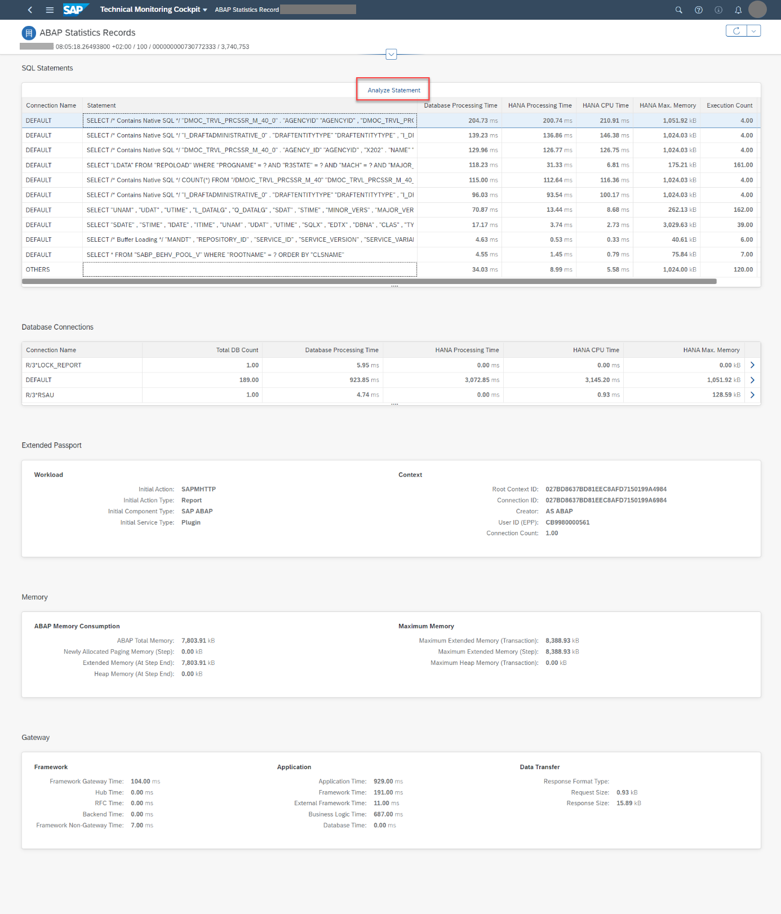

<!-- loio5fb4ce74d2f64874a56a4ac5262a0eba -->

# Analyzing the Workload of a Business Tenant

You want to know more about the workload on your business tenants in the ABAP environment.

## Context

Using the *Tenant Workload* screen, you benefit from a seamless connection between views of workloads by tenant and single ABAP statistics records \(main records and subrecords\) down to SQL statements and their prepared plan \(SQL EXPLAIN\). This gives you an excellent starting point for further performance analysis on SAP HANA level, which is true especially in the example below. Of course, you might also find records with a high ABAP CPU time where the SQL statements are not so important. In that case, a performance analysis on SAP HANA level would not be needed.

In the following example, let's analyze the usage of an application built according to the ABAP RESTful Application Programming Model \(RAP\) in a business tenant. We're going to use the well-known demo application for flight booking, which is often used as a reference scenario in SAP contexts.

## Procedure

1.  Log on to the SAP Fiori launchpad of your ABAP environment.

2.  In the group *Technical Monitoring*, choose the *Tenant Workload* tile:

    

    This leads you to the technical monitoring cockpit. The initial view shows you how the ABAP CPU time consumption changes over time and how it’s distributed among the available tenants.

3.  Using the links above the chart, you can switch to other views. In this example, let's switch to the HANA CPU time by tenant.

    

    As you can see from the chart, around 9.50 a.m., the HANA CPU time increased a bit.

4.  In the chart, click on the relevant tenant \(here: *730772333*\) and time \(9.50 a.m.\). In the *HANA CPU Time: Details* section, you see the top 10 contributors to the HANA CPU time of the chosen time and tenant. The contributors are grouped by request entry type and request entry name. You can see that the top contributor to the HANA CPU time is the travel processing service. So, on this tenant and time, it's mainly the usage of the flight processing service that is responsible for the consumption of HANA CPU time; the rest contributes only a little bit.

5.  To see more details, let’s choose the top contributor in the list. The chart on the subsequent *Request Processing* screen shows the behavior for this specific workload over time \(here, the flight processing service on tenant *730772333*\):

    

    The chart in the upper main view shows the aggregated workload, and - depending on what you click in the chart - the table below shows the relevant detail view, in this case a list of single ABAP statistics records for this workload on the tenant within the selected time frame. This is very helpful for your further analysis: You're coming from a workload perspective and now get to see a direct connection to the single records for this workload.

    With this chart, you can analyze whether the increase in HANA CPU time was due to the usage of the travel processing service. In the example, the HANA CPU time went up quite considerably around 9 a.m. Let’s have a closer look.

6.  From the *ABAP Statistics Records* table, choose a single record.

    On the following *ABAP Statistics Records* screen, you get more detailed information about the record. In the pie chart for the response time contributions, you can clearly see that the response time is dominated by the HANA processing time.

    

7.  Click on the HANA processing time in the chart and have a look at the *SQL Statements* section: The table shows the top 10 SQL statements contributing to this HANA processing time. You can then resolve the SQL statements that belong to a single record.

8.  Choose the top contributor among the SQL statements and choose *Analyze Statement*:

     

    The *Single SQL Statement Analysis* screen opens where you can view the SQL statement as well as its prepared access plans:

    

    So again, you have a convenient connection between different perspectives: You're coming from the plain SQL statement string straight to the SQL EXPLAIN for this statement. This is the tool that lets you see the SQL statement and how it would be executed on database level. From the prepared plan, a HANA expert could now dig deeper and start analyzing if the statement is problematic.

