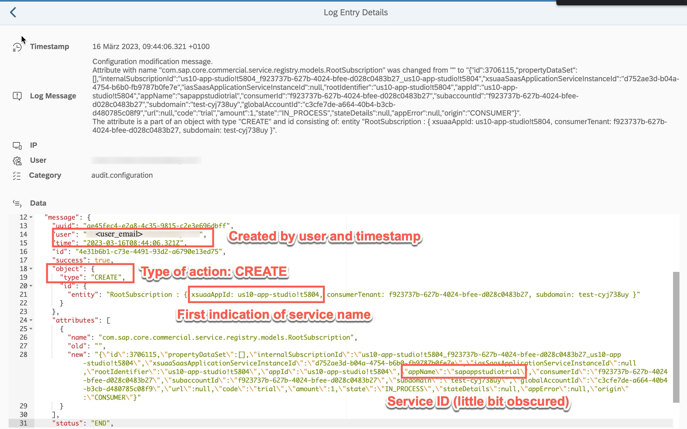
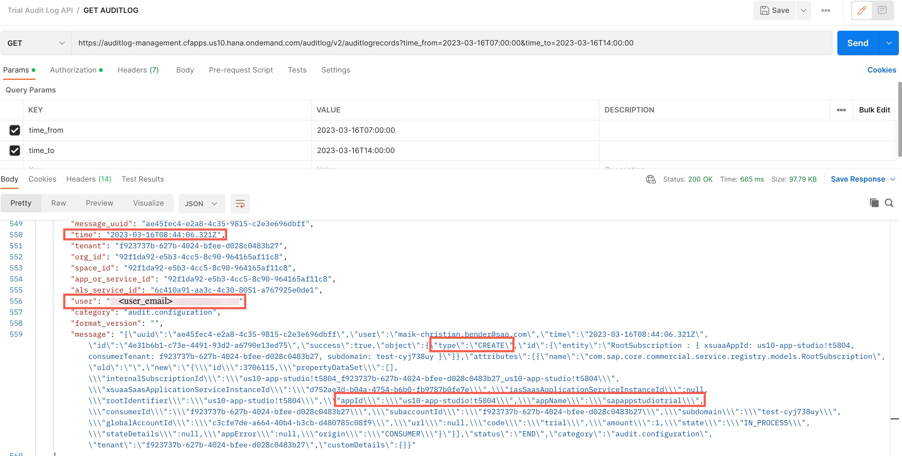

<!-- loio50a8092aa81045c6a72b3a8d330f9b40 -->

# Audit Log for Applications

Creating an application is logged by Audit Log Service. This information can be displayed in the Audit Log Viewer or retrieved with the Audit Log API.

Audit Log Viewer example: SAP Business Application Studio created by <user\_email\> on 16.03.2023 08:44:06.

The same information retrieved with Audit Log API:

