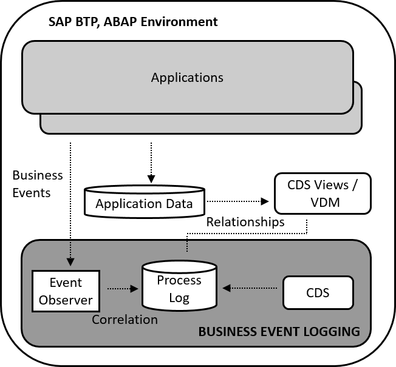

<!-- loiod3fd620a58d74ecc9e89e54aeb79aa95 -->

# Business Event Logging

Business Event Logging enables you to log business events that are raised by activities of SAP S/4HANA applications or business users. Business events are messages that are sent to notify a consumer that an object has changed.

The events triggered during the execution of business activities can be:

-   Business events for remote consumption: C2-released events \(external\)
-   Business events for local consumption: C1-released events \(internal\)

For example, you can find events such as **created**, **changed**, and **deleted** for Sales Order. The RAP-based events are listed in the SAP Business Accelerator Hub.

You can activate Business Event Logging using configuration activities for each object, such as Sales Order, Outbound Delivery, and so on.

The business event logs give you insights into the way processes run in the local system and how objects change. You can get an overview of all the logged business events, the number of events triggered, the types of events triggered, and information on changes to fields. Events of the same type occurring in the same session are grouped into activities.

This graphic displays the components of Business Event Logging:

<a name="loiod3fd620a58d74ecc9e89e54aeb79aa95__section_hrk_qtd_yqb"/>

## Benefits

With Business Event Logging, you can collect records of these business events, irrespective of whether the consumer has subscribed to the event, to get insights into the way business processes run in the local system. You can either store the default information or the complete business event data, depending on your configuration settings.

Essential properties of an event are stored by default. These properties are:

-   Objects
-   Object components
-   Business object key
-   Date of event
-   Event type \(corresponding to performed action\)
-   User who performed the action
-   Relevant field changes
-   Qualifiers \(for generic events\)

Field changes are also recorded as long as they are defined in the business events.

