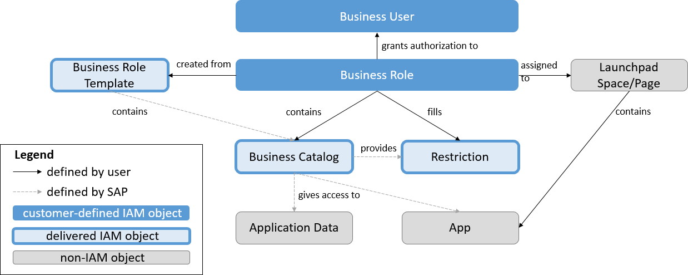

<!-- loiod45c96e6d9e2426187920bffb3287f45 -->

# Business Roles, Business Catalogs and Restrictions

SAP divides the business functionality into semantically meaningful business catalogs, representing tasks or sub-processes within a business process. These catalogs are the most finely grained units regarding structuring of work and authorization assignment. Business catalogs grant access to an app, a set of apps, or individual aspects of an app. Some business catalogs have restrictions. These restrictions give you the option of further specifying the way the user might interact with the app: they may, for example, grant write or read access.

Business catalogs are grouped into collections called business roles. A business role generally contains multiple business catalogs and corresponds to a set of authorizations required to perform the tasks of a particular job description, for example, a warehouse clerk. On the role level, restriction values of the contained business catalogs are defined. A business catalog might be contained in different business roles and might have different restriction values assigned in these different business roles.

Launchpad spaces structure the launchpad layout. You can assign launchpad spaces to business roles so that the launchpad space is visible to all users with a given business role.

Business roles are assigned to business users. Multiple business roles might be assigned to a single user. And a role might of course be assigned to different users.

To facilitate the process of business role creation, SAP delivers business role templates. These templates are collections of business catalogs suitable for a particular user persona. You can create a business role by simply copying the business role template and specifying restriction values.

<a name="loiod45c96e6d9e2426187920bffb3287f45__section_ImplementationConsiderations"/>

## Implementation Considerations

During the implementation phase of an IAM concept, the following considerations might be useful. After implementation, mechanisms for monitoring and analysis become more important.

The lifecycle of IAM elements is influenced by system upgrades. For more information, see *Manage Changes and Deprecation after Upgrade* in the *Related Information* section. For more information about monitoring of the IAM configuration, see *Monitoring and Analysis* in the *Related Information* section.

**Business Role Implementation**

If you want to model business roles sharing common properties, you can make use of the inheritance mechanism of leading and derived business roles.

In the context of inheritance, you can maintain the intended level on which a field should be filled in a business role using the field maintenance status.

**Transport**

Changes to business roles should not be carried out in production systems directly.

We recommend that you define business roles in a development/test system and transport them into the production system instead of making local changes.

**Related Information**  

[How to Create Leading and Derived Business Roles](how-to-create-leading-and-derived-business-roles-9b09af6.md "")

[How to Define Authorizations Based on Restrictions](how-to-define-authorizations-based-on-restrictions-6a6b17f.md "")

 <?sap-ot O2O class="- topic/link " href="83c1cd62666f48c68d93f2fdeae1ae95.xml" text="" desc="" xtrc="link:3" xtrf="file:/home/builder/src/dita-all/jjq1673438782153/loio2080d0faf9d84ce6aa14caa4caa32935_en-US/src/content/localization/en-us/d45c96e6d9e2426187920bffb3287f45.xml" output-class="" outputTopicFile="file:/home/builder/tp.net.sf.dita-ot/2.3/plugins/com.elovirta.dita.markdown_1.3.0/xsl/dita2markdownImpl.xsl" ?> 

[Monitoring and Analysis](monitoring-and-analysis-0fc8df8.md "")

[Manage Changes and Deprecations After Upgrade](manage-changes-and-deprecations-after-upgrade-8145afc.md "")

