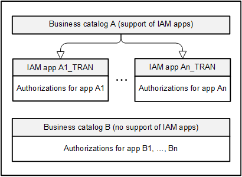

<!-- loiod45c96e6d9e2426187920bffb3287f45 -->

# Business Roles, Business Catalogs, App Authorization Variants, Restrictions

SAP divides the business functionality into semantically meaningful business catalogs, representing tasks or sub-processes within a business process. Business catalogs grant access to an app, a set of apps, or individual aspects of an app. Some business catalogs have restrictions. These restrictions give you the option of further specifying the way the user might interact with the app, for example, they may grant write or read access.

Business catalogs are grouped into collections called business roles. A business role generally contains multiple business catalogs and corresponds to a set of authorizations required to perform the tasks of a particular job description, for example, a warehouse clerk. On the business role level, restriction values of the contained business catalogs are defined. A business catalog might be contained in different business roles and might have different restriction values assigned in these different business roles.

Launchpad spaces and pages structure the layout of your SAP Fiori launchpad. Tiles can be referenced in launchpad pages. Pages are grouped into launchpad spaces. You can assign launchpad spaces to business roles so that the launchpad space is visible to all users with a given business role.

Business roles are assigned to business users. Multiple business roles might be assigned to a single business user. And a business role might of course be assigned to different business users.

To facilitate the process of business role creation, SAP delivers business role templates. These templates are collections of business catalogs suitable for a particular user persona. You can create a business role by simply copying the business role template and specifying restriction values.

> ### Note:  
> It is not recommended to use copies of business role templates for productive use.

<a name="loiod45c96e6d9e2426187920bffb3287f45__section_IAMApps_AAV"/>

## IAM Apps - App Authorization Variant

IAM apps of the app authorization variant type \(app authorization variants\) are the smallest entity for business role design and grant you flexibility to manage authorizations for business users.

> ### Caution:  
> IAM apps of the app authorization variant type are not to be confused with app variants. An app variant is an adapted version of an original SAP Fiori app. A key user can adapt an original app in UI adaptation mode and then save it as an app variant to be used by other users. For more information, see *App Variants: All You Need to Know* in the *Related Information* section.
> 
> IAM apps of the app authorization variant type should be differentiated from IAM apps used in developer extensibility. You can use the latter to define necessary authorizations for business users for one or more services created in ABAP Development Tools \(ADT\). For more information, see *Authorization Basics* in the *Related Information* section.

### Concept

Business catalogs are a well-established concept to pre-bundle authorizations. They combine authorizations for business functionality \(selection of apps\) into semantically meaningful building blocks as best practices delivered by SAP that represent tasks or sub-processes for a certain workplace within an overall business process. With the introduction of app authorization variants, business catalogs change from indivisible entities into entities that bundle app authorization variants that can be activated or deactivated. Consequently, app authorization variants become the smallest entity for business role design, providing greater flexibility to manage authorizations for business users including which apps they can use.

> ### Note:  
> To check whether a business catalog supports IAM apps, open the *Business Catalogs* app and use the *Supports IAM Apps* filter.

The graphic shows how authorizations for business users are managed differently depending on whether the business catalog supports IAM apps. Business catalogs that support IAM apps bundle app authorization variants. After these business catalogs have been assigned to a business role the referenced IAM apps can be activated or deactivated. If business catalogs do not yet support IAM apps or the app authorization variants feature is not activated, business catalogs yet remain the smallest entity for business role design.

### Components for Customer Incidents

If you need support or experience issues, please report an incident under the respective component:

-   If you experience issues with any app used to administrate IAM-related tasks, report an incident under component `BC-SRV-APS-IAM`.

-   If you experience issues with a business catalog, open the *Business Catalogs* app, select the business catalog and find the assigned component in the header section.

-   If you experience issues with an IAM app, open the *Display IAM Apps* app, select the IAM app, go to the *General* tab, and find the assigned component.

<a name="loiod45c96e6d9e2426187920bffb3287f45__section_ImplementationConsiderations"/>

## Implementation Considerations

During the implementation phase of an IAM concept, the following considerations might be useful. After implementation, mechanisms for monitoring and analysis become more important.

The lifecycle of IAM elements is influenced by system upgrades. For more information, see *Manage Changes and Deprecations After Upgrade* in the *Related Information* section.

For more information about monitoring of the IAM configuration, see *Monitoring and Analysis* in the *Related Information* section.

### Business Role Implementation

If you want to model business roles sharing common properties, you can make use of the inheritance mechanism of leading and derived business roles.

In the context of inheritance, you can maintain the intended level on which a field should be filled in a business role using the field maintenance status.

### Transport

Changes to business roles should not be carried out in production systems directly.

We recommend that you define business roles in a development system and transport them into the production system instead of making local changes.

**Related Information**  

[Business Catalogs](https://help.sap.com/docs/SAP_S4HANA_CLOUD/53e36b5493804bcdb3f6f14de8b487dd/dd0abf583e0647e5a536b878efeb5143.html)

[Maintain Business Roles](https://help.sap.com/docs/SAP_S4HANA_CLOUD/53e36b5493804bcdb3f6f14de8b487dd/8980ad05330b4585ab96a8e09cef4688.html)

[Work with IAM Apps of the App Authorization Variant Type](https://help.sap.com/docs/SAP_S4HANA_CLOUD/53e36b5493804bcdb3f6f14de8b487dd/e2b39fb01689420393931a9eb3f627ec.html)

[App Variants: All You Need to Know](https://help.sap.com/docs/SAP_S4HANA_CLOUD/4fc8d03390c342da8a60f8ee387bca1a/af47058ad66144579db6a990f3b7b919.html)

[Authorization Basics](https://help.sap.com/docs/SAP_S4HANA_CLOUD/6aa39f1ac05441e5a23f484f31e477e7/3461653ff5cc4cb1b13e578cadc412bb.html)

[Manage Changes and Deprecations After Upgrade](manage-changes-and-deprecations-after-upgrade-8145afc.md "")

[Monitoring and Analysis](monitoring-and-analysis-0fc8df8.md "")

