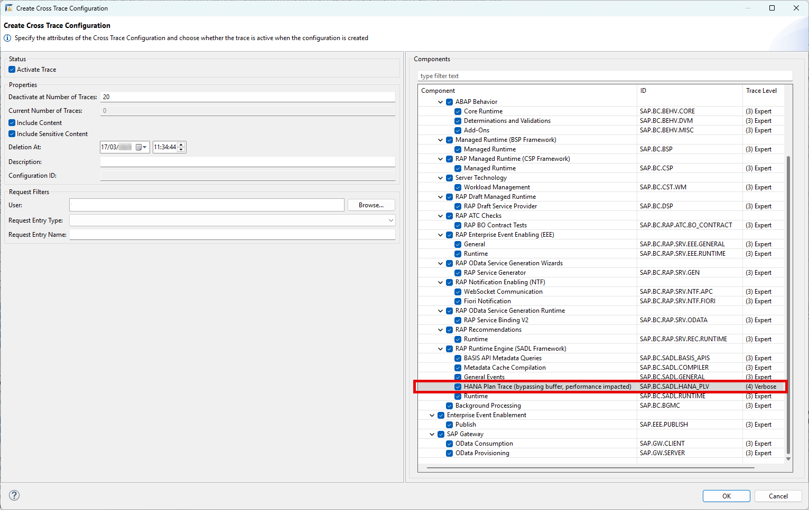
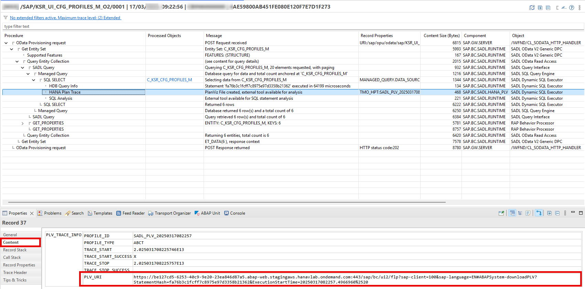
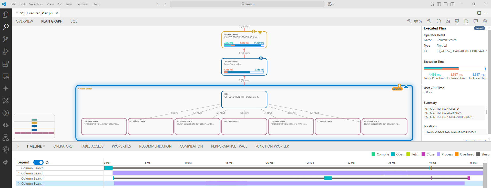

<!-- loio205615230cd146b09bf1d9c85aea5c54 -->

# Capturing and Downloading PLV Files in the ABAP Cross Trace in ADT

Analyze the SQL statement execution in your system to identify potential bottlenecks or performance issues.

To do so, in the ABAP cross trace in ABAP development tools for Eclipse \(ADT\), you can capture PlanViz \(PLV\) files for SQL statement executions using the integrated HANA Plan Trace feature and download and view the PLV files in the SQL analyzer tool for SAP HANA.

<a name="loio205615230cd146b09bf1d9c85aea5c54__section_v3z_dnh_cfc"/>

## Procedure

1.  To open the ABAP cross trace view, choose *Window* \> *Show View* \> *Other* \> *ABAP Cross Trace* in ABAP development tools for Eclipse \(ADT\).

2.  Choose *Create Cross Trace Configuration*.

3.  In the *Request Filters* section, enter your transaction criteria in the fields for *User*, *Request Entry Type* and *Request Entry Name*.

4.  In the *Components* window on the right, make sure that *HANA Plan Trace* is selected and the *Trace Level* for this component is set to *Verbose*.

    

5.  To start the trace for your user, choose *OK*. The generation of trace records will stop after the maximum number, which is set in the properties section, is reached.

6.  On the *Trace Results* tab page, right-click on your user, choose *Refresh*, and you’ll get an overview of the captured trace records for the duration the trace was running. The trace records that include a captured PLV file have a comment in the properties starting with *TMO\_HPT: SADL\_PLV*.

7.  For details of a trace record, doubleclick an entry on the *Trace Results* tab page. In the tree, you find HANA Plan Trace results within the *SADL Query* nodes in *SQL SELECT* subnodes.

8.  Choose a trace result entry named *HANA Plan Trace*. The properties for this entry are displayed in the *Properties* section.

    

9.  Chose *Content* to display the `PLV_TRACE_INFO`.

10. Copy the URL displayed under *PLV\_URI* into your web browser and open it. This will start the PLV download.

11. To view and analyze the PLV files, open them in the SQL analyzer tool for SAP HANA \(Visual Studio Code extension\).

    

<a name="loio205615230cd146b09bf1d9c85aea5c54__section_fgy_lg4_cfc"/>

## Related Information

[https://help.sap.com/docs/HANA\_SQL\_ANALYZER](https://help.sap.com/docs/HANA_SQL_ANALYZER)

