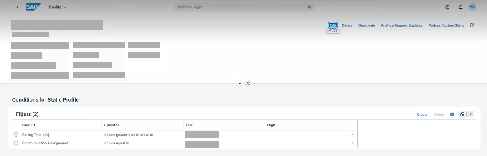

<!-- loiof33b3d26b06f4da2bc1ca7d7a5f01ca1 -->

# Capturing Request Statistics Relating to Expensive Outbound Communication

Use the *Capture Request Statistics* app to collect statistics of service requests with an expensive outbound communication \(RFC, HTTP, or Web service\).

<a name="loiof33b3d26b06f4da2bc1ca7d7a5f01ca1__prereq_ips_d5n_y5b"/>

## Prerequisites

You need a system administrator role \(based on `SAP_BR_ADMINISTRATOR`\) to perform these tasks.

## Context

With the *Capture Request Statistics* app, you can capture single ABAP statistics records of dedicated workloads in your ABAP system \(see also [Capturing Request Statistics](capturing-request-statistics-e86943a.md)\). You can also use this app for monitoring expensive outbound communication. For this purpose, you configure a capture profile to monitor the calling time of outbound calls of type HTTP, RFC, and Web service that exceed a defined threshold. In this procedure, you can capture records related to a high calling time. Alternatively, you might already have an idea which communication arrangements are related to expensive outbound communication, and you would like to find out the corresponding service requests.

With the checkbox *Health Monitoring* selected, you can also automatically export the number of captured ABAP statistics records of the profile to Health Monitoring in SAP Cloud ALM so that you get alerted when expensive outbound communication occurs.

## Procedure

1.  On the SAP Fiori launchpad of your ABAP environment, search for the *Capture Request Statistics* app.

2.  Choose *Create* and enter the basic header information for the profile.

    If you want to export the number of capture request statistics to SAP Cloud ALM, select the *Health Monitoring* checkbox.

    For more information about how to fill out the individual fields in the header, see the built-in SAP Companion documentation.

3.  To define a filter for high outbound calling times, choose *Create* and enter the following data:

    <table>
    <tr>
    <th valign="top">

    Option

    
    </th>
    <th valign="top">

    Description

    
    </th>
    </tr>
    <tr>
    <td valign="top">
    
    **Field ID**

    
    </td>
    <td valign="top">
    
    Choose *Calling Time \[ms\]* from the dropdown list.

    
    </td>
    </tr>
    <tr>
    <td valign="top">
    
    **Operator**

    
    </td>
    <td valign="top">
    
    Select *Include greater than or equal to*.

    > ### Note:  
    > When you enter a metric in the *Low* field, it doesn't matter which operator you choose here because it's always interpreted as threshold. The operator is therefore always interpreted as *Include greater than or equal to*.

    
    </td>
    </tr>
    <tr>
    <td valign="top">
    
    **Low**

    
    </td>
    <td valign="top">
    
    Enter a threshold for the calling time, for example, 1000. As a result, data for all service requests is captured whose calling time exceed 1,000 ms.

    
    </td>
    </tr>
    <tr>
    <td valign="top">
    
    **High**

    
    </td>
    <td valign="top">
    
    Leave this field empty.

    
    </td>
    </tr>
    </table>
    
4.  Choose *Create* to save the filter and go back to the header data.

    If you don't want to filter for any specific communication arrangement, you can stop defining filters here and activate your capture profile. The app will then capture any service request that makes at least one outbound RFC, HTTP, or Web consumer call and whose **total** calling time for all calls of each type exceeds the defined threshold.

5.  To define a filter for a specific communication arrangement, choose *Create* and enter the following data:

    <table>
    <tr>
    <th valign="top">

    Option

    
    </th>
    <th valign="top">

    Description

    
    </th>
    </tr>
    <tr>
    <td valign="top">
    
    **Field ID**

    
    </td>
    <td valign="top">
    
    Select *Communication Arrangement* from the dropdown list.

    
    </td>
    </tr>
    <tr>
    <td valign="top">
    
    **Operator**

    
    </td>
    <td valign="top">
    
    Select *Include equal to*.

    
    </td>
    </tr>
    <tr>
    <td valign="top">
    
    **Low**

    
    </td>
    <td valign="top">
    
    From the dropdown list, select the communication arrangement that you want to monitor.

    
    </td>
    </tr>
    <tr>
    <td valign="top">
    
    **High**

    
    </td>
    <td valign="top">
    
    Leave this field empty.

    
    </td>
    </tr>
    </table>
    
    

6.  Choose *Create* to save the filter and go back to the header data.

    Optionally, you can define more filters for additional communication arrangements.

    If you have also defined filters for communication arrangements, the *Capture Request Statistics* app will then only consider the service requests for the communication arrangements in the filters. In addition, data for a request using one of these communication arrangements is only captured if the total of at least one of the request's outbound RFC, HTTP, or Web consumer calls exceeds the defined threshold for the calling time.

7.  Activate the capture profile.

