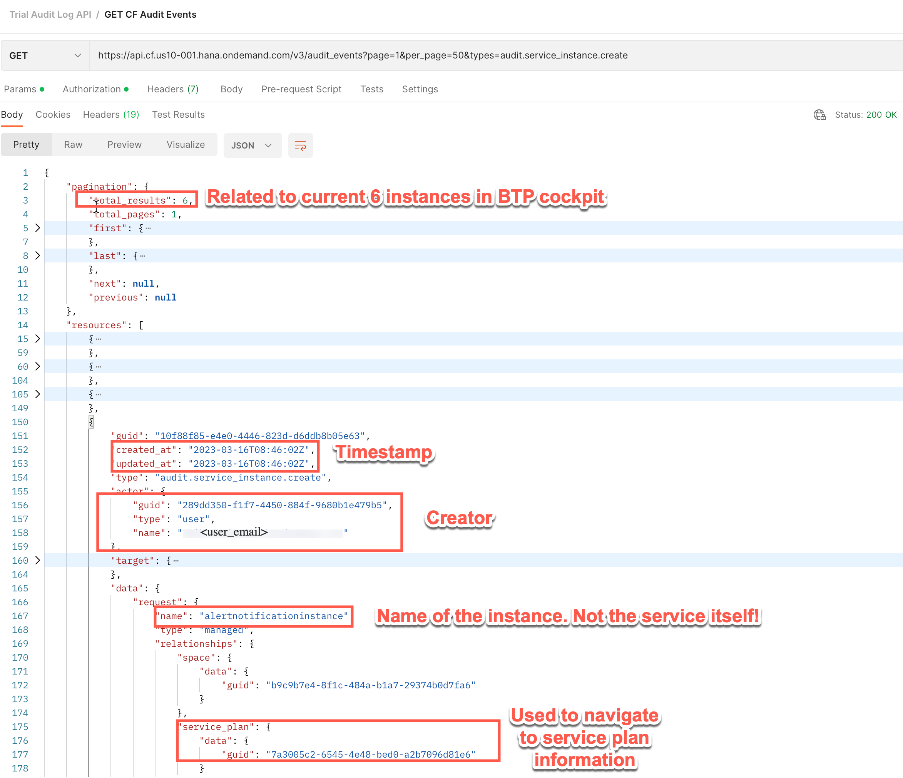
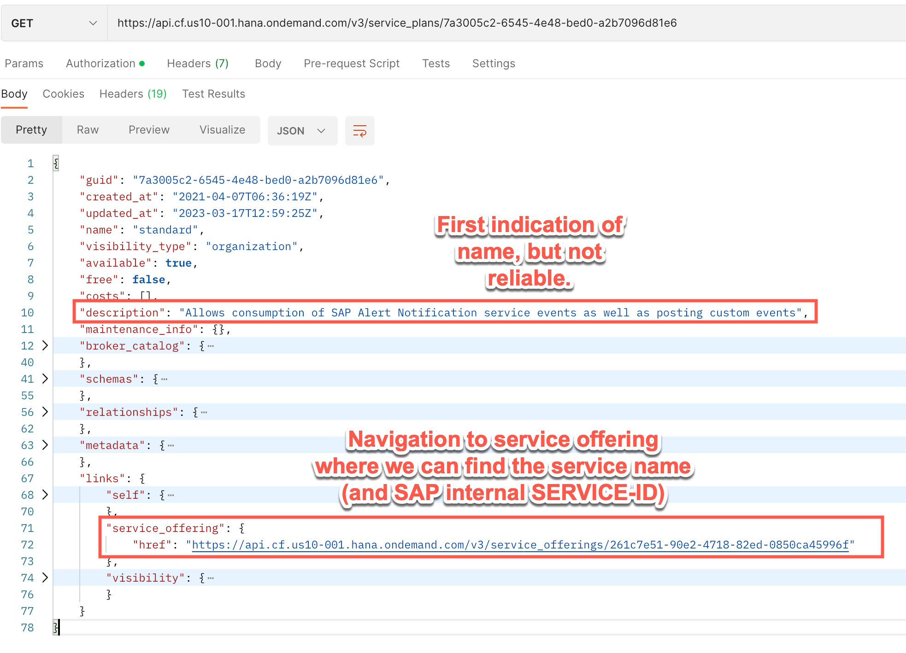
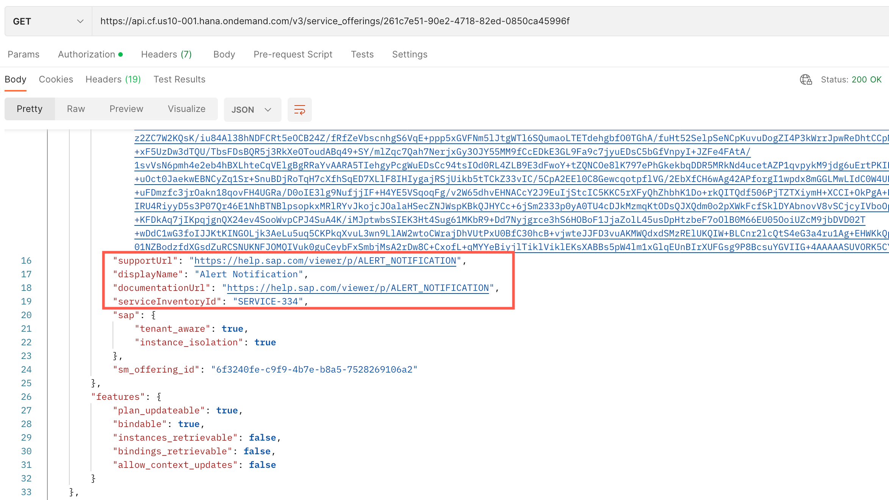

<!-- loiof51ced4de19d41fe91f6d07c1d2a1db1 -->

# Check Who Created a Service Instance

The following steps help you get information about who created a service instance. These steps are valid only for Cloud Foundry subaccounts.

To get the information for a service instance, use the [Cloud Foundry API](https://v3-apidocs.cloudfoundry.org/version/3.134.0/), which is available for all Cloud Foundry subaccounts. The following steps describe a path of API calls. Combining all information from the three steps, you get a list of all services created by a specific user at a specific time.

1.  Get a list of all audit events from type `audit.service_instance.create`.

    

2.  Follow the link to the service plan.

    

3.  See the service offering parameters to get the name, documentation URL and other parameters of the service.

    

