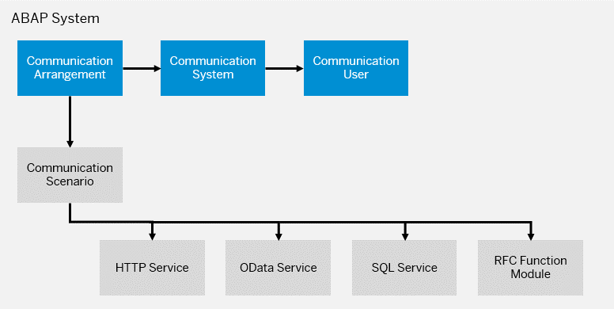
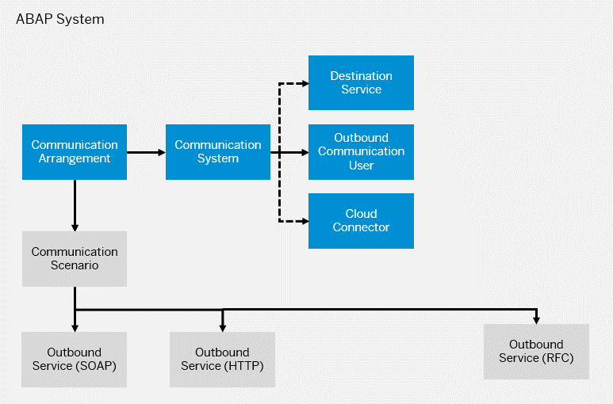

<!-- loioe7780076dd7e456ca5f24c32b8a2dfbd -->

# Communication Scenarios Managed by Customers

Other than the communication scenarios managed by SAP that are ready to use, you can create your own communication scenarios.

<a name="loioe7780076dd7e456ca5f24c32b8a2dfbd__section_ly4_t5n_wmb"/>

## Inbound Communication

You can create and expose services for external consumption to a communication partner. To create and expose services for external consumption, a developer creates a communication scenario and assigns the required services.

These inbound services can be HTTP services \(see [HTTP Service Development](../30-development/http-service-development-77c269b.md)\), remote-enabled function modules \(see [Develop a Remote-Enabled Function Module \(RFM\)](../30-development/develop-a-remote-enabled-function-module-rfm-abf7105.md)\), or services published via service bindings, such as Odata or SQL services \(see [Developing and Exposing an SQL Service in the ABAP System](../30-development/developing-and-exposing-an-sql-service-in-the-abap-system-76eeb8d.md)\).

Depending on the protocol of the service, supported authentication methods are Basic and/or X.509.

You then create a communication system and user for the communication partner according to [Supported Protocols and Authentication Methods](https://help.sap.com/docs/BTP/65de2977205c403bbc107264b8eccf4b/437e9d41d24349c3a2b363f726022677.html?version=Cloud#inbound-communication), maintain a communication arrangement for the scenario using the created communication system, and specify the authentication method. The communication partner can use the credentials provided by the communication system and user to consume the services of the scenario.

> ### Tip:  
> The following image contains links to more information.

<a name="loioe7780076dd7e456ca5f24c32b8a2dfbd__section_kgc_cvn_wmb"/>

## Outbound Communication

To set up outbound communication between two communication partners, you have to specify the endpoint and credentials by creating a communication system and user according to [Supported Protocols and Authentication Methods](https://help.sap.com/docs/BTP/65de2977205c403bbc107264b8eccf4b/437e9d41d24349c3a2b363f726022677.html?version=Cloud#outbound-communication).

-   For outbound communication to **Internet** 
    -   If authentication methods **OAuth 2.0 SAML Bearer Assertion** or **OAuth 2.0 User Token Exchange** are used, you have to configure the communication system to represent a destination set up in the subaccount of the system \(default instance of destination service\). Maintaining the host name and port of the communication partner and the user credentials via a communication user. See [How to Create Communication Users](https://help.sap.com/viewer/65de2977205c403bbc107264b8eccf4b/Cloud/en-US/0377adea0401467f939827242c1f4014.html).
    -   If other authentication methods are used, you have to create a communication system with an outbound communication user for maintaining the user credentials.

-   For outbound communication to **On-Premise** 
    -   If authentication method **Principal Propagation** is used, you have to configure the communication system to represent a destination set up in the subaccount of the system \(default instance of destination service\)
    -   If other authentication methods are used, you have to create a communication system with an outbound communication user for maintaining the user credentials.

> ### Tip:  
> The following image contains links to more information.

**Related Information**  

[Developing External Service Consumption \(Outbound Communication\)](../30-development/developing-external-service-consumption-outbound-communication-f871712.md "Get more information about consuming external services.")

