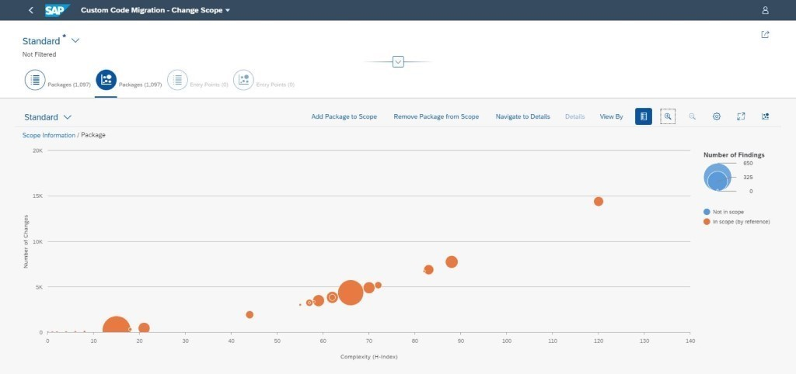

<!-- loio548c8d0ba70c47bf871befe5b1322695 -->

<link rel="stylesheet" type="text/css" href="../css/sap-icons.css"/>

# Complexity Analysis

In this topic, you will learn more about complexity analysis in the Custom Code Migration app.

<a name="loio548c8d0ba70c47bf871befe5b1322695__section_cb2_nbv_fyb"/>

## Purpose

Sometimes, your ABAP code can contain complex objects that very often also experience the most frequent changes. With the Custom Code Migration app it is possible to identify the most complex objects via complexity analysis and help you decide whether you want to redesign and therefore simplify them.

> ### Note:  
> Please be aware that, in this topic, the focus is on reducing the complexity of packages only. Nevertheless, generally, what applies to packages also applies to request entry points.

In your Custom Code Migration project, choose the bubble chart to display all packages that contain custom code. With this chart, you can also display the Halstead difficulty of a package. The Halstead complexity measures are software metrics that describe the effort to develop and understand the complexity of a program.

The chart enables you to identify packages that contain complex coding and have often been changed in the last year, for example.

The default representation of the chart displays the following information:

The X axis indicates the complexity/difficulty of the custom code within a package. The higher the number signifies the complexity. The app calculates the complexity based on the Halstead complexity measures. For packages, the Halstead difficulty is aggregated using an H-index algorithm.

> ### Note:  
> Only if you have multiple complex objects in your code does the H-index rise.
> 
> An H-index of 42 means that the package contains 42 procedures with a Halstead difficulty of 42 or higher.
> 
> An H-index of 80 means that the package contains 80 procedures with a Halstead difficulty of 80 or higher.
> 
> The Y axis displays how many changes – based on transport requests – you have made to the objects of a package.

> ### Recommendation:  
> SAP recommends you have a closer look at packages that appear in the top-right corner of this chart, as those are the packages that are very complex and have often been changed.
> 
> The size of the bubbles indicates the number of findings. Hence, the bigger the bubble, the higher the number of findings.

You can change the default representation of the chart by choosing the chart preferences \(:gear:\).

Your chart could now look as follows:

Now that you are aware of the complexity of your code, it is time to take action and reduce said complexity. There is no standard solution for fixing complex code, however, SAP can provide you with suggestions as to how to start this process:

-   Check whether you can replace your code with SAP standard functionalities.

-   Check whether there are smaller units in your code that you can reuse.

-   Check out the **[Clean ABAP](https://github.com/SAP/styleguides/blob/main/clean-abap/CleanABAP.md)** style guide to learn more about clean code.

**Related Information**  

[SAP Note 2436688](https://me.sap.com/notes/2436688)

[Custom Code Migration Guide for SAP S/4HANA](https://help.sap.com/doc/9dcbc5e47ba54a5cbb509afaa49dd5a1/latest/en-US/CustomCodeMigration_EndtoEnd.pdf)

[How to check your custom ABAP code for SAP BTP, ABAP environment](https://blogs.sap.com/2018/10/02/how-to-check-your-custom-abap-code-for-sap-cloud-platform-abap-environment/)

