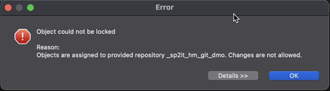

<!-- loio51bed3bd15394dceae0909906ec15676 -->

# Configure Software Components

### Context

You can configurate software components in the *Repository Settings*, which can be opened by clicking on the *Settings* button.

### Key Features

You can do the following adjustments to the selected software component:

-   Repository Role:

    Use the repository role to configure how transport requests behave when they're released. If the option *Target* is selected, the transport requests will not be pushed to the remote repository. However, if the *Source* option is selected, the transport request can be pushed to the remote repository.

-   Rollback Mechanism:

    This rollback mechanism can be enabled and disabled. If enabled, only valid commits can be imported in the repository. If disabled, all commits can be imported even if they are invalid. For more information about this mechanism, see: [Pull Software Components](pull-software-components-90b9b9d.md).

-   Update Credentials \(BYOG software components only\):

    Use this option to update your Git user credentials that were saved when the software component was cloned. This option is enabled only for Bring Your Own Git components that have already been linked to a Git repository. For more information on that, see [Bring Your Own Git](bring-your-own-git-994c961.md).

## Repository Role: Target

Software components configured with the role *Target* are now protected from changes and cannot be recorded on transports. This feature is designed to prevent inadvertent modifications to components, ensuring their integrity and stability.

1.  *Detailed Goal Description*
    -   Importance: Protecting components from unauthorized or accidental modifications is crucial in maintaining system stability and reliability.
    -   Benefits for Users: This feature ensures that objects associated with *Target* role software components remain unchanged, reducing the risk of potential errors and preserving the intended configuration.

2.  *Behavior Demonstration*
    -   The following steps demonstrate the behavior of software components with the *Target* role:

    1.  Clone a software component \(SC\) configured with the role *Target*.

        

    2.  Open an object \(e.g., a class\) within the software components package using ABAP development tools for Eclipse.
    3.  Attempt to modify the object.
    4.  An error window should appear, blocking the modification and providing a reason for the restriction.

        

3.  *Summary*

    The *Target* role feature safeguards software components from accidental changes by locking their objects against modification. Implemented to enhance system integrity, this feature is essential in environments where stability and consistency are of utmost importance.

    > ### Tip:  
    > If you need to modify the contents of a software component, clone it in the *Source* role instead.

