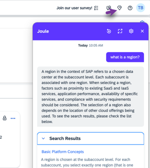

<!-- loio20b5e3ed85a14925bb079feef6a105d3 -->

# Conversations with Joule \(Beta\)

Let Joule help you find answers to questions about managing your accounts in SAP BTP cockpit.

> ### Note:  
> This offering is a beta feature. Beta features aren't part of the officially delivered scope that SAP guarantees for future releases. For more information, see [Important Disclaimers and Legal Information](https://help.sap.com/viewer/disclaimer).

Take your SAP BTP cockpit administration questions to Joule. Just type a question in the Joule chat using natural language and let Joule scan the product documentation on the SAP Help Portal for answers.

Joule summarizes the relevant SAP Help Portal information. This summary is then displayed along with the top help results. If you select a link result, you're taken directly to the topic on the SAP Help Portal.

> ### Note:  
> Joule is an addition to in-app help content, guided tours, embedded learning content, and customer-specific enablement content in SAP Companion.

**Related Information**  

[Features of Joule](https://help.sap.com/docs/joule/capabilities-guide/features-of-joule?version=CLOUD)

[Supported Administrative Tasks \(Beta\)](supported-administrative-tasks-beta-88b02d5.md "Learn about the administrative tasks that Joule can perform for you in the SAP BTP cockpit.")

