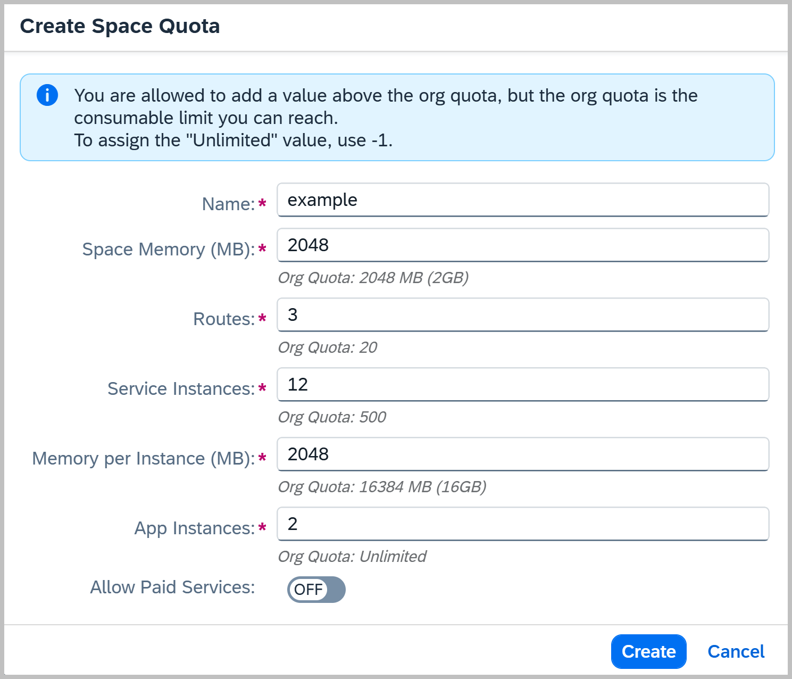

<!-- loiob13c4a2666dd4018a52780da581bbf6d -->

# Create Space Quotas

You can use the SAP BTP cockpit to create space quotas.

<a name="loiob13c4a2666dd4018a52780da581bbf6d__prereq_ofw_ghw_4bb"/>

## Prerequisites

You have the Org Manager role for the org in which you want to create a space quota.

<a name="loiob13c4a2666dd4018a52780da581bbf6d__steps_l1r_b3w_4bb"/>

## Procedure

1.  Navigate to the subaccount that contains the spaces to which you want to add quotas.

2.  In the navigation menu, choose *Cloud Foundry* \> *Space Quotas*.

3.  Choose *Create Space Quota*.

4.  Enter a name for your space quota and add limits for the following:

    -   *Space Memory \(MB\)*: Total amount of memory a space can have

    -   *Routes*: Total number of routes

    -   *Service Instances*: Total number of service instances

    -   *Memory per Instance \(MB\)*: Maximum amount of memory an application instance can have

    -   *App Instances*: Total number of application instances

    -   \(Optional\) *Allow Paid Service*: Switch on if you'd like to allow the provisioning of instances of paid service plans.

    > ### Note:  
    > The value of `-1` represents an unlimited amount.

    > ### Note:  
    > If the space quota limit for a resource exceeds the org quota limit, the org quota limit applies.

5.  Choose *Create*.

<a name="loiob13c4a2666dd4018a52780da581bbf6d__example_tpp_j22_zdc"/>

## Creating a Space Quota in the Cockpit

**Related Information**  

[Entitlements and Quotas](../10-concepts/entitlements-and-quotas-00aa2c2.md "When you purchase an enterprise account, you’re entitled to use a specific set of resources, such as the amount of memory that can be allocated to your applications.")

[Create Space Quota Plans Using the Cloud Foundry Command Line Interface](create-space-quota-plans-using-the-cloud-foundry-command-line-interface-504fde9.md "You can use the Cloud Foundry Command Line Interface to create space quota plans.")

