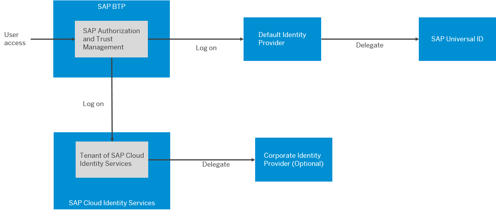

<!-- loiod6a8db70bdde459f92f2837349f95090 -->

# Default Identity Provider

SAP ID service is the default identity provider for both platform users and business users \(in applications\) at SAP BTP. You can start using it without further configuration.

> ### Note:  
> For China \(Shanghai\) region, a different default identity provider is used.
> 
> For more information, see this [blog article](https://blogs.sap.com/2021/02/22/activate-totp-two-factor-authentication-on-sap-business-technology-platform-formerly-known-as-cloud-platform-at-alibaba-cloud/) on *SAP Community*.
> 
> For Government Cloud \(US\) region, a different default identity provider is used.

SAP ID service provides:

-   A central user store
-   A Single Sign-On \(SSO\) service. It enables users to log on once and get access to all your applications.

Use SAP ID service as a preconfigured user store in your starter scenarios or for testing. You can also use the default identity provider as a backup identity provider if access to your custom identity provider fails. SAP ID service is the place where you register to get initial access to SAP BTP.

  
  
**SAP ID Service Authenticates Users**

If you're a new user, you can use the self-service registration option at the [SAP Web site](https://www.sap.com) The SAP website registers you with SAP Universal ID, which also registers you with SAP ID service.

<a name="loiod6a8db70bdde459f92f2837349f95090__section_fmj_mbp_ktb"/>

## SAP Universal ID

SAP Universal ID manages the users of official SAP sites, including the SAP developer and partner community. If you already have such a user, then you're already registered with SAP ID service as well. SAP ID service acts as a proxy for SAP Universal ID, when users log on with their e-mail addresses. Users can log on with and manage all their user accounts with SAP Universal ID.

The following figure illustrates how default and custom identity providers can federate other identity providers.

  
  
**Identity Providers and Federation**

<a name="loiod6a8db70bdde459f92f2837349f95090__section_hpw_zlg_fsb"/>

## Managing Users

To add users to a subaccount, the users must exist in an identity provider.

For more information about adding users to our default identity providers, see [Create SAP User Accounts](create-sap-user-accounts-ebe42f6.md).

To add new users to a subscribed app or service, such as Web IDE, add those users to your subaccount.

For more information, see [Add Users from SAP ID Service for Multi-Environment Subaccounts](add-users-from-sap-id-service-for-multi-environment-subaccounts-760ab77.md).

<a name="loiod6a8db70bdde459f92f2837349f95090__section_e34_mmg_fsb"/>

## Multifactor Authentication

For SAP ID service, you can ask users hosted by this identity provider to enable multifactor authentication as a self-service. There's **no** mechanism to enforce users in SAP ID service to use this function.

> ### Recommendation:  
> To enforce multifactor authentication, we recommend that you trust SAP Cloud Identity Services - Identity Authentication and configure enforcement. Optionally, integrate Identity Authentication with your corporate identity provider and enforce the policy there.
> 
> For more information, see:
> 
> -   [Establish Trust and Federation of Custom Identity Providers for Platform Users \[Feature Set B\]](establish-trust-and-federation-of-custom-identity-providers-for-platform-users-feature-c368984.md)
> 
> -   [Establish Trust and Federation Between SAP Authorization and Trust Management Service and Identity Authentication](establish-trust-and-federation-between-sap-authorization-and-trust-management-service-a-161f8f0.md)

For more information about your users of SAP ID service can enable multifactor authentication themselves, see [How to Enable Multi-Factor Authentication \(MFA\)](https://support.sap.com/en/my-support/mfa.html) on the *SAP Support Portal*.

> ### Note:  
> Some user interfaces don't offer an interactive way to support multifactor authentication, such as time-based one time passwords \(TOTP\). Instead, such tools offer fixed logon ID and password fields. For such tools, enter your password directly followed, without any spaces or dividers, by the TOTP offered by your multifactor device.
> 
> <code>User ID: <code>MylogoniD</code></code>
> 
> <code>Password: <code>MystrongpassworDMytotppasscodE</code></code>
> 
> For some tools, this behavior affects log on to the tool itself:
> 
> -   Cloud Foundry command-line interface \(cf CLI\)
> 
>     Alternatively, you can log on through a browser instead.
> 
>     For more information, see [Log On Manually With a Custom Identity Provider](log-on-manually-with-a-custom-identity-provider-e1009b4.md).
> 
> -   SAP Business Technology Platform command-line interface \(btp CLI\)
> 
>     Alternatively, you can log on through a browser instead.
> 
>     For more information, see [Log in with Single Sign-On](log-in-with-single-sign-on-b2a56a8.md).
> 
> 
> For other tools, this behavior doesn't affect log on to the tool itself, but log on to the platform when establishing connections or deploying software and such. For example:
> 
> -   Cloud Connector
> 
> -   SAP Business Application Studio
> 
> -   SAP Web IDE

<a name="loiod6a8db70bdde459f92f2837349f95090__section_ifv_xlg_fsb"/>

## Trust and Identity Providers

Trust between your subaccount and SAP ID service is preconfigured by default, so you can start using it without further configuration.

In cloud management tools feature set A, you can set the default trust to inactive, for example if you prefer to use another identity provider.

In cloud management tools feature set B, you can hide the default trust.

For more information, see [Hide Logon Link for Default Identity Provider](hide-logon-link-for-default-identity-provider-9e3d457.md).

To use a custom identity provider, establish trust to your custom identity provider. We describe a custom trust configuration using the example of Identity Authentication.

For more information, see [Trust and Federation with Identity Providers](trust-and-federation-with-identity-providers-cb1bc8f.md).

**Related Information**  

[Security](../60-security/security-e129aa2.md "Use the security features and functions of SAP BTP to support the security policies of your organization.")

[Platform Identity Provider](https://help.sap.com/viewer/ea72206b834e4ace9cd834feed6c0e09/Cloud/en-US/80edbe70b8f3478d8a59c21a91a47aa6.html "The platform identity provider is the user base for access to your SAP BTP subaccount in the Neo environment. The default user base is provided by SAP ID Service. You can switch to an Identity Authentication tenant if you want to use a custom user base.") :arrow_upper_right:

 <?sap-ot O2O class="- topic/link " href="085051d896e04488951ba01a7e7e7671.xml" text="" desc="" xtrc="link:3" xtrf="file:/home/builder/src/dita-all/jjq1673438782153/loio2080d0faf9d84ce6aa14caa4caa32935_en-US/src/content/localization/en-us/d6a8db70bdde459f92f2837349f95090.xml" output-class="" outputTopicFile="file:/home/builder/tp.net.sf.dita-ot/2.3/plugins/com.elovirta.dita.markdown_1.3.0/xsl/dita2markdownImpl.xsl" ?> 

[Working with Users](working-with-users-2c91f88.md "In the SAP BTP cockpit, you can see the users of your global account or subaccount, user-related identity provider information, and their authorizations. In a user's overview, you can create and delete users, and assign role collections. You can also display an overview of the role collections, where you can drill down all the way to the role, and see the application that the role is belongs to.")

[Cloud Management Tools — Feature Set Overview](../10-concepts/cloud-management-tools-feature-set-overview-caf4e4e.md "Cloud management tools represent the group of technologies designed for managing SAP BTP.")

